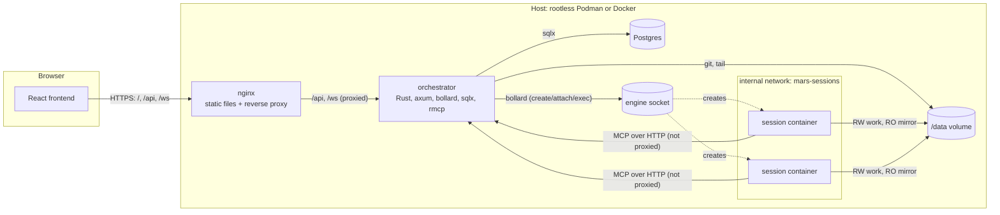
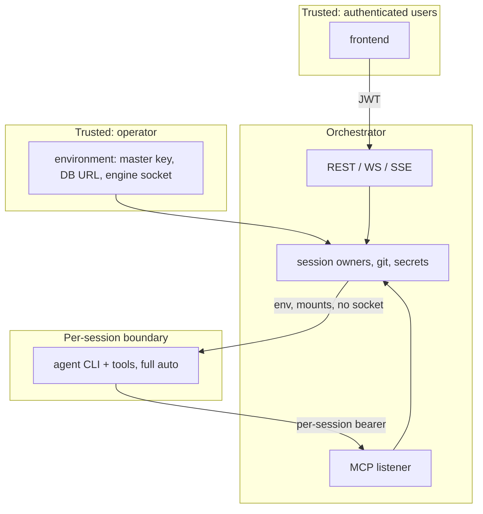
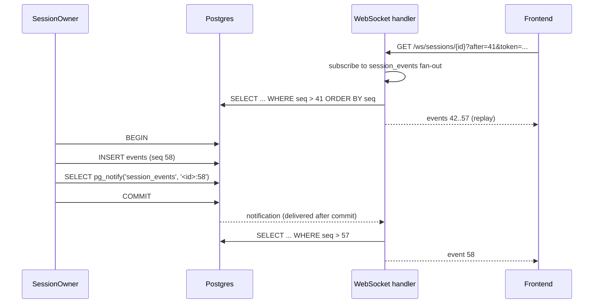
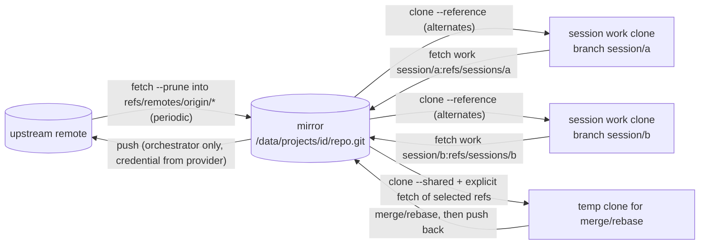
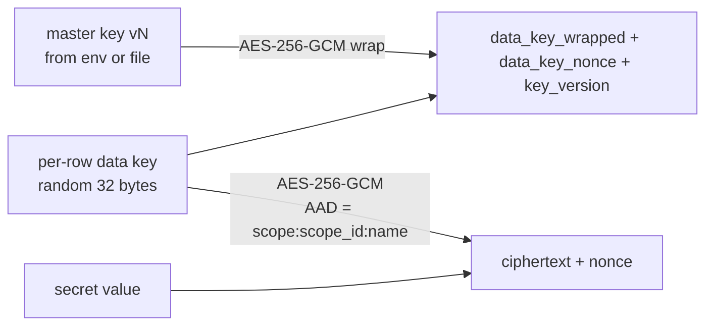

# Architecture

Mars runs coding-agent sessions in isolated containers and exposes them to a browser. This document describes the components, the trust boundaries between them, and the designs that hold the system together: session lifecycle, durability and recovery, the git model, secrets, the MCP surface, and the task tracker. The functional contract (endpoints, schemas, tool signatures) is in `SPEC.md`; the database schema is in `docs/data-model.md`; the reasoning behind the non-obvious choices is in `docs/decisions/`.

## Components

Four kinds of container run under compose. Session containers are not in the compose file; the orchestrator creates them on demand.



| Component | Role | Notes |
| --- | --- | --- |
| orchestrator | The only stateful service. Serves the REST API, WebSocket and SSE endpoints on the API listener, and the MCP endpoint on a separate listener. Owns every session as a long-lived task. Talks to the container engine and runs `git`. | Runs as an unprivileged user. Holds the engine socket. Attached to both networks. |
| postgres | The only system of record. | Version 18. Not reachable from session containers. |
| nginx | Serves the built frontend, proxies `/api` and `/ws` to the orchestrator. | Does not proxy the MCP listener. Configured for WebSocket upgrade and unbuffered SSE. |
| session container | One per session. Runs the agent CLI under an entrypoint that writes its output to the session volume. | Never gets the engine socket. On the internal MCP network and the separate egress network. Unprivileged user. |

### Networks

Three networks. `mars-frontend` connects nginx, the orchestrator and Postgres. `mars-sessions` is declared `internal: true` (no gateway, no masquerading) and connects the orchestrator and every session container; it exists only so that sessions can reach the MCP listener. `mars-egress` is an ordinary bridge network with outbound internet that connects session containers and nothing else, because the model API and package registries are on the internet. A session container is attached to both (see "Session container specification"). The orchestrator's MCP listener binds on all interfaces but is only reachable through `mars-sessions` because nginx never forwards to it and the host does not publish its port. Containers on the frontend network (nginx, Postgres) can open the MCP port — the orchestrator sits on both networks — but hold no session token, so it answers them with a bearer challenge and nothing more; the host and the browser cannot reach it at all. `scripts/verify-deployment.sh` checks exactly that.

That last part holds for the compose deployment. An orchestrator running on the host instead (the `keep-id` fallback in `README.md`, "Podman setup", and the development mode below) binds both listeners on all of the host's interfaces, is not attached to `mars-sessions` at all, and is reached from sessions through the egress network's gateway; the MCP port is then only as closed as the host firewall makes it. `HOSTRUN=1 scripts/verify-deployment.sh` asserts that shape rather than this one.

Nothing on the host or the frontend network can reach a session container, and session containers cannot reach Postgres or nginx. Restricting egress on `mars-egress` to an allow-list is a hardening step, not a v1 requirement. The orchestrator creates both session networks at startup if they do not exist (names from `SESSION_NETWORK_INTERNAL` and `SESSION_NETWORK_EGRESS`, defaults `mars-sessions` and `mars-egress`), so a development orchestrator running outside compose needs no manual network setup.

## Trust boundaries



Three boundaries matter:

1. **User to orchestrator.** Users exist only through invites from an admin (ADR 0013); they authenticate with username and password and receive a short-lived JWT access token plus an HTTP-only refresh cookie (see `SPEC.md`, "Authentication"). Every user is trusted with every project; the `admin` flag exists for inviting and managing users only. Authorisation questions of the form "may this user see this project" do not exist in v1.
2. **Agent to orchestrator.** A session container talks to the orchestrator through MCP, authenticated by a per-session bearer token generated afresh for each process launch (ADR 0029). The token identifies the session; from it the orchestrator derives the project, the profile and therefore which tools the agent may call. Agents never self-identify.
3. **Agent to everything else.** The container is the intended permission boundary (ADR 0012), with the accepted git-execution vulnerability below (ADR 0019). Inside it the agent runs with the CLI's bypass-permissions mode. It can read and write its session volume, read the project mirror, reach the internet, and call MCP. Its configured container access excludes the engine, Postgres, nginx and sessions of other projects, and it is not given git credentials. Sessions of the same project share the CLI state directory and the project's declared shared directories (ADR 0015). These restrictions do not guarantee containment if agent-controlled git configuration executes inside the orchestrator.

The orchestrator container is the high-value target. It runs as an unprivileged user, its root filesystem is read-only where the engine allows, it contains `git` and nothing else beyond the binary, and the engine socket is the only privileged thing it holds. Under rootless Podman that socket is itself unprivileged on the host.

### User authentication and revocation

User access tokens include `auth_version`, matched against the current user on every authenticated request. Password changes and resets increment this version and revoke refresh tokens in one transaction; self-service changes issue a replacement pair for the current browser. Authorization uses the database's current administrator role and password-change flag. A deleted user cannot authenticate. Login, refresh and password/reset-token mutations serialize on the user row so credential issuance cannot race past revocation (ADR 0025; exact API and transaction contracts in `SPEC.md` and `docs/data-model.md`). `auth::Credentials` is the only issuer of access tokens and refresh cookies in the orchestrator, so that ordering — lock the user row, revalidate what was read, mutate, commit, and only then mint the pair — is written once rather than repeated by each route.

Open WebSocket and SSE connections retain the existing rule that ordinary JWT expiry does not interrupt them. They recheck account existence, login version and the password-change gate at their existing heartbeat ticks; WebSocket also checks before accepting application messages or terminal input. Invalid authorization closes the connection and its terminal attachment, without stopping agent sessions. Revocation may take one heartbeat interval to end passive streaming. Failed authorization refresh returns the browser to login; a self-service password change reconnects using its replacement credentials. This uses database checks, with no token blacklist or revocation broadcast service.

### Known v1 vulnerability: git execution outside the session container

The agent can edit its checkout's local git configuration. When the orchestrator runs git against that checkout, execution-capable settings such as `core.fsmonitor` can cause agent-controlled commands to run with orchestrator privileges, potentially exposing application secrets, project data and the engine socket. This is an accepted, unresolved v1 vulnerability (ADR 0019). Git operations remain in the orchestrator; a restricted helper container or equivalent isolation is deferred until after v1. Reference clones and subprocess argument arrays are not a complete mitigation. The ordinary audited REST/MCP flows describe intended operations, not a guarantee that exploitation of this path would be audited.

## Storage

Postgres holds every fact the UI displays. The `/data` volume holds working state that is expensive or impossible to keep in a database. Both must persist across restarts; only Postgres is backed up as a database, `/data` is backed up as files.

```
/data
├── projects/<project_id>/
│   ├── repo.git/                 bare project repository: upstream tracking, integration heads and session refs; gc disabled; mounted RO
│   ├── claude/                   CLI state dir (CLAUDE_CONFIG_DIR), shared by the project's sessions; mounted RW at the same path
│   │   └── projects/-session-work/
│   │       ├── <cli_session_id>.jsonl   one transcript per session
│   │       └── memory/                  the CLI's auto memory, shared by the project's sessions
│   └── shared/<name>/            project shared directories, mounted RW at their container path
├── sessions/<session_id>/
│   ├── work/                     git clone, mounted RW at /session/work
│   ├── home/                     the agent's HOME, mounted RW at /session/home
│   ├── log/
│   │   ├── stream.jsonl          native CLI stdout, redirected there by the entrypoint
│   │   └── stderr.log            native CLI stderr
│   └── mcp.json                  CLI MCP config with the session's bearer token, mounted RO at /session/mcp.json
└── tmp/                          temporary clones for merge/rebase and the startup probe; emptied by orphan cleanup
```

`/data` in this document is shorthand for `DATA_DIR`, the path at which the orchestrator itself sees the volume: `/data` in the compose deployment, or any directory the developer owns when the orchestrator runs on the host with `cargo run`. The orchestrator additionally needs the host path of the same directory (`DATA_DIR_HOST`, equal to `DATA_DIR` when running on the host) because bind-mount sources given to the engine are host paths. The parts a session needs are mounted into session containers at the orchestrator's path (`DATA_DIR/projects/<id>/repo.git` and so on), never at the host path: `git clone --reference` records the mirror's absolute path as the orchestrator saw it in the session clone's alternates file, so the mirror must appear at that same path inside the container (ADR 0001). The full mount list is in "Session container specification".

**Per-project CLI state.** The CLI's state directory is per project, not per session (ADR 0015). Every session runs with `cwd = /session/work`, so the CLI files transcripts, memory and project settings under the same encoded-path subdirectory; sharing the directory per project turns that into project memory, while sharing it more widely would merge the memory of unrelated projects. Transcripts are named by CLI session id, so co-locating them is harmless, and several CLI processes on one state directory is the ordinary single-machine situation. Everything else under `HOME` (shell history, tool caches) stays per session.

**Shared directories.** A project declares zero or more shared directories, each a name and an absolute container path (`SPEC.md`, "Shared directories"; `docs/data-model.md`, `project_shared_dirs`). At launch the orchestrator creates `/data/projects/<id>/shared/<name>` if missing (owned by uid 1000, like the session directories) and adds a read-write bind mount to the container path. The expected first use is `target` mounted at `/session/work/target`, so that Cargo's build output is shared by every session of a Rust project. A container path inside the work tree is a nested bind mount over the clone; the engine mounts parents before children, and the engine tests verify this on both engines. Rules the launcher enforces come from the model: the path is absolute and normalised, is not `/data` or below it, and is neither equal to nor an ancestor of `/session/work`, `/session/home`, `/session/log` or `/session/mcp.json`. Changes to the list take effect at the next launch of each session; a running container keeps the mounts it started with. Emptying a shared directory (the `clear` action) and deleting one are refused while any session of the project is `running` or `creating`, because a build in progress may hold files open.

Deleting a session removes its directory and, if it has a `cli_session_id`, that session's transcript file and any directory of the same name under the project's CLI state directory. Deleting a project removes the mirror, the CLI state directory and all shared directories after all of its sessions are gone.

## Orchestrator internals

The crate layout follows a module-per-concern shape with a shared prelude and repositories for all database access. Names below are binding for the implementation tasks.

```
orchestrator/
├── migrations/                sqlx migrations (.up.sql / .down.sql)
├── src/
│   ├── main.rs                config, pool, migrations, listeners, recovery, spawn services
│   ├── lib.rs                 build_api_router + run (serves the API and MCP listeners)
│   ├── prelude/               AppState, Config, Claims, Error, Result, Json/Path/Query, credential lifetimes and auth message strings
│   ├── models/                domain types + validation (User, Project, Session, Task, Secret, ...)
│   ├── repositories/          all SQL; one struct per aggregate, borrows the pool
│   ├── routes/                axum routers, one module per resource, nested under /api
│   ├── auth/                  login credentials: issue, rotate, revoke; cookie; throttle wiring
│   ├── ws/                    session WebSocket handler
│   ├── sse/                   task event stream
│   ├── mcp/                   rmcp server, tool handlers, bearer auth
│   ├── engine/                ContainerEngine trait + bollard implementation + mock
│   ├── agent/                 AgentBackend trait, claude/ adapter, event translation
│   ├── projects/              project layout on /data, creation (incl. the seeded role profile templates), clone job, deletion
│   ├── session/               SessionOwner task, launcher (incl. launch-for-task), user action service (input, stop, end, retry, sync, delete), idle reaper, recovery
│   ├── git/                   git binary wrapper, mirror + session clone ops, GitCredentialProvider
│   ├── healthcheck.rs         the `healthcheck` subcommand's probe of the local /api/health
│   ├── secrets/               envelope crypto, resolution, injection
│   ├── tracker/               task-tracker domain service: mutation context, state changes, leases, graph rules, escalation
│   ├── events/                AgentEvent / TaskEvent types, notify fan-out
│   ├── email/                 EmailClient trait, Resend implementation, log fallback, mock
│   └── cron/                  periodic jobs: mirror fetch, idle reaper, stuck-task reaper, token cleanup, secret rotation, orphan cleanup
└── tests/                     integration tests (TestApp with testcontainers Postgres)
```

`main.rs` owns the startup order — configuration, tracing, pool, migrations, the recovery steps above, then binding the two listeners — and the serving itself is `lib.rs`: `build_api_router(AppState)` and `run(state, api_listener, mcp_listener, shutdown)`, which takes both listeners already bound so that `main` binds the configured ports while tests bind port 0, and drives both graceful shutdowns from one signal.

`AppState` is cloned into every handler and holds: `Arc<Config>`, the `PgPool`, `Arc<dyn ContainerEngine>`, `Arc<dyn EmailClient>`, `Arc<dyn GitCredentialProvider>`, the `SecretsKeyring`, the in-memory `LoginThrottle` and `ResetRateLimit` (`SPEC.md`, "Authentication"), the `ProjectGitLocks` table the per-project git lock is taken from ("Git model", Serialization), the `SessionRegistry` (handles to running session owner tasks), and the broadcast senders for event fan-out. Every `Arc<dyn Trait>` has a mock behind the `integration-tests` feature so the whole API can be tested without an engine, a mail provider or GitHub.

`auth/` borrows that same `AppState` — the throttle and the rate limit stay where they are, and `auth::Credentials` is what reads them. It owns every operation that hands out a credential (login, refresh, logout, invite acceptance, reset-link issuance and consumption, password changes, invitation issuance), together with the access-token and refresh-cookie lifetimes, the cookie's name and attributes and the `Claims` minting. The route modules above it are HTTP translation: they parse a request, call one method and shape the answer, and none of them opens a transaction, locks a user row or builds a cookie. The read side is separate and stays in `routes/extractors.rs`.

**Crates**, one per concern, added with `cargo add` and never by editing versions by hand. Git is not a crate (ADR 0011).

| Concern | Crate |
| --- | --- |
| HTTP, WebSocket, SSE | `axum` (features `ws`), `axum-extra` (`cookie`, `typed-header`), `tower-http` (`trace`, `cors`) |
| Database | `sqlx` (`postgres`, `runtime-tokio`, `uuid`, `chrono`, `json`) |
| Container engine | `bollard` |
| MCP server | `rmcp` (`server`, `transport-streamable-http-server`) |
| MCP tool schemas | `schemars` (`uuid1`, `chrono04`), the version `rmcp` depends on, so the derived schemas are the type `rmcp` expects |
| Async runtime | `tokio` (`full`), `tokio-stream`, `futures-util`, `bytes` (the buffer type the engine's attach and exec streams hand back) |
| Cancellation | `tokio-util` (`rt`), for the `CancellationToken` the shared Postgres listener is stopped by |
| Auth | `jsonwebtoken` (`rust_crypto`, which selects its pure-Rust signing backend; the crate ships no provider by default and panics on the first signature without one), `argon2`, `sha2` |
| Secrets | `aes-gcm`, `rand`, `zeroize`, `base64` |
| Serialisation | `serde`, `serde_json` |
| Errors | `thiserror` |
| Trait objects | `async-trait`, so the `ContainerEngine`, `EmailClient` and `GitCredentialProvider` traits keep `async fn` methods while staying dyn compatible |
| Logging | `tracing`, `tracing-subscriber` (`env-filter`) |
| Email | `reqwest` (default features off, `json`, `rustls`) against the Resend HTTP API (no SDK crate) |
| Ids, time | `uuid` (`v4`, `serde`), `chrono` (`serde`) |
| Config | `dotenvy` |
| Tests | `axum-test`, `testcontainers-modules` (`postgres`), `tempfile` |

`bollard` tracks the version `testcontainers` depends on: both pull `bollard-stubs` at an exact version, so a mismatched pair cannot resolve. Bump the two together.

**Errors.** One `Error` enum in `src/prelude/error.rs` with `#[from]` variants for `sqlx::Error`, `ClaimsError`, each model error (`UserError`, `TaskError`, ...), `EngineError`, `SecretsError` and `EmailError` (and a hand-written `From<GitError>` that routes a `GitError::Conflict` to `GitConflict` and every other variant to `Git`), plus `NotFound`, `Missing(String)`, `Forbidden(String)`, `Conflict(String)`, `BadRequest(String)`, `Unauthorized(String)`, `Throttled(String)`, `GitConflict { message, conflicts }` and `Internal(String)`. `NotFound` is the 404 to reach for and answers the generic `not found`, because which of a route's lookups came up empty is not usually something a caller is entitled to learn; `Missing(String)` is the same 404 with a call-site message, for the routes where it is — one that resolves several things in a row and whose caller has to act differently depending on which one was absent, as `DELETE .../dependencies/{dep}` does with `dependency not found` (`SPEC.md`, "Tasks"). A call site with nothing to add uses `NotFound`. `impl IntoResponse for Error` maps to `{ "status": <u16>, "error": "<message>" }`, with `conflicts` added for `GitConflict` (422); `Error::status()` is public so the WebSocket, SSE and MCP layers reuse the same mapping without building a response, and `Error::user_message()` and `Error::conflicts()` are public for the same reason: a `git` outcome event's `detail.error` and `detail.conflicts` are the very message and paths the REST response would carry. `sqlx::Error::RowNotFound` answers 404 `not found`, so repositories can use `fetch_one`; every other database failure, like `Internal`, is logged with `tracing::error!` and answered with a generic `internal error`. Axum's extractor rejections convert into `BadRequest`, and the prelude's `Json<T>`, `Path<T>` and `Query<T>` wrappers (axum's own extractors with `Error` as their rejection) are what handlers extract and respond with, so a malformed body, a path segment that is not a UUID and a query parameter that does not deserialise all keep the documented shape instead of axum's plain text. The three live together in `src/prelude/error.rs` and reach every module through `use crate::prelude::*;`, so a route does not have to remember to import them. `Result<T>` is `std::result::Result<T, Error>`. MCP tool handlers map `Error` to MCP error codes in `src/mcp/error.rs`.

**Cron jobs** are each a method on `CronService`; see "Background jobs".

### Session owner task

Each session in state `running` is owned by exactly one tokio task, the `SessionOwner`. It is the only writer to the CLI's stdin and the only reader of the transcript file. It is not the only writer of the session's `events` rows: git operations, recovery, the launcher and the reaper insert `git`, `state_change` and `launch_warning` events through the same repository call, whether or not an owner exists. Its loop:

1. Tail `log/stream.jsonl` from the recorded offset; for every complete line, translate it through the backend adapter into zero or more `AgentEvent`s, append each to `events` with the next `seq` and the line's end offset, and issue `pg_notify` for `session_events` in that same transaction. Postgres delivers the notification only after commit (ADR 0028).
2. Receive input messages from the `SessionRegistry` channel (user messages, answers, stop requests), serialise them and write them to the container's attached stdin. Inputs are recorded as `user_message` events before being written, so history shows them even if the write fails.
3. Watch the container: on exit, emit a `state_change` event and transition the session to `parked` (clean exit or SIGINT-stopped) or `failed` (non-zero exit outside a stop request; see "Session lifecycle" for the exact rule), and leave its registry entry as that transition asks *before* removing the container, not after the task returns (see "A session that is parking").
4. Track `last_activity_at`; the idle reaper (a cron job, not the owner) parks conversational sessions idle longer than the profile's `idle_timeout_secs` and fails ephemeral ones as stalled (see "Task tracker"). Idle is measured from the last event, so one long tool call with no output counts as idle; parking only between turns is a post-v1 tuning.
5. Fold every `result` event into the session's cost and token counters (see "Cost accounting").

No writer holds an in-memory event counter. Every event writer first locks the session row in its database transaction, then derives `seq` in the insert statement (`docs/data-model.md`, `events`; ADR 0021). A complete native line's translated events, transcript offset and session counters commit together. Concurrent writers wait for that row lock instead of racing for the same sequence. A unique violation is an invariant failure: roll back and surface a repository error, never retry only part of a batch. The transcript offset is rechecked under the lock before appending a translated line.

## Session lifecycle

```mermaid
stateDiagram-v2
    [*] --> creating: POST /sessions
    creating --> running: container started, stdin attached
    creating --> done: user ends session (launch cancelled)
    creating --> failed: clone or container error
    running --> parked: conversational: idle reaper / stop / CLI exit 0 / container gone
    running --> failed: unrecoverable CLI or container error; ephemeral: stalled
    running --> done: user ends session, or ephemeral result
    parked --> running: user message or explicit resume
    parked --> done: user ends session
    parked --> failed: relaunch fails
    failed --> parked: user retries
    done --> [*]
```



| State | Meaning | Container | Accepts input |
| --- | --- | --- | --- |
| `creating` | Session row exists; clone and container creation in progress. Ending it cancels the launch and closes it `done`. | being created | queued |
| `running` | CLI process alive; `SessionOwner` attached and stdin open. Any task it holds stays held. `cli_session_id` is null until the first `init` event. | running | yes |
| `parked` | No process. Resumable with `--resume` at any time. Default rest state of a conversational session. Held tasks stay held. | removed | yes, triggers relaunch |
| `done` | Ended by a user or policy, or an ephemeral session whose `result` arrived. Not resumable through the UI; branch remains in the mirror. Held tasks are released. | removed | no |
| `failed` | Last launch or run failed; `sessions.error` says why (`stalled` for an ephemeral session the idle reaper gave up on). A retry of a conversational session moves it to `parked` and relaunches; an ephemeral session is not retried, a new one is launched instead. Held tasks are released. | removed | retry only (conversational) |

For conversational sessions, inputs arriving while `creating` or `parked` are queued in the registry and delivered as soon as the session is `running`, which is as soon as its container has started and stdin is attached. Nothing waits for output from the CLI: under `--input-format stream-json` the pinned CLI writes nothing at all, `system`/`init` included, until it has read its first stdin line, so an owner that waited for `init` before flushing would deadlock against a CLI waiting for input (ADR 0032). Ephemeral sessions accept only their launch prompt, never additional input.

**A session that is parking.** A session leaves `running` in two steps: its owner commits the `state_change`, and only then removes the container and closes its stdin, which takes a few hundred milliseconds. The row reads `parked` for the whole of that gap, so an input accepted against it must not be handed to the owner that is on its way out. The owner therefore parks its registry entry in the same step as the transition — before the container clean-up rather than after its task returns — and takes the session's relaunch claim with it: from that moment inputs queue, and because the claim is held they are answered as queued rather than starting a container under the one still being removed. When the clean-up is done the owner hands back whatever its channel still held, in front of the queue, releases the claim, and resumes the session itself if anything is waiting. So an input accepted for a session whose `parked` state change is committed is never dropped: it either reaches the running CLI or causes the relaunch that delivers it. The same step forgets the entry of a session that ended `done` or `failed`, where there is nothing to resume into: a later input is then refused as a conflict instead of being accepted into nothing, and anything still queued is dropped with its count logged.

**A session ended while it is creating.** A user who launches a session by mistake ends it at once, without waiting for a container they never wanted, so `end` is accepted in `creating` and closes the session `done` over the `creating → done` edge. What makes that safe is a cancellation the launch itself reads: the end sets a flag in the registry against the session and the launch sequence checks it at three points — before the git work, before any container is created, and after the stdin attach, immediately before the transition into `running`. At any of them the launch stops where it is, removes the container if it had created one, clears `container_id` and lets go of the session's launch claim, leaving the state change, the registry entry and the end-of-session hook to the end that is waiting for it, so the session is closed once and the tasks it held are released once. The end waits for that claim to be released before it reads the row again, which is why the `done` it answers is a session with nothing of it left running. Two outcomes follow from the same rule: a launch that reached `running` before the flag was set is ended the ordinary way, because the row read after the wait is the one that decides; and a launch that has not let go after 30 seconds — a pull or a clone that is taking longer than that — is left to itself, the end closes the session and removes whatever container the row names, and the launch's own `creating → running` transition is then refused as a conflict, whose failure path removes anything it created after that. A session ended this way has no run to stop and, if its launch never got as far as cloning, no work tree to fetch back; the fetch-back is attempted all the same and refuses without an event, as it does for any session with no work tree and no ref of its own ("Git model", Fetch-back).

These input queues are in memory in v1. Acceptance and a recorded `user_message` do not guarantee delivery across an orchestrator restart; the known limitation is documented under "Input delivery across restarts" (ADR 0020).

### Launch sequence

The same sequence runs for a fresh launch and a resume; the differences are marked.

```mermaid
sequenceDiagram
    participant U as User / UI
    participant API as REST API
    participant SO as SessionOwner
    participant G as git
    participant SEC as secrets
    participant E as engine
    participant C as session container

    U->>API: POST /projects/{id}/sessions {profile_id, base_ref, message?, task_id?}
    API->>API: generate fresh MCP token; insert session (creating) with its hash and claim task_id in one transaction
    API-->>U: 201 {session}
    API->>SO: spawn owner with launch token (never returned to UI)
    SO->>SO: write mcp.json using launch token; on resume first generate a new token and persist its hash
    SO->>G: fetch --prune mirror  (fresh only; skipped if fetched < 30 s ago)
    SO->>G: resolve base_ref; clone --reference mirror --no-checkout work; fetch selected ref; checkout -b session/<id> at resolved commit  (fresh only)
    SO->>SEC: resolve profile.secrets for (global, project, user)
    SEC-->>SO: env map (orchestrator-only excluded); secret_uses rows written
    SO->>E: create container (image, mounts incl. CLI state dir and shared dirs, env, labels, network, runtime)
    SO->>E: start; attach stdin (an exec relaying into the CLI's FIFO; conversational only)
    E->>C: entrypoint execs CLI, stdin on the FIFO /tmp/mars-stdin, stdout >> log/stream.jsonl
    SO->>SO: tail stream.jsonl from offset 0 (fresh) or last offset (resume)
    SO->>API: state running
    SO->>C: flush queued inputs on stdin (the generated task message first, if launched for a task)
    C-->>SO: system/init {session_id}  (only after the first input; already known on resume)
    SO->>API: cli_session_id stored
```

**The session is `running` once stdin is attached, not once `init` arrives.** The pinned CLI writes no output whatsoever under `--print --input-format stream-json` until it has read its first line of stdin: a probe that waited for `system`/`init` before writing saw nothing for 120 s, and one that wrote first had its `init` within a second (`orchestrator/tests/fixtures/claude/2.1.274/NOTES.md`, `stdin_shape`; `images/claude/VERIFY.md`, "Observed on 2.1.274"). Ordering `init` before the first write would therefore deadlock, and a conversational session created without a first message would never leave `creating`. So the owner transitions `creating`/`parked` → `running` and flushes the queue as soon as the container is started and stdin is attached, and `cli_session_id` stays null until the first `init` event arrives — which for a fresh conversational session is after its first message, and never for one that is parked or ended before any message is sent. Forcing an early `init` by writing a throwaway first line was rejected: it costs a model turn and puts a message in the conversation the user did not write (ADR 0032).

A `running` session with no `cli_session_id` is therefore normal, and the places that read it treat it as "this process has said nothing yet": the launcher's resume path uses `--resume <cli_session_id>` only when one is recorded and otherwise relaunches fresh in the existing checkout (there is no conversation to resume); a stop, an end or a delete of such a session behaves as it does for any other, with no transcript file to remove; and restart adoption never needed the id, because it re-attaches to the running container and resumes tailing from the last committed offset ("Durability and recovery"). Resume itself is unaffected in every other respect: `cli_session_id` is already known from the earlier process, `--resume` is passed on the launch command, and the resumed process's own `init` (which again arrives only with the first stdin line) repeats the same id. Ephemeral launches are unaffected too: `claude -p "<prompt>"` carries its prompt in argv, writes its `init` with nothing on stdin, and runs to its `result`.

The profile's current system prompt is passed on every launch with `--append-system-prompt`; `--system-prompt-snapshot off` prevents a resumed conversation from reusing an older prompt snapshot. The MCP config is passed explicitly with `--mcp-config /session/mcp.json` on every launch. Each actual process launch, including resume and conversational retry, uses a fresh MCP token; both its stored hash and config file must be ready before starting the container (ADR 0029; "MCP design"). A fresh launch fetches the mirror first to refresh upstream-tracking refs; this never moves Mars's integration branches. The default base is the Mars integration branch named by `default_branch`; choosing `origin/<branch>` explicitly starts from the latest fetched upstream version. A fetch failure (upstream unreachable) is recorded as a `launch_warning` and the launch continues from the mirror as it is. For an ephemeral session the queued-input step does not exist: the generated task message and the user's message form the `-p` prompt.

### Stop semantics

A stop request from the UI sends `SIGINT` to the CLI process (through `docker kill --signal`), which ends the current turn cleanly and lets the CLI write its `result`. If the process has not exited after the grace period (`STOP_GRACE_SECS`, default 20) the owner sends `SIGTERM`, which the CLI treats as a hard stop (exit 143, turn unfinished). Either way the session becomes `parked`, except that an ephemeral session, which is never parked (ADR 0003), becomes `failed` with the stop as its `error`. The owner records which signal ended the run in the `state_change` event so the UI can say "stopped" versus "killed".

Every stop goes through the owner, and its reason is what the `state_change` records: `stopped by user` for a stop a user asked for, `idle timeout` for a conversational session the idle reaper gave up on (`parked`), and `stalled` for an ephemeral one (`failed`, with `sessions.error` = `stalled`, which is what releases the tasks it held). The signal sequence is the same for all three; only the reason and the state the exit leads to differ. An ephemeral session can never end `parked` and a conversational one is never failed by idleness, so a reason that does not match the session's kind is corrected to the one that does.

What `SIGINT` produces, recorded on the pinned version (`images/claude/VERIFY.md`, "Observed on 2.1.274"): a `user` line whose text is `[Request interrupted by user]`, then a `result` with `subtype: "error_during_execution"`, `is_error: true` and `terminal_reason: "aborted_streaming"`, within seconds, and the process exits **0**. Two rules follow. The interruption line is not stored: Mars asked for the stop and writes its own `state_change`, so the translator drops that echo (`SPEC.md`, "AgentEvent", the `user` rule). And this `result` is not a failure of the session: the owner reads `terminal_reason` — carried on the `result` event for exactly this reason — and parks the session as a stop, with no `error` event and no failure state, even though `is_error` is true. A `result` with `is_error: true` and any other `terminal_reason` is an ordinary failed turn. An exit code of 0 after a stop is likewise expected and is not a crash; the restart procedure treats it as the completion of the stop it asked for.

Ending a session (`done`) is the same stop followed by a final fetch of the session branch into the mirror and removal of the container. The session directory is kept until the session is deleted. Ending a session that is still `creating` has no run to stop and cancels its launch instead ("Session lifecycle", "A session ended while it is creating").

### Cost accounting

Every `result` event carries the CLI's `total_cost_usd` and `usage`. The owner accumulates them into `sessions.cost_usd`, `input_tokens` and `output_tokens` in the same transaction that inserts the event, and the session DTO exposes them.

**The increase-over-previous rule.** `total_cost_usd` and the `modelUsage` breakdown are cumulative for the CLI process, not per turn: the three turns of the recorded run reported 0.0727, 0.1448 and 0.1633 USD (`images/claude/VERIFY.md`, "Observed on 2.1.274"), and the probe's two-turn run reported 0.0412 then 0.0471 for two turns that each reported `num_turns: 1` (`orchestrator/tests/fixtures/claude/2.1.274/NOTES.md`, `multi_turn`). What the owner adds to the session counters is therefore the increase over the previous `result` of the same process, never the value itself. `num_turns` is per turn (3, 5 and 2 in the same run) and is not accumulated at all. A process that starts again — a resume, a conversational retry, a launch after a restart — starts its counters again from zero, because `--resume` does not carry the earlier process's totals forward; the owner's memory of the previous value is per process, so the first `result` after a launch contributes its full value and a session's total is the sum across its processes. A `result` whose value is lower than the previous one of the same process contributes nothing rather than a negative amount.

`usage` is different and is summed as it arrives: its counters are the turn's own (the recorded run's `output_tokens` were 193, 840 and 124, which do not increase), while the cumulative breakdown sits beside them in `modelUsage`, which Mars does not read. The event carries `usage` through untouched, so a reader can still see what one turn cost in tokens.

Clients can derive per-project totals by summing the counters returned by the session-list API; there is no aggregate-cost endpoint or cost table.

## Agent process model

Everything below is written for Claude Code, the only backend in v1 (the process model itself is ADR 0003; the translation into one event schema is ADR 0008). A second backend is a second implementation of the same `AgentBackend` trait and a new `agent_backend` enum value; GitHub Copilot CLI is the candidate on the roadmap in `README.md`.

The `AgentBackend` trait has four responsibilities: build the launch command for a fresh or resumed session from a profile, translate one native output line into `AgentEvent`s, serialise an input message into the CLI's stdin format, and name the secrets its CLI authenticates with (ADR 0036).

```rust
pub trait AgentBackend: Send + Sync {
    fn launch_command(&self, ctx: &LaunchContext) -> Command;      // fresh or resume
    fn translate(&self, line: &str, state: &mut TranslateState) -> Vec<AgentEvent>;
    fn encode_input(&self, input: &SessionInput) -> Result<String>; // one line, newline-terminated
    fn credential_names(&self) -> &'static [CredentialName];        // what the CLI authenticates with
    fn as_any(&self) -> &dyn Any;                                   // downcast hook for tests
}
```

The owner constructs the two argument types itself, one pair per launch: a `LaunchContext` (the profile's `model`, `system_prompt` and `partial_messages`, the MCP configuration path, and a `LaunchMode` that is either `Conversational { resume: Option<String> }` or `Ephemeral { prompt: String }`, so an ephemeral resume or an inline prompt on a conversational launch cannot be expressed), and a fresh `TranslateState` holding the per-process translation memory — whether this launch resumed, whether partial messages were asked for, which credential was injected, the hashes of the inputs written into the process and the open-subagent and denial bookkeeping. `backend_for(backend)` maps the profile's `agent_backend` value to the `Arc<dyn AgentBackend>` the owner uses; the `integration-tests` feature adds a `MockAgentBackend` that records its launch contexts and translates scripted `AgentEvent` lines.

### Claude Code invocation

Conversational sessions run one long-lived process:

```
claude --print \
  --output-format stream-json --input-format stream-json --verbose \
  --forward-subagent-text --system-prompt-snapshot off \
  [--include-partial-messages] \
  --permission-mode bypassPermissions --permission-prompts none \
  --mcp-config /session/mcp.json \
  [--model <profile.model>] \
  [--append-system-prompt <profile.system_prompt>] \
  [--resume <cli_session_id>]
```

Ephemeral sessions run `claude -p "<prompt>"` with the same output, permission, MCP and prompt flags and without `--input-format stream-json`; the prompt is the generated task message (when launched for a task) followed by the user's `message`, and nothing is written to stdin afterwards: the launcher does not attach a stdin writer for an ephemeral session at all, because the attach is an exec (ADR 0034) and a run short enough to have ended already would refuse it. When `result` arrives the owner runs the fetch-back, stops the container and marks the session `done`; an ephemeral session is never parked, resumed or retried. Follow-up work is a new session (which can start from the finished session's branch as `base_ref`). In v1 users launch ephemeral sessions by hand ("run once" on a task, or from the project page with a message); the dispatcher that launches them automatically is post-v1.

`--include-partial-messages` is added when the profile's `partial_messages` flag is set. The flag defaults to true for conversational profiles and false for ephemeral ones: unattended agents do not need it, and whole-message granularity produces fewer rows.

`--bare` is not used in v1. Verified against the CLI documentation: bare mode never reads OAuth credentials, so `CLAUDE_CODE_OAUTH_TOKEN` does not work with it, and it also skips the repository's `CLAUDE.md`, `.mcp.json`, hooks, skills and plugins. Non-bare mode gives the desired split of responsibilities: the repository owns "how we work here" through its `CLAUDE.md` and `.mcp.json`, the profile owns "what this agent's job is" through its system prompt. The seeded role prompts are written to that split: each one describes its role and then defers to the repository's own instructions for conventions, tests and checks, overriding them only where they name a task tracker other than the one the session is connected to (`SPEC.md`, "Role profile templates"). The cost is that a non-bare `-p` session connects every server in the repository's `.mcp.json` without a trust prompt, which is acceptable because the container is the boundary. A per-profile `--bare` option for API-key-backed sessions was considered and left out of v1; it is one column if a need appears.

`--strict-mcp-config` is not used either, and the probe is the reason. On the pinned version, a launch with `--mcp-config /session/mcp.json` and a repository `.mcp.json` in the working directory reported both servers in `init.mcp_servers`; adding `--strict-mcp-config` left only the one Mars wrote (`NOTES.md`, `mcp_config`). The flag therefore does what its documentation says, and what it suppresses is exactly the repository-owned configuration the non-bare split of responsibilities depends on. Leaving it off is the decision, not an open item. An unreachable server is not fatal either way: both runs reported it as `failed` in `init.mcp_servers`, the turn still ran and the process still exited 0 on stdin EOF, which is the observation behind the degraded-session wording of the launcher's MCP `launch_warning` ("MCP design").

The CLI's state directory is relocated onto the project's data directory with `CLAUDE_CONFIG_DIR=/data/projects/<project_id>/claude` so that transcripts survive container replacement, `--resume <cli_session_id>` finds them, and the CLI's auto memory is shared by every session of the project (see "Storage", ADR 0015). `cli_session_id` is taken from the `session_id` field of the `system`/`init` event. The CLI writes such a line at the start of every turn, not once per process, and every line of one process carries the same id; the translator turns only the first into an `init` event, so the owner records `cli_session_id` once (`SPEC.md`, "AgentEvent", the `init` rule). Under `--input-format stream-json` the first of those lines is written only after the CLI has read its first stdin line, so the column is null until a conversational session has been sent a message ("Launch sequence", ADR 0032). Should the id ever fail to resume, the transcript file path (`/data/projects/<project_id>/claude/projects/-session-work/<id>.jsonl`; the CLI encodes the working directory `/session/work` as `-session-work`) can be passed to `--resume` instead; the owner tries the id first.

Credentials: the backend's `credential_names` are `ANTHROPIC_API_KEY` and `CLAUDE_CODE_OAUTH_TOKEN`, and the launcher resolves them for every Claude session without the profile declaring them (ADR 0036; "Secrets", Agent credentials). A scope holds at most one of the two and the most specific scope wins, so exactly one is injected and the CLI's precedence rules, which would silently pick the API key, never come into play. The names live in the adapter and not in the secrets resolver: they are a property of this backend's CLI rather than of what a caller may read, so a second backend brings its own names instead of inheriting these. The launcher identifies the injected credential by name and never by value. Token lifetime is not managed: when the CLI fails to authenticate, the translator emits an `error` event with `fatal: true` that names the secret that was injected (`ANTHROPIC_API_KEY` or `CLAUDE_CODE_OAUTH_TOKEN`) and its scope, the session is parked, and the user replaces the secret and sends the next message. A rejected credential is reported by the pinned CLI as a run of `system`/`api_retry` lines with `error_status: 401` and `error: "authentication_failed"`, then a synthetic assistant message and a `result`, and the process exits 1 (`images/claude/VERIFY.md`, "Observed on 2.1.274"). The event is emitted on the first of those lines and once per process, because the user has one secret to replace however many times the CLI says so.

The `system`/`init` line the CLI opens each turn with carries more than the two fields the CLI reference documents. On the pinned version it carries `agents`, `analytics_disabled`, `apiKeySource`, `capabilities`, `claude_code_version`, `cwd`, `fast_mode_disabled_reason`, `fast_mode_state`, `mcp_servers`, `memory_paths`, `messaging_socket_path`, `model`, `output_style`, `permissionMode`, `plugins`, `product_feedback_disabled`, `session_id`, `skills`, `slash_commands`, `subtype`, `terminal_slash_commands`, `tools`, `type` and `uuid` (`NOTES.md`, `mcp_config` and `resume_prompt`). Three of those matter to Mars and are what the `init` event carries: `session_id`, `model` and `tools` are all present and always have been in the recordings, so `model` is optional in the event only because the schema does not want to depend on it, and `tools` is required. There is no native field saying a launch was resumed — a resumed launch's `init` is field-for-field the same kind of line and repeats the `session_id` that was resumed — so `resumed` is the launcher's own knowledge (`SPEC.md`, "AgentEvent", the `init` rule). Every other field is ignored rather than stored; a future need for one is a spec change, not a translation change.

Permissions are full auto: `--permission-mode bypassPermissions` plus `--permission-prompts none` so nothing ever waits for an answer. The probe confirms the "nothing ever waits" half: asked to use `AskUserQuestion`, the CLI did not offer the tool at all and the model asked its question as ordinary assistant text, the turn ended with a `result` of subtype `success`, and nothing blocked on stdin (`NOTES.md`, `prompt_kind`). Mars therefore has no prompt event and no answer input (ADR 0033). `--permission-prompts none` requires Claude Code 2.1.259 or later; the pinned version is **Claude Code 2.1.274**, carried by `images/claude/Dockerfile` as `ARG CLAUDE_CODE_VERSION=2.1.274`, recorded in the image tag `mars-session-claude:2.1.274` ("Session image") and asserted against the adapter's `agent::claude::CLAUDE_CLI_VERSION` by a unit test in `agent/claude/mod.rs`, so the three cannot drift apart. The fixtures under `orchestrator/tests/fixtures/claude/2.1.274/` are from that same version; a bump moves all of them together and adds fixtures rather than editing old ones (`CLAUDE.md`, "Testing expectations"). Denials (from tool allow-lists in the repository's settings, or from the CLI's own safety rules) arrive as `permission_denied` system messages carrying `tool_name`, `tool_use_id`, `decision_reason_type` and `message` — and no `decision_reason` — followed by a `tool_result` with `is_error: true`, and are listed again in `result.permission_denials` as `{tool_name, tool_use_id, tool_input}`; both are translated to `permission_denied` events, and the `tool_use_id` is what keeps one denial from producing two.

Both launch modes use `--print` for the streaming protocol, `--forward-subagent-text` to include subagent text and thinking, and `--system-prompt-snapshot off` to apply current profile prompts on resume. These flags are documented in the [Claude Code CLI reference](https://code.claude.com/docs/en/cli-reference), and the probe verified their combination on the pinned version rather than each one alone: `--print` with `--input-format stream-json` carried several turns on one process, `--forward-subagent-text` produced the subagent's own text and thinking as lines carrying `parent_tool_use_id`, and a process relaunched with `--resume` and a changed `--append-system-prompt` obeyed the new prompt, which is what `--system-prompt-snapshot off` is for and what ADR 0003's "a resume behaves like a fresh launch" depends on (`NOTES.md`, `multi_turn`, `subagent`, `resume_prompt`). Subagent messages carry `parent_tool_use_id`. The translator keeps it on every event it emits so the frontend can nest a subagent's transcript under the tool call that started it. On 2.1.274 the tool that starts one is named `Agent` in the `tool_use` frames (`Task` in `init.tools`, and no recorded `Task` frame exists), and the first frame of the subagent is a `user` text line carrying its prompt and the `parent_tool_use_id` of that call; the four `system` lines `task_started`, `task_progress`, `task_updated` and `task_notification` surround the run and are not translated, because `subagent_start`, the subagent's own events and `subagent_end` already describe it (`SPEC.md`, "AgentEvent").

### Input encoding

User messages are written to stdin as one JSON line each. The shape used is the SDK user-message shape:

```json
{"type":"user","message":{"role":"user","content":[{"type":"text","text":"..."}]}}
```

This shape is not spelled out in the CLI reference documentation; it is the shape the Agent SDK uses over the same protocol. It is confirmed against the pinned version by the live probe `orchestrator/tests/claude_probe.rs`, which launches the real CLI through the adapter's own `launch_command` and `encode_input` and records what it sees under `orchestrator/tests/fixtures/claude/<version>/`. What that probe observed on 2.1.274, and what this section therefore states as the contract:

- **The line above is accepted exactly as written.** Neither `session_id` nor `parent_tool_use_id` is required on it: the recorded line carries neither and the CLI answered a turn to it (`NOTES.md`, `stdin_shape`). Nothing is added to the line on spec, so the encoder writes those four constant keys and nothing else.
- **The CLI writes nothing until it has read its first stdin line**, `system`/`init` included. This is what the launch sequence is built around ("Launch sequence", ADR 0032).
- **A message written mid-turn queues; it does not interrupt.** A second line written one second into a turn was answered only after the first turn had run to its `result`, and each message got a `result` of its own on the one process (`NOTES.md`, `mid_turn`, `multi_turn`). So an "interject" is a queued next turn, not a preemption, and the owner never needs to hold input back to protect a running turn.
- **A turn can be stopped without parking the session**, by writing a `{"type":"control_request","request_id":"<id>","request":{"subtype":"interrupt"}}` line. The pinned CLI answers it with a `control_response` of subtype `success` and then closes the turn exactly as `SIGINT` does — a `user` line reading `[Request interrupted by user]` and a `result` with subtype `error_during_execution` ("Stop semantics"). The one difference observed is the exit status: the process that had been interrupted exited **1** on stdin EOF rather than 0. v1 does not use this: a stop is a stop of the session (`SIGINT` to the process, then `parked`), and no UI action ends a turn while leaving the process running. The finding is recorded because it is what makes such an action possible later without a new protocol.

No prompt-like message can reach the host under `--permission-mode bypassPermissions --permission-prompts none`, so there is no input kind but `message`: see "Claude Code invocation" and ADR 0033. The owner records every message immediately as a `user_message` event.

### Session image

Session images are built from `images/claude/Dockerfile`; v1 ships that one image for real work and profiles reference images by name. It is tagged `mars-session-claude:<CLAUDE_CODE_VERSION>`, the pinned CLI version the Dockerfile's `ARG CLAUDE_CODE_VERSION` line carries (today `mars-session-claude:2.1.274`; the variable name is what both the build command and the adapter's pin test grep for, so the line stays exactly `ARG CLAUDE_CODE_VERSION=<x.y.z>`, unquoted), and `mars-session-claude:latest` is an alias for the same build, which is what `SESSION_IMAGE_DEFAULT` names by default (`README.md`, "Session image"). Per-project toolchains are a later extension (a setup script run by the entrypoint before the CLI). The contract every session image must honour:

- an unprivileged user `agent` (uid 1000) with `HOME=/session/home`; the CLI always runs as this user, never as root, which also sidesteps any restriction the CLI may place on bypass-permissions mode under root;
- the CLI on `PATH`, pinned to a version recorded in the image tag;
- `git` and whatever toolchain the project needs (profiles choose images, so a project can build its own on top of the base);
- the entrypoint `/usr/local/bin/mars-entrypoint`, which `cd`s to `/session/work`, sets up the environment, makes the FIFO `/tmp/mars-stdin`, and `exec`s the command given by the orchestrator with stdin opened read-write on that FIFO, stdout redirected (appending) to `/session/log/stream.jsonl` and stderr to `/session/log/stderr.log`. The FIFO is how input reaches the CLI: the engine adapter writes into it through an exec (a POSIX `sh` and `cat` in the image are all that needs), and because the CLI itself holds a write end, no writer going away — an orchestrator restart included — is ever an EOF for a CLI that exits on one (ADR 0034; "Restart procedure"). It lives in the container's own filesystem and not on a session mount, because a bind mount need not support FIFOs (a directory shared into an engine VM does not) and a new container must start without a stale one. The CLI is therefore PID 1 of the container and receives `SIGINT`/`SIGTERM` from `kill` directly. ADR 0010's `tee` is realised as a redirect because nothing reads the container's own stdout: the orchestrator tails the file and the attach stream carries only stdin. The engine tests confirm this on rootless Podman 4.9.3 and 6.1.2 and on Docker 28.0.4: `SIGINT` and `SIGTERM` sent with `kill` reach PID 1 and run its handler, so the container is created without `Init` (`tests/engine.rs`, `kill_sigint_reaches_pid1_without_init` and `kill_sigterm_exit_code`). The rule behind the result is the kernel's, not the engine's: a pid namespace's init process receives a signal from outside the namespace only if it has installed a handler for it, `SIGKILL` and `SIGSTOP` excepted (`pid_namespaces(7)`). The CLI installs its own `SIGINT` and `SIGTERM` handlers, which is why it can be PID 1 without an init process; a session command that installs none would ignore the stop sequence, and an image whose CLI behaves that way needs `Init: true` rather than a change here.

The entrypoint is the place where the tmpfs-file-plus-export-and-unset secrets pattern goes when it is adopted (see "Secrets", "Injection").

A second image, `images/stub/`, honours the same contract for end-to-end tests and is tagged `mars-session-stub:latest`. Its "CLI" is installed at `/usr/local/bin/claude` like the real one, but is a dependency-free replay of a recorded `stream-json` transcript, so it needs no model credentials and Playwright and the session-owner tests run against real containers. What it replays and how it ends:

- the fixture is `/opt/mars-stub/fixtures/default.jsonl`, overridden per container with `MARS_STUB_FIXTURE`; `MARS_STUB_LINE_DELAY_MS` paces the output, and `MARS_STUB_EXIT_AFTER_TURNS` with `MARS_STUB_EXIT_CODE` ends the run after a given number of turns so a crash can be tested;
- it emits one `system`/`init` line at the start of every turn, as the pinned CLI does (`images/claude/VERIFY.md`, "Observed on 2.1.274"), all carrying the one `session_id` of the process, and the fixture's own `init` lines are dropped. Under `--input-format stream-json` it writes nothing at all — that first `init` included — until it has read a line from stdin, which is what the pinned CLI does and what the launch sequence depends on (ADR 0032); under `-p` the `init` opens the replay with nothing on stdin. Its `mcp_servers` mirror the `mcpServers` of the file passed with `--mcp-config`, so a session sees the servers the launcher actually wrote, and its `tools` list both `Task` and `Agent`: 2.1.274 lists the subagent tool as `Task` in `init.tools` but names it `Agent` in the `tool_use` frames it writes;
- the fixture is split into turns at each `result` line: under `--input-format stream-json` one turn is replayed per line read from stdin and, once the turns are exhausted, a synthesised assistant reply and `result` answer every further line; under `-p` the whole file is replayed back to back;
- it exits **0** on stdin EOF and on `SIGINT`, in the latter case after closing the turn in progress the way the real CLI does — a `user` line whose text is `[Request interrupted by user]`, then a `result` with `subtype: "error_during_execution"`, `is_error: true` and `terminal_reason: "aborted_streaming"` — and **143** on `SIGTERM`.

### Session container specification

The launcher builds every container from the inputs below and nothing else. `DATA_DIR` is the orchestrator's path to the volume and `DATA_DIR_HOST` the host's (see "Storage"); `<sid>` and `<pid>` are the session and project ids.

| Field | Value |
| --- | --- |
| Image | `profile.image`, pulled at launch if absent; a pull failure fails the launch with the engine's message in `sessions.error`. |
| Name | `mars-session-<sid>` |
| Labels | `mars.session_id`, `mars.project_id`, `mars.profile_id` |
| User | `1000:1000`, the image's `agent`; see "Uid contract". |
| Working directory | `/session/work` |
| Command | the backend's launch command; the image entrypoint wraps it. |
| Environment | `HOME=/session/home`, `CLAUDE_CONFIG_DIR=DATA_DIR/projects/<pid>/claude`, `MARS_SESSION_ID=<sid>`, `MARS_PROJECT_ID=<pid>`, `MARS_TASK_ID=<task id>` (only when launched for a task), then the resolved secrets. |
| Stdin | `OpenStdin: false`, `Tty: false`, nothing attached. The container's own stdin is not used: the CLI reads the FIFO its entrypoint made ("Session image"), and the owner writes into it through an exec ("Engine adapter", the stdin row; ADR 0034). |
| Binds (host source → container target) | `DATA_DIR_HOST/sessions/<sid>/work → /session/work` rw; `…/home → /session/home` rw; `…/log → /session/log` rw; `…/mcp.json → /session/mcp.json` ro; `DATA_DIR_HOST/projects/<pid>/repo.git → DATA_DIR/projects/<pid>/repo.git` ro; `DATA_DIR_HOST/projects/<pid>/claude → DATA_DIR/projects/<pid>/claude` rw; one `DATA_DIR_HOST/projects/<pid>/shared/<name> → <container_path>` rw per shared directory, parents before children. |
| Root filesystem | writable (`ReadonlyRootfs: false`). The container is disposable and agents install tools into it. |
| Networks | created on `SESSION_NETWORK_INTERNAL`; connected to `SESSION_NETWORK_EGRESS` before start. |
| Extra hosts | the entries in `SESSION_EXTRA_HOSTS`, if any (development: `host.containers.internal:host-gateway`). |
| Security | `CapDrop: ["ALL"]`, `SecurityOpt: ["no-new-privileges"]`, `Privileged: false`. |
| User namespace | `UsernsMode: "keep-id:uid=1000,gid=1000"` on Podman; unset on Docker. |
| Runtime | `profile.runtime` when set. |
| Resource limits | none in v1; `Memory` and `NanoCpus` are reserved for profile columns later. |
| Restart policy | none; the orchestrator relaunches. |

Anything not in this table is left at the engine default, and a field is added only after the engine tests pass on both engines (see "Engine adapter").

**Uid contract.** Every file under `DATA_DIR` must be readable and writable by both the orchestrator and the CLI without ownership fix-ups. The image's `agent` user is uid 1000. Under rootless Podman the container is created with `keep-id:uid=1000,gid=1000`, which maps the host user running Podman (the service user, whatever its uid) to uid 1000 inside the container, so files the CLI writes are owned by the service user on the host. Under Docker there is no user-namespace mapping, so the orchestrator itself must run as uid 1000: the compose file sets `user: "1000:1000"` on the orchestrator service and `DATA_DIR_HOST` must be owned by uid 1000. Fixing the uid that way settles ownership under `/data` but not access to the engine socket, which is `root:docker` mode `0660` on the host: uid 1000 inside the container is in no group that may open it, so the Docker override also adds the host `docker` group's gid as a supplementary group (`group_add`, from `DOCKER_GID`; `README.md`, "Configuration"). Rootless Podman needs neither, because the socket already belongs to the service user that `keep-id` maps. The startup probe verifies the outcome on either engine: a file written by a probe container must be owned by the orchestrator's own uid.

**Development on the host.** With `cargo run` on the host, `DATA_DIR` equals `DATA_DIR_HOST`, session containers mount the volume at that same path, and the MCP listener is reached through the host gateway: `MCP_URL=http://host.containers.internal:7001/mcp` (Docker: `host.docker.internal`) and, where the engine does not add the name itself, `SESSION_EXTRA_HOSTS=host.containers.internal:host-gateway`. `MCP_URL` is the URL the launcher writes into `mcp.json`; its default, `http://orchestrator:<MCP_PORT>/mcp`, is for compose. On macOS the engine runs in a VM, so `DATA_DIR_HOST` must lie under a directory the Podman machine or Docker Desktop shares with the VM; the startup probe catches a path that is not shared.

## Durability and recovery

The transcript file on the session volume is the source of truth for what the CLI said; the `events` table is the source of truth for what the UI shows; the stdin relay's connection is only a pipe for stdin (ADR 0010, ADR 0034).

Every `events` row stores, inside its payload under `_offset`, the byte offset just past the native line that produced it. The owner reads the file from the last committed offset, so after any interruption it resumes exactly where the database says it stopped. Because a native line may produce several events, the offset is only advanced on the last event of a line, and all events of a line are inserted in one transaction.

Translation state belongs to the CLI process. Before an owner restarts or adopts a running container, it reconstructs that process's open subagent calls, denied-tool bookkeeping and input-echo hashes from retained transcript and event history, respecting process-launch boundaries. If cost accounting uses cumulative results, it also restores the last accounted result for that process. Reconstruction must finish before processing output beyond the committed offset; it does not publish replayed events, increment counters or resend inputs. A delayed subagent result still emits its matching `subagent_end`, and a delayed echo of a recorded input remains suppressed. Actual process launches, including resume and retry, start fresh translation state. This restores output translation, not input-delivery guarantees; ADR 0020 still applies.

**Where the boundary is.** The process-launch boundary is the last `state_change` into `running`: the launcher writes it when it attaches stdin, before any output of the new process can be committed ("Launch sequence"), so every event with a higher sequence and every transcript byte after the highest offset committed before it belongs to the process that is running now. An adopting owner reconstructs from exactly that: the `user_message` events of this process — recorded first, so an echo inside the replayed region consumes its hash exactly as it did the first time and only an echo that has not arrived yet stays suppressed — and then the transcript between that offset and the committed one, replayed through the adapter with its events discarded. Because `log/stream.jsonl` is appended to across launches and never truncated, this is what keeps an earlier process's open subagents and echo hashes out of the current one's state.

**A transcript that shrinks.** Nothing in Mars shortens `log/stream.jsonl`, so a file that gets shorter was edited or replaced under the owner from outside. `_offset` is monotonic regardless, and the rule has two halves. A shrink that leaves the file **at or above** the committed offset only costs the bytes the owner had read and not yet committed: it logs a warning, drops what it had buffered and continues from the new end, because rewinding would re-translate history the database already holds. A shrink **below** the committed offset is different, because the stored `MAX(_offset)` is then ahead of the whole file: every line the file gains would carry an offset lower than one already committed, so the offset recheck in `append_native_line` and the resume point after a restart would stop meaning anything. The owner therefore records nothing from below the committed offset — those lines are dropped without reaching the translator — and writes one non-fatal `error` event saying that the transcript was truncated and that output is not recorded until it grows past the committed offset again. The session stays usable: the container keeps running, stdin keeps working, stop, exit and state handling are unaffected, and the first complete line ending above the committed offset is committed as ordinary output, after which a later shrink announces itself afresh. The alternative, failing the session, was rejected: the agent in the container is unharmed by someone editing a log file, and a session that can still be stopped, inspected and ended loses less than one that is killed.

### Input delivery across restarts

v1 accepts disruption to incoming messages when the orchestrator restarts (ADR 0020). Registry queues are not durable, and there is no persistent delivery status between recording `user_message` and writing CLI stdin. A queued message can be lost, a transcript entry can exist for a message never delivered, and a crash around the write can leave it unclear whether the agent received or acted on the input. Manual resubmission can repeat work.

Keep the existing input path for v1: no durable input queue, delivery-status UI, or restart-safe input deduplication. Recovery and reconnect replay stored output events but do not automatically resend inputs from history or client pending state. Operators inspect the conversation and decide whether to resend. The existing transcript-file recovery and container adoption remain required; this limitation does not apply to ordinary browser disconnection while the orchestrator continues running.

### Restart procedure

On start the orchestrator:

1. Runs migrations.
2. Lists containers with the label `mars.session_id` through the engine. For each one whose session row is `running`, it re-creates a `SessionOwner`, reattaches stdin, and resumes tailing from `MAX(_offset)` of that session's events. Adoption leaves the existing MCP token hash and configuration unchanged because the process is already running (ADR 0029). If the container is gone — removed, never started, or in any state other than running or exited — the session is marked `parked` with a `state_change` event saying so, and the same applies when its stdin cannot be reattached. An ephemeral session is adopted without a stdin writer, as it was launched ("Claude Code invocation"). A container that has *exited* is adopted as well — including one that exits between the listing and the attach, which the engine refuses as a conflict — because only its owner can drain the rest of the transcript and read the exit code; the state that exit leads to is the ordinary one for it ("Session lifecycle"). An ephemeral session is never parked (ADR 0003), so wherever this step would park one it is `failed` with the same reason. A container whose `mars.session_id` label is not a session id is left alone, and so is every container belonging to a session that is already `parked`, `done` or `failed`: collecting those is the orphan-cleanup job's work ("Background jobs"). A duplicate container carrying a session's label, left by a crash between a create and a remove, is removed once the running one has been adopted.
3. Marks every session in `creating` as `failed` with reason `orchestrator restarted during creation`, removes its labelled container and releases any task its launch claimed; the user can retry.
4. Starts the cron jobs (mirror fetch, idle reaper, stuck-task reaper, token cleanup, secret rotation, orphan cleanup).

Recovery runs after the engine's startup probe and before either listener accepts a request, so an adopted owner is in the registry before anything can launch or resume the same session, and a failure to list the containers at all is fatal: an orchestrator that does not know what is running would park sessions whose CLI is alive. A failure for one session — an engine that refuses the attach — parks that session and leaves the rest of the sweep to finish.

Because parked sessions need nothing running, a restart with a hundred parked sessions and two running ones costs two reattaches.

**What the CLI makes of the restart: nothing.** Losing the last process's owners closes the connections they wrote stdin through, and the pinned CLI exits 0 on stdin EOF ("Claude Code invocation"), so what matters is that the close never becomes one. It cannot: the CLI's stdin is a FIFO that its own entrypoint opened read-write ("Session image"), so the CLI holds a write end itself and the FIFO has a writer for as long as the process lives; the owner's connection is an exec that relays into that FIFO, and its end is the end of a `cat`, nothing more. The adopting owner starts a new relay and writes to the same process, mid-turn or idle, so the promise above holds on both engines. A plain attach to the container's stdin was the first design and does not give this on the target engine: with `StdinOnce: false` Docker keeps a container's stdin open when the attach client disconnects, but rootless Podman passes the close on as EOF, the CLI exited within about 100 ms of a restart, and every running session came back `parked` with its turn interrupted (ADR 0034). `orchestrator/tests/session_e2e.rs` asserts the outcome on a real engine — after `recover()` the session is `running` in the container it was launched in, the token is not rotated, and the next message is answered by the same process, with no second launch and no second `init` — and `tests/engine.rs` asserts the mechanism under it.

### Event delivery



Writers issue `pg_notify` on the same database transaction as the event rows and related state updates. PostgreSQL delivers it only on successful commit and discards it on rollback. A shared Postgres listener forwards delivered notifications to the in-process broadcast channels; writers do not broadcast before commit or send a second notification afterwards. Batches may notify once per affected stream with the highest committed sequence. Notifications remain wake signals, not event payloads (ADR 0028).

That listener is one `PgListener` for the whole process (`events::listener`), started by `run` before either server accepts a request and stopped once they have; it holds one pooled connection permanently, which the pool size of 20 accounts for. A notification whose channel or payload it cannot read is logged and dropped — the rows are the truth. When its connection is lost it reconnects with exponential backoff (500 ms doubling to a 10 s cap) and then broadcasts a `Resync` to every live subscriber, because the notifications issued while it was away are gone (ADR 0005) and a subscriber must read from its cursor at once rather than wait out the safety read.

The handler subscribes before it replays, so a row committed during the replay is either included in the replay or triggers a read afterwards; the client dedupes on `seq`. Older history (before `after`) is fetched over paginated REST with `seq` as the cursor. A periodic safety read (every 30 seconds) covers a lost notification. The same pattern, keyed by project, serves `TaskEvent`s over SSE with `Last-Event-ID` as the cursor. The SSE handler establishes its notification subscription before opening the response. The task board then loads REST data and uses events as refresh signals, following ADR 0022; task event identities survive task deletion.

Input is single-writer: the WebSocket handler forwards inputs to the session's owner through the registry, which serialises them. There is one input kind, `message`, because the CLI never asks the host anything under the permission flags Mars launches it with ("Claude Code invocation", ADR 0033); an input that cannot be delivered — the session is ephemeral, or in a state that takes no input — is refused with an `input_rejected` message on the socket rather than being written to the CLI.

## Git model

Worktrees are not used (ADR 0001). All git operations shell out to the `git` binary (ADR 0011). No session container ever holds a credential or pushes (ADR 0007). The repository called the "mirror" throughout these documents is a bare project repository, not an exact upstream mirror: upstream-tracking refs, Mars integration branches and session refs have separate ownership (ADR 0017).



**Supported git, and option injection.** The orchestrator image ships Debian trixie's git (2.47), but the supported floor is **git 2.39**, bookworm's: the orchestrator is also run directly on a host, where `git` is whatever the distribution provides, so every invocation the crate makes must work on 2.39. `main.rs` probes `git --version` at startup and refuses to start when the binary is missing or unrunnable, logging the version it found; it does not parse the version, because CI is where the floor is enforced. Every invocation puts `--end-of-options` after its flags so that a revision, a remote name or a refspec can never be read as an option — except `git checkout` and `git reset`, which do not support the option on 2.39 (`checkout` reads it and everything after it as pathspecs, which with `-b`/`-B` is fatal; `reset` rejects it as coming after a non-option argument). Those four call sites — the session work clone, the merge and rebase work trees, and the work-clone reset after a rebase — name the revision first and end the argv with `--` instead, which is the same protection against a revision being taken for a pathspec, and pass only a full object id git itself printed or a ref the orchestrator wrote. Every other subcommand's `--end-of-options` form was verified on 2.39.5 directly. The Orchestrator CI workflow runs the git tests in the Dockerfile's builder base (the image's git) and on 2.39.5 (the floor), so neither contract can drift again.

**Project clone.** A background job runs `git init --bare /data/projects/<id>/repo.git`, adds the upstream as `origin`, and configures its fetch refspecs as `+refs/heads/*:refs/remotes/origin/*` and `+refs/tags/*:refs/tags/*`. It sets `gc.auto=0`, `gc.pruneExpire=never`, and leaves `remote.origin.mirror` unset; neither fetch nor push uses `--mirror`. The job discovers the remote's symbolic `HEAD` with `git ls-remote --symref origin HEAD` (unless the user supplied `default_branch`). After the first fetch, it seeds a Mars integration head under `refs/heads/<branch>` for each fetched upstream branch and sets the bare repository's `HEAD` to the default integration branch. Subsequent fetches update or prune only upstream-tracking refs and tags, never integration heads or `refs/sessions/*`. A cron job runs `git fetch --prune origin` on every ready mirror every `MIRROR_FETCH_INTERVAL_SECS` (default 600) and updates `last_fetched_at`; a fresh session launch and `POST /projects/{id}/fetch` run the same fetch on demand.

**Ref ownership.** `refs/remotes/origin/<branch>` records the last fetched upstream commit; `refs/heads/<branch>` is Mars's integration branch and changes only through an explicit integration operation; `refs/sessions/<sid>` records a session's synced work. `refs/handoffs/<id>` retains the immutable commit named by a task hand-off (ADR 0018); it is never a mutation target or push source, and is selected for a task merge through the hand-off id. A fetch must preserve an unpushed merge on an integration branch, even if upstream moves or deletes that branch. API names are `origin/<branch>` for upstream tracking and `<branch>` for integration heads; fully qualified refs disambiguate names. Upstream-tracking refs are read-only merge sources and rebase/diff bases. For example, merging `origin/main` into `main` explicitly incorporates fetched upstream changes. Only integration heads and session refs can be mutation targets or push sources.

**Session clone.** Resolve `base_ref` to a commit in the project repository, then run `git clone --reference /data/projects/<pid>/repo.git --shared --no-checkout /data/projects/<pid>/repo.git /data/sessions/<sid>/work` and create `session/<sid>` at that commit. `--shared` is needed as well as `--reference`: a clone from a local path otherwise copies the source's entire object directory, which would leave the alternates file decorative and defeat the borrowing ADR 0001 is for. Supported bases are integration heads, upstream-tracking refs, tags, session refs and commit ids present in the project repository. Fetch a selected named ref explicitly before checkout: an ordinary clone does not copy `refs/sessions/*` or the source repository's upstream-tracking refs. Commit-id bases are accessible through the reference object's alternates. The clone's `user.name`/`user.email` are set to the launching user's name and email so commits are attributed. The work directory is mounted RW at `/session/work`; the mirror is mounted RO at its own path so the alternates file resolves. The clone's `origin` is the mirror, so an agent can `git fetch origin` and rebase or merge locally by itself; ordinary remote-tracking branches in this clone track Mars's integration heads. Reading the mirror's upstream or session refs requires an explicit refspec. The agent cannot push to the mirror. Getting work out of a session (fetch-back, merge, rebase, push) is the orchestrator's alone.

**Fetch-back.** On session end, on an explicit "sync" from the UI, and before any `merge`, `rebase` or `push` involving the session, the orchestrator runs `git -C <mirror> fetch /data/sessions/<sid>/work session/<sid>:refs/sessions/<sid>` (force). Nothing in the container triggers this; the agent just commits.

**Merge, rebase, push.** Merge and rebase run in a temporary clone (`git clone --shared`) in `/data/tmp/`; the orchestrator explicitly fetches the selected source and target refs from the project repository into temporary local refs before operating. It must not assume an ordinary clone includes `refs/sessions/*` or `refs/remotes/origin/*`. On success it writes back only the intended integration head or session ref with an explicit refspec. Conflicts abort the operation, delete the temp clone, and return the list of conflicting paths to the caller. After a successful `rebase` of a session branch, the orchestrator also updates the session's work clone (`git fetch origin refs/sessions/<sid>` followed by `git reset --hard` only if the work tree is clean, otherwise the operation reports that checkout reconciliation is required in its `git` outcome event (a transcript event alone does not deliver input to the CLI)). Every sync, merge, rebase and push records its outcome as a `git` event on each session whose ref took part as `source`, `branch` or `ref`, and additionally on the calling session when an agent asked; an operation naming no session — merging `origin/main` into `main`, say — records none and is described by what it returns.

A push sends exactly the selected integration head or session ref to `refs/heads/<remote_branch>` upstream with an explicit refspec, never a mirror push. If upstream has advanced incompatibly, a normal push returns a conflict (HTTP 409 / MCP `conflict`) and retains all local refs; the caller can fetch, integrate the upstream changes and retry. Existing explicitly requested force-push behavior is unchanged. A failed push never rolls back a successful local merge.

A task merge selects `{task_id, handoff_id}` instead of a live `source` branch. Under the project git lock it verifies that this is the task's current hand-off and that its review status is `approved`, then merges that hand-off's pinned commit. It does not fetch a newer session tip as the source. A stale or unapproved hand-off returns a conflict without updating the target. The final current-hand-off check and target-ref write are serialized against task hand-off changes under the same project git lock. Generic branch merges remain available as explicit user or profile-authorized git operations; they do not record task review approval.

**Serialization.** One per-project asynchronous lock covers orchestrator operations that mutate the project repository: initialization, upstream fetch, session fetch-back, hand-off publication, merge, rebase and push, including their dependent fetches and write-back. Composite operations acquire it once and hold it through completion; helpers do not reacquire it. Fresh launch holds it through base resolution and clone setup, and project deletion uses the same lock. Task deletion also acquires this lock before removing hand-off refs. An operation also changing tracker data acquires the git lock before the database project lock, and that project lock before session or task row locks (ADR 0021). Git preparation precedes the short tracker transaction, which revalidates before publishing; hand-off publication holds the lock from that preparation through the tracker transaction's commit, and a transaction holding the project row must never wait for the git lock. This prevents cron, REST and MCP operations from racing over refs or removing a repository in use. It does not serialize commands an agent runs inside its own checkout. Ref resolutions for read-only diffs are captured under the lock so the operation uses fixed commits, and the branch listing reads its refs under it too, in one command, so it never reports a repository part-way through seeding.

**Diff.** `GET /projects/{pid}/git/diff` runs `git diff --numstat` and `git diff` from `merge-base(base, head)` to `head` directly against the mirror (read-only, no temporary clone), after a fetch-back when `head` is a session. This internal fetch-back emits no separate `git` event: otherwise the panel's refresh-on-git-event rule would repeatedly trigger itself. Explicit sync actions retain their outcome events. Supplying `handoff_id` instead of `head` selects that project's retained hand-off commit and never syncs a moving branch. The patch is truncated above 1 MiB with `truncated: true`. This is what the session view's "Changes" panel and the task's revision view show.

**Commit identity.** Commits made inside a session carry the launching user's name and email. Commits the orchestrator creates (merge commits) carry the bot identity from `GIT_BOT_NAME` and `GIT_BOT_EMAIL`, obtained through `GitCredentialProvider::commit_identity`, with a `Requested-By: user:<id>` or `Requested-By: session:<id>` trailer naming who asked. A future GitHub App provider substitutes the app's bot identity without touching callers.

**Credentials.** Every command that touches upstream gets its credential from `GitCredentialProvider` (ADR 0002). The wrapper writes `http.extraHeader = Authorization: Basic <base64(x-access-token:PAT)>` into a temporary config file with `0600` permissions, selects it through the child process's `GIT_CONFIG_GLOBAL`, and deletes it after the command. The remote URL stored in `projects.remote_url` never contains a credential. Do not pass the header through `-c`: those values are argv and visible in process listings. Only the orchestrator runs these commands.

## Secrets

Envelope encryption in the orchestrator (ADR 0006). The API is write-only; no endpoint returns a value.



**The sealed envelope.** One type in `secrets/envelope.rs` is a row's encrypted identity: the `(scope, scope_id, name)` the AAD is built from together with the ciphertext, the nonce and the wrapped data key. It is the only place that string is assembled and the only place a data key is unwrapped, so nothing else formats an AAD or handles a wrapping. Sealing a value, opening it, re-sealing it under a new identity (which is what a rename is) and re-wrapping its data key (which is what rotation is) are its four methods, and the secrets service, the launch resolver, the git credential provider and the rotation sweep all go through them. A ciphertext therefore cannot be written beside a name it was not sealed under.

**Keyring.** `SECRETS_MASTER_KEYS` holds one or more `<version>=<base64 32 bytes>` entries; the highest version is used for new rows. Alternatively `SECRETS_MASTER_KEY_FILE` points at a file with the same content. At start the keyring verifies it can unwrap one row per `key_version` present in the table and refuses to start otherwise, because a missing key version would only be discovered at session launch.

**Rotation.** Add the new version, restart, and run `mars-orchestrator rotate-secrets` (a subcommand of the same binary) or wait for the cron job: it selects rows with `key_version < newest` in batches of 100, re-wraps each row's data key under the newest master key through the sealed envelope's own `rewrap`, and updates `data_key_wrapped`, `data_key_nonce`, `key_version` in one statement per row. A row whose `key_version` has no configured master key is logged once per version and skipped, so one un-rotatable row does not hold up the rest. Ciphertexts are untouched. Once no row references the old version, it can be removed from the environment.

**Resolution at launch.** The resolver is handed two lists: the names in the profile's `secrets` list and the backend's credential names (next paragraph). For each name in the profile's list, it looks up rows in order `global`, `project(session.project_id)`, `user(session.created_by)`; the last one found wins. If the winning row has `orchestrator_only = true`, the name is not injected at all; a lower-precedence non-orchestrator-only row does not leak through, and the launch log records the skip. Names with no row at any scope are reported as a `launch_warning` event and the launch proceeds. A `secret_uses` row is written per injected secret, the agent credential included.

**Agent credentials.** The secrets a backend's CLI authenticates with are declared by the backend (`AgentBackend::credential_names`; for Claude Code `ANTHROPIC_API_KEY` and `CLAUDE_CODE_OAUTH_TOKEN`) and are resolved for every session of that backend, so a profile never lists them and `ProfileInput` refuses one in `secrets` (ADR 0036). They are ordinary rows of `secrets` with two write-time rules, both enforced by the secrets service because that is where the conflict is created: a scope holds at most one credential per backend (409 on create and on rename, backed by a partial unique index, `docs/data-model.md`), and a credential cannot be `orchestrator_only` (400), since a credential that is never injected authenticates nothing. Resolution treats the backend's names as one slot: among the rows carrying any of them at `global`, `project(session.project_id)` and `user(session.created_by)`, the one at the most specific scope wins whatever its name, and it alone is injected. The resolver receives the names as a list and does not know which backend they belong to. No row at any scope is a `launch_warning` (`no agent credential for backend claude; add one on the Secrets page`) and the launch proceeds, because the stub image and an image that carries its own authentication need none. The resolver reports the empty slot and the launcher writes that message, since the backend's name is the launcher's knowledge and not the resolver's. A winning credential row that is `orchestrator_only` — only a row older than the rule above — is skipped like any other suppressed secret, and no lower-precedence credential takes its place. The same selection without decryption answers `GET /projects/{pid}/agent-credentials` (`SPEC.md`, "Secrets"), which is what lets the UI say which credential a launch would use, and whose, before anything is launched.

Resolved values stay in zeroizing buffers from the cipher through spec construction — the resolver's result, the launcher's spec input and the container specification's own secret environment all hold the same wrapper — and are copied into plain bytes only in the engine adapter's create call, which is where the guarantee ends and the container's own config takes over (see "Injection"). Nothing in between materialises a second, unwiped copy, and neither the spec input nor the specification can be `Debug`-printed with values in it.

**Injection.** v1 injects secrets as container environment variables, which the engine stores in the container's config and which `docker inspect` can show to anyone with the engine socket (only the orchestrator has it). The hardening step, documented here so the entrypoint contract already leaves room for it, is: mount a tmpfs at `/run/secrets`, have the orchestrator write one file per secret through `docker cp` or an exec before starting the CLI, and have the entrypoint `export` each file's content into the environment and then `unset`-proof it by deleting the files, so the values exist only in the CLI process's environment and never in the container config.

**Credential handling and transcripts.** The orchestrator zeroizes its temporary credential buffers after use, uses secret names only in tracing spans, and does not copy credential values into operational logs or its own generated event metadata. The intentional invitation/reset-link logging exception remains as specified in ADR 0026.

Agent/tool output and user-provided transcript content are different: commands can print injected environment variables or credentials from files, and users can paste secrets into messages. v1 preserves that content through the existing transcript, event storage and UI paths without automatic secret detection or redaction (ADR 0027). Normal translation, payload limits and backend-provided redaction still apply. Consequently, transcript files, event rows and their backups may contain plaintext credentials; encryption of the `secrets` table does not encrypt copies emitted into those records. There is no v1 guarantee that transcripts or events are secret-free.

## MCP design

The orchestrator serves MCP with `rmcp` over Streamable HTTP on its own listener (`MCP_PORT`, default 7001) so that nginx cannot accidentally expose it and so that a firewall rule can later restrict it to the sessions network. The path is `/mcp`.

**Authentication.** Every request carries `Authorization: Bearer <session token>`. The token is generated afresh for each actual process launch; orchestrator adoption of a running process retains its token (ADR 0029). The middleware hashes the token, looks up `sessions.mcp_token_hash`, and rejects with 401 if missing, or with 403 if the session is `done` or `failed`. The resolved `SessionContext { session_id, project_id, profile }` is attached to the request; tool handlers never take a session id as an argument.

**Host check.** `rmcp` answers 403 to a request whose `Host` it does not know, as its guard against DNS rebinding, and out of the box it knows only loopback names. Session containers reach the listener under the authority of `MCP_URL` (`orchestrator:7001` under compose), so the transport's allowed hosts are the loopback default plus that authority: the host, and the port when the URL names one. The check is widened by exactly the one name sessions are told to use and is never disabled. `Config::from_env` refuses an `MCP_URL` without a scheme and a host, because such a value would otherwise surface as every session's MCP connection being refused.

**Tool exposure.** The `tools/list` response for a session contains the task-tracker tools always, and the git tools only if named in the profile's `mcp_tools`. A call to an unlisted tool returns an MCP error, not a silent no-op. The listing is marked `cacheScope: private` with a `ttlMs` of one minute: protocol revision 2026-07-28, which the pinned CLI negotiates, requires both fields on a list result and the CLI discards a listing without them, leaving the session with no Mars tools; `private` because the listing is filtered by the calling session's profile. Tool descriptions are short and opinionated; the exact text is in `SPEC.md`, "MCP tool contracts".

**Instructions.** The `instructions` string returned at `initialize` states that this server is the session's task tracker and supersedes any tracker the repository's own instructions name. The session works in a normal checkout, so the CLI reads the repository's `CLAUDE.md` or equivalent on every turn; where that file names another tracker the agent otherwise follows it, reports the missing tool, or falls back to writing task files into the working tree. The instructions are delivered once per connection and paid for in every session's context, so they stay one paragraph, and they name no tracker product: the statement must hold for whatever the repository at hand uses. The verbatim text is in `SPEC.md`, "MCP tool contracts". A repository that ships its own `.mcp.json` naming a tracker server still makes the CLI attempt that connection and fail, since the session image does not contain it; that is a separate concern from what the instructions say.

**Side effects.** Successful tracker changes write their `TaskEvent` rows and upsert the calling session's `task_sessions` link for the directly changed task in the same mutation transaction, before returning success. Read-only calls such as `ready` and `get_task`, rejected operations, and updates with no effective change write neither tracker events nor session-task links and do not advance touch timestamps. `list_session_branches` is also read-only and emits no `git` event. Git operations retain their existing session `git` outcome events; these are separate from tracker history. Ordinary backend-reported tool calls/results may still appear in the session transcript, including reads and failures. No separate persistent audit log of MCP reads is added in v1 (ADR 0030).

**Per-session config file.** `/data/sessions/<sid>/mcp.json`:

```json
{
  "mcpServers": {
    "mars-orchestrator": {
      "type": "http",
      "url": "http://orchestrator:7001/mcp",
      "headers": { "Authorization": "Bearer <token>" }
    }
  }
}
```

The server is named `mars-orchestrator` rather than `mars` to reduce the chance of a repository's own `.mcp.json` shadowing it; the launcher emits a `launch_warning` if the process's `init` event does not list it with status `connected`. The status to expect when the server could not be reached is `failed`, beside the entry's `name` and a `source` the translator does not forward (`{"name":"mars-orchestrator","status":"failed","source":"dynamic"}` in the recorded run), and the turn runs anyway with no MCP tools — so the warning names the status the `init` event carried and is worded as a degraded session, not a failed launch. The check runs on the one `init` event a process produces (`SPEC.md`, "AgentEvent", the `init` rule), so a session is warned about once per launch and not once per turn. A conversational launch produces that event only once its first message has been written (see "Launch sequence"), so the warning appears with the first turn rather than at the moment the container starts. The URL is `MCP_URL` (default `http://orchestrator:<MCP_PORT>/mcp`); the hostname `orchestrator` resolves on the sessions network, and a development orchestrator running on the host sets it to the host gateway instead (see "Session container specification"). The file is regenerated from a fresh cryptographically random token on every actual launch, resume or conversational retry. The database stores only its SHA-256 hash; the original token cannot be reconstructed from that hash.

Serialize preparation through the existing per-session launch path, with no old session process still running. On first creation, generate the token before inserting the session row and pass it to the owner for this launch. On relaunch, generate a new token and commit its replacement hash before starting the process. Write the matching `mcp.json` through a temporary file and atomic replacement before container creation; the raw token is never returned through the API or included in operational logs. If hash persistence or config preparation fails, do not start the process; use the existing launch-failure path. Database and file writes are not one transaction, but no new process starts until both are ready. A subsequent launch attempt generates another fresh token, so it does not need to recover an interrupted preparation.

When the orchestrator restarts and adopts an already-running process, it leaves the stored hash and config unchanged; rotating them would invalidate the credentials held by that process. Rotation on the next actual launch replaces the old hash, causing subsequent requests with the old token to fail authentication. No encrypted token column or hash-to-token recovery mechanism is added.

## Task tracker

The tracker is how agents hand work to each other and to people. It is modelled on Beads: a dependency-aware issue list that agents query for work they can start, with comments as the channel for context. Beads syncs a per-checkout store through git because every agent has its own copy; here every agent talks to one orchestrator and Postgres is the single store (ADRs 0016 and 0021).

**One mutation at a time per project.** Every tracker writer starts a database transaction, locks the project row with `SELECT ... FOR UPDATE`, and only then reads authoritative state and validates the operation in subsequent statements under `READ COMMITTED`. Task changes, claims/releases, dependencies, comments, task-state configuration, profile served states, hand-offs, launch-for-task and reaper/parent updates all use this path. Relevant session, user, profile or project deletion also coordinates tracker changes through it rather than relying on uncoordinated cascades. An operation affecting several projects acquires their project rows in UUID order; if git locks are needed, acquire those in the same order before the database locks.

Cycle checks, parent rules, task-number allocation, lease decisions, recomputed `blocked` flags, comments, session links and the full batch of `TaskEvent` rows are part of that one transaction. Helpers share the transaction: the tracker repository helpers accept the mutation's locked connection as a token that only the mutation can hand out, rather than a bare connection, so a tracker write outside the project lock does not compile. The helper that writes a task's state, lease, attempt count, closure, escalation reason, hand-off pointer and blocked flag is crate-private together with the value it takes, so the combination each operation writes is composed in the tracker and nowhere else — including from the test suite, which arranges those columns through the same verbs every transport uses. The reads a mutation makes go through that connection too, including the `task_states` lookups a state change and a name resolution need, so an open mutation holds exactly one pooled connection: were it to take a second, as many concurrent mutations as the pool has connections would each hold one and wait for another until the acquire timeout, on projects that never contend for a lock. Lock-free callers — board filters, `ready` and the state list endpoint — read the pool as before. Nothing is broadcast before commit; rollback exposes none of the changes or their events. Concurrent requests for the same project wait; another project's mutations and ordinary reads can proceed. Keep transactions short: git preparation runs beforehand under the git lock, and engine, email and model operations run outside the tracker transaction. This uses the existing Postgres connection pool and project row, with no new queue service. Session-only event writers lock their session row; combined tracker/session operations take the project lock first and never reverse that order.

**State is a queue, defined per project.** A task's state names the queue it is waiting in. Each agent profile declares which states it serves, and the MCP `ready` tool returns claimable tasks in those states only. That is the whole role mechanism: a planner is a conversational profile that serves `backlog` and hands tasks to `ready`; an implementer serves `ready` and hands to `review`; a reviewer serves `review` and hands to `merge`, or back to `ready` with a comment saying why; a merger serves `merge` and closes. None of those names are hard-coded. Those four profiles are what project creation seeds, prompts included, so a new board has an agent for each of its queues without anyone writing one; the texts are in `SPEC.md`, "Role profile templates" and they are copied into the project, never referenced from the binary (ADR 0038). A project's states are rows (`task_states`) with a `kind` that tells the orchestrator what it needs to know: `queue` states are where agents pick work up, the one `human` state is where escalations land, `terminal` states close a task and satisfy dependencies. Every project starts with `backlog`, `ready`, `review`, `merge`, `needs_human`, `done`, `cancelled` and can change the list from the project page. The project must retain at least one queue state, exactly one human state and at least one terminal state; deletion of the last queue or terminal state is rejected.

**The lease is the worker.** There is no in-progress state. A task in `ready` with a lease holder is being implemented; the same task in `review` with a holder is being reviewed. Claiming is one atomic statement that succeeds for exactly one session (ADR 0009's mechanism, kept). A hand-off changes to a different state; assigning the current state preserves the lease, attempt count and closure timestamp. A state change by the holder clears the lease in the same transaction, so a task is never both held and waiting in a new queue. A holder that cannot finish gives the task back with `release`, which keeps the state. Users are bound by none of this in the UI: they can move, release and edit anything, and a move by a user hands off just like one by an agent.

**Code hand-offs.** A state change can include a `handoff` input that publishes a committed revision or forwards the current hand-off, together with a required comment describing the work, checks and next step (ADR 0018; shapes in `SPEC.md`). A new revision identifies its source session and full commit id. The orchestrator syncs that session branch, requires the fetched tip to match the requested commit, and pins the commit at `refs/handoffs/<new id>` before committing the state change. It never creates a commit on the agent's behalf or includes uncommitted files. The source branch may advance later; the hand-off keeps the exact published revision. Forwarding uses the current hand-off id and retains its source session, branch and commit, so a reviewer does not accidentally replace the implementation with the reviewer's own branch. It creates a new retained ref at that same commit without syncing or requiring the original session to still exist.

Git and Postgres cannot share a transaction. Under the project git lock, publication first validates the task's state, holder and current hand-off, then syncs and creates the immutable ref. A database transaction locks the project row before the task, rechecks those values and the caller's authority, and atomically writes the hand-off, its comment, the new current-hand-off pointer, lease release, state change and task events. The git lock is held from that preparation through the tracker transaction's commit, so nothing can read or remove the pinned ref while the database half decides. A sync failure or stale task returns an error with the task and lease unchanged, and any failure of the database half — a recheck conflict, a deleted task, a lost connection at commit time — removes the just-pinned ref, best effort and with the lock still held, before returning the publication's own error rather than the cleanup's. A crash before the database commit, or a ref that could not be removed, may leave an unreferenced hand-off ref; it cannot publish a task whose commit is missing. The orphan cleanup job removes hand-off refs without matching database rows while holding the project git lock. It removes a ref only after two of its runs, at least an hour apart, both found that ref without a row: the git lock alone proves no publication is between pinning its ref and releasing the lock at that instant, and the second sighting covers a publication whose database half commits afterwards, so a publication in flight is never affected. The sightings are held in memory and are not persisted; after a restart an orphan simply needs two more of them. Committed hand-off refs survive session deletion and remain until their task or project is deleted. Failed publication is safe to retry after reading the task's current state.

**Review approval.** Forwarding may explicitly record `approved` or `changes_requested`; the decision's actor and time are recorded separately from the forwarding actor. Without a new review decision, forwarding retains the existing review status and attribution. Publishing a new revision always starts `unreviewed`, including after a rebase; prior approvals remain in history and never transfer automatically. Moving a card to a state named `merge` does not itself approve anything: state names remain configurable and roles remain profile behavior. The UI's task-merge action and the MCP merge tool's task form require the current hand-off to be approved and merge only its pinned commit. Planning-only state changes require no code hand-off; an ordinary state move leaves the current hand-off unchanged and neither approves it nor picks up new code. Automatic parent closure and lease releases likewise leave it unchanged.

**Liveness comes from the session, not from tool calls.** A lease has no TTL. It is valid while its holder is alive, where alive means the session is `creating`, `running`, or `parked`. `parked` counts because a parked conversational session is waiting for a person, and a planner that talks with a user for two hours without touching the tracker must not lose its task. Dead means `done` or `failed`. Two jobs enforce this. The idle reaper already parks a conversational session that has produced no event for the profile's `idle_timeout_secs`; for an ephemeral session the same silence means stalled, and the reaper stops the container and marks the session `failed` with error `stalled`. The stuck-task reaper then releases every lease whose holder is `done` or `failed`, with reason `session_ended` or `stalled`, and writes a system comment on the task. Both paths run the same release, so the comment reads the same either way: `Lease released by the orchestrator: holder session <session_id> ended.`, or `… stalled.` for the idle reaper's, and a release that escalates adds `Escalated to <human state> after <attempts> attempts. attempt limit reached (<attempts>/<max_attempts>): session <session_id> ended` beside it. Ending a session from the UI releases its leases immediately; the reaper is the backstop, so a lease is released once, by whichever of them gets there first.

**Attempts and escalation.** `attempts` counts claims since the task last changed state; a claim increments it, a hand-off resets it. When a release (by the agent or by the reaper) finds `attempts` at the project's `max_attempts` (default 3), the task goes to the project's `human` state instead of back into its queue, with the reason recorded and an `escalated` event. Three implementers failing on one task therefore produces one item in `needs_human` with three comments explaining what went wrong, not a fourth attempt. A task that is already in the human state is not escalated twice: such a release clears the lease and records the reason in `needs_human_reason` and as a comment, emitting `updated` and `released` rather than a second `escalated` event, and sends no further email — the same rule `needs_human` follows in that case. A review loop (reviewer rejects, implementer retries) is not capped by this counter because each rejection is a state change; the reviewer's prompt and the comment history are what stop it.

**Launching a session for a task.** `POST /projects/{pid}/sessions` takes an optional `task_id`. The launch inserts the session and claims the task in one transaction, records the task on the session, and delivers a generated first message naming the task before any user-supplied message. A launch by a user ignores the profile's served states, since the user chose the pairing; the task must merely be unheld, unblocked and non-terminal. A task in the human state qualifies: a person handing an escalated task back to an agent, with a comment saying what was decided, is the intended way out of that state. A launch that fails in `creating` releases the task when the session becomes `failed`. This is the v1 way of putting an agent on a specific task: open a backlog item with a planner, open a review item with a reviewer, run an ephemeral implementer once on a ready item, all from the task's detail view.

When `base_ref` is omitted and the task has a current hand-off, launch selects that hand-off's pinned commit, records its id on the session and stores the commit as `base_ref`. Selection and claim use the same locked task row, so the session cannot silently start from a superseded hand-off. An explicit `base_ref` overrides this default; the UI calls out the override, and it confers no review approval. The generated task message includes the hand-off id, source branch, commit, review status and comment. Without a hand-off, the default remains the project's integration branch. An already-running session that calls `claim` receives the hand-off through the returned task, but its checkout is not automatically changed: it must fetch and inspect that exact revision before reviewing or continuing the work.

**Blocked is stored.** A `blocks` dependency on a non-terminal task marks the dependant `blocked`, which excludes it from `ready` in every state. The flag is recomputed for all dependants in the same transaction that adds or removes a `blocks` edge, moves a task into or out of a terminal state, or deletes a prerequisite, and each flip emits a `blocked` or `unblocked` event. On deletion, capture affected dependants before cascading the edges, then recompute from surviving prerequisites and children and emit dependency-removal events in the same transaction. The other dependency kinds, `discovered_from` and `related`, are informational and never affect readiness. Different kinds may coexist for the same task pair and are removed independently.

**Discovery provenance.** When an agent creates a task, infer its origin only if it holds exactly one task. With multiple held tasks it must supply `discovered_from`; a supplied origin must be currently held by that caller in the same project. With no held tasks there is no automatic origin. Validate this under the project lock before insertion. If the origin equals the new task's parent, the parent link suffices; otherwise record a `discovered_from` edge, even when a `blocks` dependency connects the same pair (ADR 0023).
**Parents.** Nesting is limited to one level, including terminal tasks: a task with children cannot acquire a parent, and a task with a parent cannot receive children. Validate both ends on creation and re-parenting under the project lock; the parent must be a different task in the same project. A task with a non-terminal child is `blocked` in the same way as one with an open `blocks` dependency; the flag is recomputed when a child is created, deleted, re-parented or changes state. When the last non-terminal child of a non-terminal parent enters a terminal state, the same transaction moves the parent to the project's terminal state with the lowest position (`done` by default), clears any lease on it, and writes a `state_changed` event with actor `system`. A parent is never reopened automatically when a child is reopened or added; a user does that. A planner therefore works an epic by claiming it, creating its children, and releasing it wherever it is; the epic closes itself when the children are done.

**Notification.** Every move into the human state, by the `needs_human` tool or by the reaper, sends one email through `EmailClient` (a third message beside invite and password reset) to the task's assignee if it has one, otherwise to every admin, skipping users whose `notify_email` is off. An assignee who turned `notify_email` off therefore receives nothing and the administrators are not fallen back to: the fallback is for a task nobody owns, not a way around one owner's choice. An `assignee_user_id` whose user row no longer exists is the unassigned case. The email names the project, the task, the reason and a link to the task, `<PUBLIC_URL>/projects/<project_id>/tasks/<number>`. No other tracker change sends email in v1 — a user moving a task into the human state by hand sends none.

Sending happens after the mutation has committed, never inside it, and it is `tracker::escalation::notify` that does it for every caller: the MCP tools, the session hooks and the reaper finish a mutation with `tracker::commit_and_notify`, which commits and then sends. A delivery failure is logged and stepped over — the next recipient is still told — and never fails the tracker operation, which has already succeeded by then.

### After v1: dispatcher and scheduled agents

Nothing in v1 launches a session by itself. Two additions are planned and the model above is shaped so that they touch profiles and jobs only, never the task tables:

- **Dispatcher.** A profile gains `auto_launch` and `max_concurrent`. A job, woken by `task_events` and run on a timer as a fallback, finds profiles with `auto_launch` whose served states contain a claimable task and fewer than `max_concurrent` live sessions, and launches an ephemeral session for the highest-priority such task through the same path as a user launch. Users already launch ephemeral sessions by hand; the MCP surface, the reaper and the attempt limit already cover an unattended agent that fails.
- **Scheduled agents.** A profile gains a cron expression. A job launches an ephemeral session of that profile, without a task, at each tick. The tech-debt scanner that files `ready` tasks once a day and the agent that turns new GitHub issues into `backlog` tasks are instances; both need only `create_task`, and the latter needs GitHub access, which is on the roadmap in `README.md`.

## Engine adapter

`ContainerEngine` is a trait with one production implementation on `bollard` and one mock. The production implementation is engine-agnostic by construction: it uses only endpoints and `HostConfig` fields that both Docker and Podman's compatible API implement (ADR 0004).

| Operation | Docker | Podman compat API | Notes |
| --- | --- | --- | --- |
| create / start / stop / kill / remove | yes | yes | `kill` with a named signal is used for SIGINT/SIGTERM. Verified to reach a handler-installing PID 1 without `Init` on both engines (`tests/engine.rs`; see "Session image"). Removing a running container without `force` is refused with 409 by Docker and with 500 by Podman; the adapter reports both as a conflict, as it does for the exec below. |
| stdin (exec relay into the FIFO, TTY off) | yes | yes | `attach_stdin` does not attach to the container: it starts an exec, as the container's own user, that waits for the FIFO `/tmp/mars-stdin` ("Session image"), says `ready`, and then `cat`s its stdin into it; the adapter returns the writer once it has read `ready`, so an image with no FIFO fails the attach (`Unsupported`) instead of losing the first message. A container attach is not used because of what the engines make of its end: with `StdinOnce: false` Docker keeps the container's stdin open when the attach client disconnects, while rootless Podman (4.9.3 and 6.1.2) passes the close on as EOF, which the CLI exits on. The relay's end is never an EOF for the CLI, which holds the FIFO open read-write itself, so a restart reattaches to a live process on both (ADR 0034; "Restart procedure"). The adapter drains the exec's output half and treats its end — the relay died with the container — as the attachment closing, because a rootless Podman accepts and discards writes to a container that has already exited; a write after that fails rather than being silently lost. Nothing in Mars relies on EOF reaching the CLI. |
| exec + resize (TTY on) | yes | yes | Used by the optional terminal view. An exec on a container that is not running is refused with 409 by Docker and with 500 by Podman; the adapter reports both as a conflict, so the terminal answers the same on either engine. The whole terminal path — the login-shell exec as uid 1000, a resize the live PTY reports back, input, and the exit code on close — is exercised on both engines through `ws::terminal::Terminal` itself by the `terminal_*` scenarios of `tests/engine.rs`. **Closing a terminal whose shell is still alive ends the exec on both engines**, because `close` ends it through the PTY rather than through the connection: it writes `^U^D` — discard the half-typed line, then end the input on an empty one — which an interactive shell exits on, and if the output has not ended within 1.5 s it writes `^C` and the end of input again, for a shell sitting in a foreground command. Those bytes are the container's own line discipline, so both engines pass them on identically; the half-close of the connection follows and is an additional EOF on Docker but nothing at all on rootless Podman (6.1.2, compat API), which is why it cannot be what the normalisation rests on. A close therefore answers with the shell's own exit code, normally within milliseconds; only a process that takes neither the end of input nor the interrupt survives, and `close` then gives up after half a second more and reports `-1`, which `SPEC.md` allows `terminal_closed` to carry. |
| list with label filter | yes | yes | Recovery lists `mars.session_id`. A list row carries the container's id, name, labels, whether it is running and its `Created` time, which both engines report as whole Unix seconds and which orphan cleanup's five-minute guard is measured against ("Background jobs"). The Podman 4 series reports a container between `running` and `exited` as `stopped`, a state the Docker API does not have and the typed response refuses for the whole listing; the adapter asks again for up to two seconds, by which time the container is `exited`. |
| bind mounts (`Binds`) | yes | yes | Sources are host paths (`DATA_DIR_HOST`). |
| nested bind mounts | yes | yes | A shared directory mounted inside `/session/work`; parents are mounted before children. Exercised by the engine tests. |
| `NetworkMode` = named network | yes | yes | The internal sessions network, at creation. |
| connect to a second network before start | yes | yes | The egress network. |
| image pull | yes | yes | At launch, when the image is absent. |
| `ExtraHosts` with `host-gateway` | yes | yes (4.x+) | Development on the host only. |
| `Runtime` (`runsc`, `kata`) | yes | yes if configured in `containers.conf` | |
| `UsernsMode: keep-id:uid=1000,gid=1000` | ignored | required | Set when `/version` reports Podman; verified on Podman 4.9.3 and 6.1.2 through the compat API (`tests/engine.rs`, `userns_keep_id_accepted`). The startup probe re-verifies it on the deployment's own host (see below) and the orchestrator refuses to run on a Podman that does not honour it. **One `keep-id` create at a time per host.** Podman resolves `keep-id` by calling `subid_get_uid_ranges` in `libsubid` through cgo (`specgen.SetupUserNS` → `util.GetKeepIDMapping` → `rootless.GetConfiguredMappings` → `idtools.readSubid`), and that call is not thread-safe, so two creates in flight in one `podman system service` process corrupt each other's mapping. Measured on Podman 6.1.2 with shadow `libsubid`, twenty concurrent creates through the compat API give about one container in fourteen either a mapping of only `1000:0:1`, with no sub-uid range, or one whose sub-uid range is counted twice (`1001:1001:130072`), and the service itself segfaults in that call every few hundred creates. The mapping is already wrong when `create` returns, so serialising creates is enough; it surfaces at `start` as `doesn't map UID 0`, `write to uid_map: Operation not permitted` or `write to /proc/sys/net/ipv4/ping_group_range`, and a session container running as `1000:1000` fails the same way, so this is not only a test-suite concern. No fixed Podman version is known. The `podman` CLI is unaffected because each invocation is its own process. **The adapter enforces the rule:** `BollardEngine::create` holds an async mutex across the create call and releases it before the caller's `connect_network` and `start`, so at most one container is ever being created per engine host and nothing outside the adapter — not the launcher, not the startup probe, not the engine suite — has to know about the constraint. The mutex is shared per `DOCKER_HOST` value rather than per adapter instance, because the corruption is in the engine's own process: a clone of the adapter and a second connection to the same socket take the same lock. It is taken whatever the engine reports rather than only on Podman, since a create against a local socket is a few milliseconds and sessions are not launched in bursts, so the branch would buy Docker nothing measurable and cost a second code path. Nothing after `create` is serialised. `tests/engine.rs`, `concurrent_session_creates_all_start`, launches twenty containers with the session's `1000:1000` at once and asserts every one starts; it fails on Podman 6.1.2 without the lock (Bears u6zkz). |
| memory / cpu limits | yes | yes (cgroup v2 required for rootless) | Kept to `Memory`, `NanoCpus`. |
| `SecurityOpt`, `CapDrop` | yes | mostly | Only `no-new-privileges` and `CapDrop: ALL` are used. |
| `ReadonlyRootfs` | yes | yes | Available; not used for sessions in v1, which get a writable root. |

Anything outside this table is not used without being verified on both engines first, and the verification is recorded in this table. What each operation answers in the states a caller cannot avoid — a container that is missing, one that has exited, one that is already running — is the "Normalised semantics" list below, and the conformance suite is its executable definition.

**Normalised semantics.** Docker and Podman disagree about which status a refusal gets, and the same operation is asked for twice by a retry, a recovery or a relaunch, so the adapter — not its callers — decides what each of these means. Every implementation of `ContainerEngine`, the mock included, answers exactly this:

- `ping` — reachability and nothing else; every failure is `Connection`, whatever the engine said.
- `ensure_network` — a network that already exists is `Ok` and is left exactly as it is, including when its own `internal` flag or driver disagrees with what was asked for (a warning, never a failure) and when a concurrent creation is what made it exist.
- `image_exists` — an absent image is `Ok(false)`, never an error; every other failure propagates instead of being reported as absence.
- `pull_image` — every failure is `ImagePull`, including one the engine reports inside an otherwise successful response stream.
- `create` — a name already in use is `Conflict` (Docker and Podman 6 answer 409, the Podman 4 series 500, and the adapter reports both as a conflict); an image the engine does not have is `NotFound` naming the image. At most one create per engine host is in flight (the `UsernsMode` row).
- `connect_network` — a container already on the network is `Ok`, so connecting is idempotent; a missing container or network is `NotFound`.
- `start` — a container that is already running is `Ok`: both engines answer 304 and the adapter reads it as success, so a start that races another start cannot fail on it. A missing container is `NotFound`.
- `stop` — a container that is not running, whether it has already exited or was never started, is `Ok`, because being stopped is what the caller asked for and it already is: both engines answer 304 and the adapter reads it as success. A missing container is `NotFound`.
- `kill` — a container that has exited is `Conflict`, which the session owner reads as "it is already gone" rather than as a failure; a missing container is `NotFound`. A named signal reaches the container's main process without `Init: true` (see "Session image").
- `remove` — a missing container is `Ok`, because a container that is not there is already removed; a running container is `Conflict` without `force` and `Ok` with it. Docker refuses the unforced removal with 409 and Podman with 500, exactly as they differ over the exec, and the adapter reports both as a conflict.
- `inspect` — a missing container is `NotFound`, which is the answer recovery reads as "the container is gone" and parks the session on.
- `wait` — a container that has already exited answers immediately with its exit code, which is what makes it safe to call on a container a restart readopted; a non-zero exit code is not a failure (130 and 143 are ordinary stops); a missing container is `NotFound`.
- `list_by_label` — every container carrying the key, running or exited; a key nothing carries is an empty list, not an error. Each row's `created` is the engine's own creation time; an engine that reports none reads as the Unix epoch, never as "just now", because the only caller uses the age to protect a container that is too young to be a leftover.
- `attach_stdin` — a missing container is `NotFound`; dropping the writer leaves the container's process running and a later attach writes to the same process; a write after the container exited returns an error, never a silent success (the stdin row above).
- `exec_pty` — a container that is not running is `Conflict` on both engines, although Docker answers 409 and Podman 500 (the exec row above); a missing container is `NotFound`. Closing the session ends the exec's process: a terminal closed while its shell is still at its prompt leaves nothing running in the container on either engine, and the code answered is the shell's own rather than the unknown `-1` (the exec row above).

A container specification the builder refuses — a resolved secret named like one of the fixed variables of "Session container specification" — is `EngineError::InvalidSpec`, the enum's only 400 and the only message a caller is shown verbatim, because the name that collides is the operator's own and is what they can change. It is deliberately not `EngineError::Unsupported`, which means a capability this engine lacks: a launcher has to tell a misconfiguration no retry will fix from an engine that cannot do what was asked.

**The conformance suite is the definition.** `orchestrator/tests/common/engine_contract.rs` holds one scenario per line of the list above, plus create → connect → start → wait ordering, label listing and signal delivery, as methods on `EngineContract` over an `Arc<dyn ContainerEngine>`; `assert_engine_contract` runs all of them. `tests/engine.rs` runs it against `BollardEngine` when `DOCKER_HOST` is set and keeps only the scenarios that are genuinely engine-specific — the image pull, nested binds, `keep-id`, many creates at once, a real PTY, a real stdin delivery into a bind mount, and the startup probe and `bootstrap_engine` end to end — and `tests/engine_mock.rs` runs it against `MockEngine` on every run of the test suite, with no engine anywhere. An adapter that does not pass it is not an implementation of this trait.

**Startup probe.** Before adopting any session, the orchestrator runs a short-lived probe container from the default session image with the same `HostConfig` a session would get, which writes a file into `/data/tmp/probe-<random>/`. The orchestrator checks that the file is owned by its own uid and is writable, then removes the directory. The probe directory's `work`, `home` and `log` subdirectories are created world-writable so that the check measures ownership rather than permission: the container can always write its file, and a host that maps uids wrongly fails naming both uids instead of reporting a non-zero exit code. On Podman this proves `keep-id` is honoured; on Docker it proves the bind mount and uid layout are sane, and on a Docker host that is not uid 1000 it is the check that refuses, with `probe file is owned by uid 1000, orchestrator runs as uid <n>` (the uid-1001 CI runner, asserted in `tests/engine.rs`). A failed probe is a fatal startup error with the reason in the log, because every session would otherwise fail later in less obvious ways.

Container labels: `mars.session_id`, `mars.project_id`, `mars.profile_id`. Container name: `mars-session-<sid>`.

## Frontend architecture

The frontend is a Vite-built React 19 + TypeScript application served by nginx. It talks to `/api` with TanStack Query for everything request-shaped and holds per-session transcript state in a reducer fed by the session WebSocket. Transcript events are folded as they arrive into `messages` (map plus order), `pendingTools`, and `status`; raw event arrays are not retained. The task board stores authoritative REST snapshots, with project SSE events triggering a refresh instead of being folded into cards. It subscribes before loading, repeats a load dirtied by incoming changes, and refreshes on reconnect (ADR 0022). Task-board search derives visible cards from the complete project snapshot using title text or an exact task number, without changing the stored snapshot or issuing search requests. Search state is local to the project view and is reapplied after live refreshes (ADR 0031). Component structure and synchronization rules are in `SPEC.md`, "Frontend".

nginx configuration requirements:

- `location /api/` proxies to the orchestrator API listener with `proxy_http_version 1.1`;
- `location /ws/` additionally passes `Upgrade` and `Connection` headers and sets `proxy_read_timeout` to at least 1 hour; the orchestrator sends WebSocket pings every 30 seconds;
- `location /api/projects/` paths ending in `/tasks/stream` set `proxy_buffering off`, `proxy_cache off`, and `Connection ''`;
- both of those locations use a log format without `$request` or `$args` (or `access_log off`), because they receive the access token as a query parameter;
- everything else serves `index.html` for client-side routing.

## Background jobs

One cron service with independent intervals, mirroring the reference layout of a single `CronService` with named jobs:

| Job | Interval | Work |
| --- | --- | --- |
| mirror fetch | 10 min | `git fetch --prune` on every `ready` mirror. |
| idle reaper | 1 min | Park `running` conversational sessions idle beyond their profile's timeout; stop and fail `running` ephemeral sessions idle beyond it (`stalled`); a CLI that survives both signals receives `SIGKILL` on a later tick. |
| stuck-task reaper | 1 min | Release tasks held by `done` or `failed` sessions, escalating those at the attempt limit; write the system comment and emit `TaskEvent`s. |
| token cleanup | 1 h | Delete expired refresh tokens, reset tokens, unaccepted invites, and secrets whose scope row no longer exists. |
| secret rotation | 1 h | Re-wrap rows whose `key_version` is behind the newest key, if any. |
| orphan cleanup | 1 h | Remove containers labelled `mars.session_id` whose session is `parked`/`done`/`failed`/missing; delete `/data/tmp` leftovers; under each project's git lock, remove `refs/handoffs/*` with no matching hand-off row. (Containers younger than 5 minutes and sessions this process is launching or running are skipped; `/data/tmp` entries older than one hour; a hand-off ref only after two runs at least an hour apart found it without a row.) |

Every job logs its outcome and never panics the process; a failing job is retried at its next interval. Every job runs once when the service starts, after recovery, then at its interval; a tick never overlaps the same job's previous run. Outcomes with no work are logged at `debug`, everything else at `info`.
