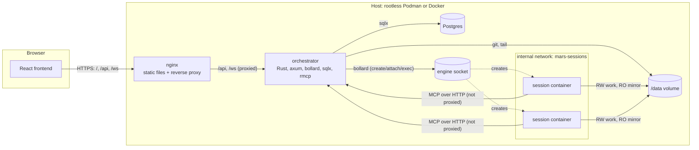
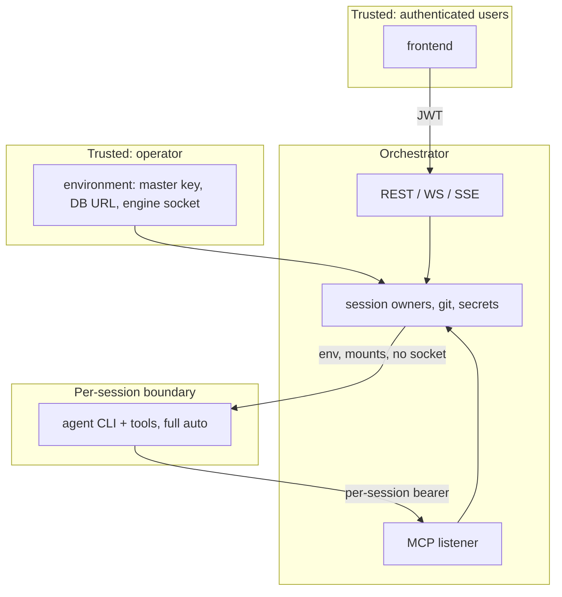
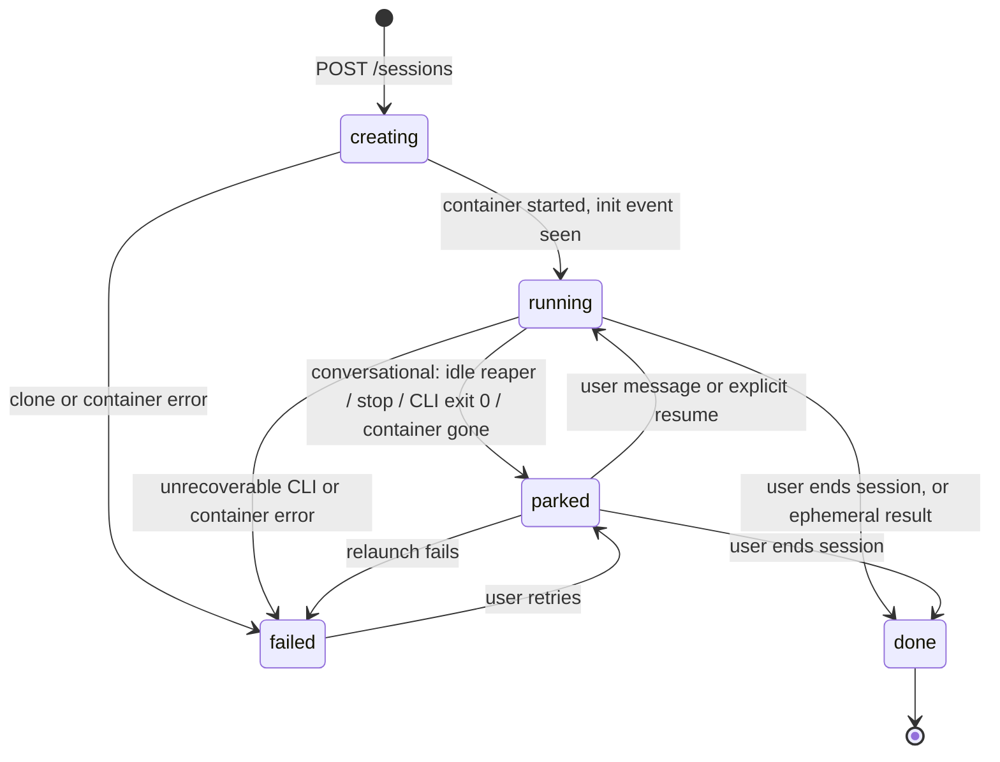
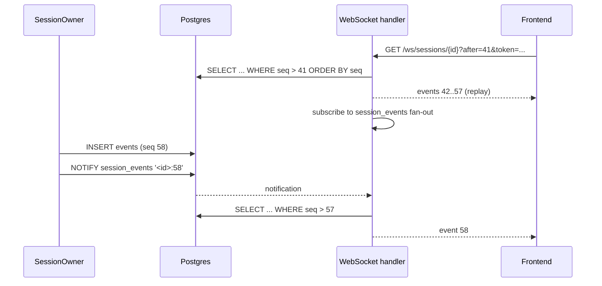
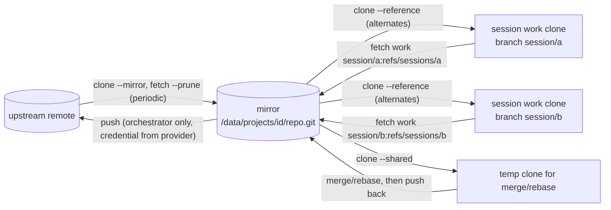
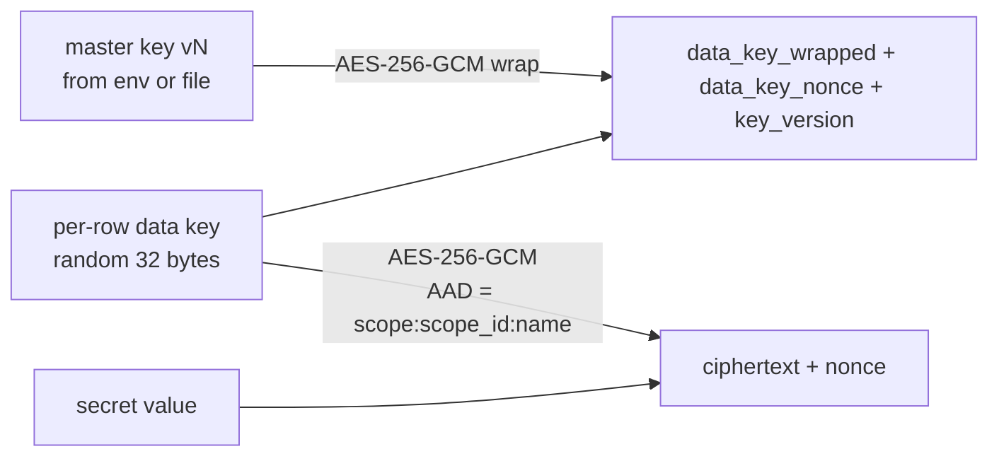

# Architecture

Mars runs coding-agent sessions in isolated containers and exposes them to a browser. This document describes the components, the trust boundaries between them, and the designs that hold the system together: session lifecycle, durability and recovery, the git model, secrets, and the MCP surface. The functional contract (endpoints, schemas, tool signatures) is in `SPEC.md`; the database schema is in `docs/data-model.md`; the reasoning behind the non-obvious choices is in `docs/decisions/`.

## Components

Four kinds of container run under compose. Session containers are not in the compose file; the orchestrator creates them on demand.



| Component | Role | Notes |
| --- | --- | --- |
| orchestrator | The only stateful service. Serves the REST API, WebSocket and SSE endpoints on the API listener, and the MCP endpoint on a separate listener. Owns every session as a long-lived task. Talks to the container engine and runs `git`. | Runs as an unprivileged user. Holds the engine socket. Attached to both networks. |
| postgres | The only system of record. | Version 18. Not reachable from session containers. |
| nginx | Serves the built frontend, proxies `/api` and `/ws` to the orchestrator. | Does not proxy the MCP listener. Configured for WebSocket upgrade and unbuffered SSE. |
| session container | One per session. Runs the agent CLI under an entrypoint that tees its output to the session volume. | Never gets the engine socket. On the internal network only. Unprivileged user. |

### Networks

Two compose networks. `mars-frontend` connects nginx, the orchestrator and Postgres. `mars-sessions` is declared `internal: true` for the routing that compose controls, and connects the orchestrator and every session container. The orchestrator's MCP listener binds on all interfaces but is only reachable through `mars-sessions` because nginx never forwards to it and the host does not publish its port.

Session containers currently have outbound internet through the engine's default masquerading, because the model API and package registries are on the internet. Restricting egress to an allow-list is a hardening step, not a v1 requirement; the network is still `internal` in the sense that nothing on the host or the frontend network can reach a session container, and session containers cannot reach Postgres or nginx.

## Trust boundaries



Three boundaries matter:

1. **User to orchestrator.** Users exist only through invites from an admin (ADR 0013); they authenticate with username and password and receive a short-lived JWT access token plus an HTTP-only refresh cookie (see `SPEC.md`, "Authentication"). Every user is trusted with every project; the `admin` flag exists for inviting and managing users only. Authorisation questions of the form "may this user see this project" do not exist in v1.
2. **Agent to orchestrator.** A session container talks to the orchestrator only through MCP, authenticated by a per-session bearer token generated at session creation. The token identifies the session; from it the orchestrator derives the project, the profile and therefore which tools the agent may call. Agents never self-identify.
3. **Agent to everything else.** The container is the permission boundary (ADR 0012). Inside it the agent runs with the CLI's bypass-permissions mode. It can read and write its session volume, read the project mirror, reach the internet, and call MCP. It cannot reach the engine, Postgres, other sessions or nginx, and it holds no git credentials.

The orchestrator container is the high-value target. It runs as an unprivileged user, its root filesystem is read-only where the engine allows, it contains `git` and nothing else beyond the binary, and the engine socket is the only privileged thing it holds. Under rootless Podman that socket is itself unprivileged on the host.

## Storage

Postgres holds every fact the UI displays. The `/data` volume holds working state that is expensive or impossible to keep in a database. Both must persist across restarts; only Postgres is backed up as a database, `/data` is backed up as files.

```
/data
├── projects/<project_id>/
│   └── repo.git/                 bare mirror of the remote, gc disabled
└── sessions/<session_id>/
    ├── work/                     git clone, mounted RW at /session/work
    ├── home/                     the agent's HOME, mounted RW at /session/home
    │   └── .claude/              CLI config dir, transcripts (CLAUDE_CONFIG_DIR)
    ├── log/
    │   └── stream.jsonl          native CLI output, tee'd by the entrypoint
    └── mcp.json                  CLI MCP config with the session's bearer token
```

`/data` is mounted at `/data` in the orchestrator container and, for the parts a session needs, at the same absolute path in session containers. The orchestrator additionally needs to know the host path of the volume (`DATA_DIR_HOST`) because bind-mount sources given to the engine are host paths. `git clone --reference` records the mirror's absolute path in the session clone's alternates file, which is why the mirror must be mounted at the same path in the session container as the orchestrator sees it (ADR 0001).

Deleting a session removes its directory; deleting a project removes the mirror after all of its sessions are gone.

## Orchestrator internals

The crate layout follows a module-per-concern shape with a shared prelude and repositories for all database access. Names below are binding for the implementation tasks.

```
orchestrator/
├── migrations/                sqlx migrations (.up.sql / .down.sql)
├── src/
│   ├── main.rs                config, pool, migrations, listeners, recovery, spawn services
│   ├── lib.rs
│   ├── prelude/               AppState, Config, Claims, Error, Result
│   ├── models/                domain types + validation (User, Project, Session, Task, Secret, ...)
│   ├── repositories/          all SQL; one struct per aggregate, borrows the pool
│   ├── routes/                axum routers, one module per resource, nested under /api
│   ├── ws/                    session WebSocket handler
│   ├── sse/                   task event stream
│   ├── mcp/                   rmcp server, tool handlers, bearer auth
│   ├── engine/                ContainerEngine trait + bollard implementation + mock
│   ├── agent/                 AgentBackend trait, claude/ adapter, event translation
│   ├── session/               SessionOwner task, launcher, idle reaper, recovery
│   ├── git/                   git binary wrapper, mirror + session clone ops, GitCredentialProvider
│   ├── secrets/               envelope crypto, resolution, injection
│   ├── events/                AgentEvent / TaskEvent types, notify fan-out
│   ├── email/                 EmailClient trait, Resend implementation, log fallback, mock
│   └── cron/                  periodic jobs: mirror fetch, lease reaper, token cleanup
└── tests/                     integration tests (TestApp with testcontainers Postgres)
```

`AppState` is cloned into every handler and holds: `Arc<Config>`, the `PgPool`, `Arc<dyn ContainerEngine>`, `Arc<dyn EmailClient>`, `Arc<dyn GitCredentialProvider>`, the `SecretsKeyring`, the `SessionRegistry` (handles to running session owner tasks), and the broadcast senders for event fan-out. Every `Arc<dyn Trait>` has a mock behind the `integration-tests` feature so the whole API can be tested without an engine, a mail provider or GitHub.

### Session owner task

Each session in state `running` is owned by exactly one tokio task, the `SessionOwner`. It is the only writer of that session's `events` rows and the only writer to the CLI's stdin. Its loop:

1. Tail `log/stream.jsonl` from the recorded offset; for every complete line, translate it through the backend adapter into zero or more `AgentEvent`s, append each to `events` with the next `seq` and the line's end offset, then `NOTIFY session_events`.
2. Receive input messages from the `SessionRegistry` channel (user messages, answers, stop requests), serialise them and write them to the container's attached stdin. Inputs are recorded as `user_message` events before being written, so history shows them even if the write fails.
3. Watch the container: on exit, emit a `state_change` event and transition the session to `parked` (clean exit or SIGINT-stopped) or `failed` (non-zero exit outside a stop request; see "Session lifecycle" for the exact rule).
4. Track `last_activity_at`; the idle reaper (a cron job, not the owner) parks sessions idle longer than the profile's `idle_timeout_secs`.

The owner never holds an in-memory event counter. `seq` is derived in the insert statement; a duplicate-key error means another writer exists, which is a bug that the owner surfaces by failing the session rather than by retrying silently.

## Session lifecycle



| State | Meaning | Container | Accepts input |
| --- | --- | --- | --- |
| `creating` | Session row exists; clone and container creation in progress. | being created | queued |
| `running` | CLI process alive; `SessionOwner` attached. | running | yes |
| `parked` | No process. Resumable with `--resume` at any time. Default rest state of a conversational session. | removed | yes, triggers relaunch |
| `done` | Ended by a user or policy, or an ephemeral session whose `result` arrived. Not resumable through the UI; branch remains in the mirror. | removed | no |
| `failed` | Last launch or run failed; `sessions.error` says why. A retry moves it to `parked` then relaunches. | removed | retry only |

Inputs arriving while `creating` or `parked` are queued in the registry and delivered once the CLI has emitted its init event, so from the frontend's point of view a session always accepts messages.

### Launch sequence

The same sequence runs for a fresh launch and a resume; the differences are marked.

```mermaid
sequenceDiagram
    participant U as User / UI
    participant API as REST API
    participant SO as SessionOwner
    participant G as git
    participant SEC as secrets
    participant E as engine
    participant C as session container

    U->>API: POST /projects/{id}/sessions {profile_id, base_ref, message?}
    API->>API: insert session (creating), generate MCP token, write mcp.json
    API-->>U: 201 {session}
    API->>SO: spawn owner
    SO->>G: clone --reference mirror --branch base_ref work; checkout -b session/<id>  (fresh only)
    SO->>SEC: resolve profile.secrets for (global, project, user)
    SEC-->>SO: env map (orchestrator-only excluded); secret_uses rows written
    SO->>E: create container (image, mounts, env, labels, network, runtime)
    SO->>E: start; attach stdin
    E->>C: entrypoint runs CLI | tee log/stream.jsonl
    SO->>SO: tail stream.jsonl from offset 0 (fresh) or last offset (resume)
    C-->>SO: system/init {session_id}
    SO->>API: state running, cli_session_id stored
    SO->>C: flush queued inputs on stdin
```

The profile's system prompt is passed on every launch with `--append-system-prompt`; the CLI does not persist it across resumes. The MCP config is passed explicitly with `--mcp-config /session/mcp.json` on every launch.

### Stop semantics

A stop request from the UI sends `SIGINT` to the CLI process (through `docker kill --signal`), which ends the current turn cleanly and lets the CLI write its `result`. If the process has not exited after the grace period (`STOP_GRACE_SECS`, default 20) the owner sends `SIGTERM`, which the CLI treats as a hard stop (exit 143, turn unfinished). Either way the session becomes `parked`. The owner records which signal ended the run in the `state_change` event so the UI can say "stopped" versus "killed".

Ending a session (`done`) is the same stop followed by a final fetch of the session branch into the mirror and removal of the container. The session directory is kept until the session is deleted.

## Agent process model

Everything below is written for Claude Code, the only backend in v1 (the process model itself is ADR 0003; the translation into one event schema is ADR 0008). A second backend is a second implementation of the same `AgentBackend` trait and a new `agent_backend` enum value; GitHub Copilot CLI is the candidate on the roadmap in `README.md`.

The `AgentBackend` trait has three responsibilities: build the launch command for a fresh or resumed session from a profile, translate one native output line into `AgentEvent`s, and serialise an input message into the CLI's stdin format.

```rust
pub trait AgentBackend: Send + Sync {
    fn launch_command(&self, ctx: &LaunchContext) -> Command;      // fresh or resume
    fn translate(&self, line: &str, state: &mut TranslateState) -> Vec<AgentEvent>;
    fn encode_input(&self, input: &SessionInput) -> Result<String>; // one line, newline-terminated
}
```

### Claude Code invocation

Conversational sessions run one long-lived process:

```
claude \
  --output-format stream-json --input-format stream-json --verbose \
  [--include-partial-messages] \
  --permission-mode bypassPermissions --permission-prompts none \
  --mcp-config /session/mcp.json \
  [--model <profile.model>] \
  [--append-system-prompt <profile.system_prompt>] \
  [--resume <cli_session_id>]
```

Ephemeral sessions run `claude -p "<prompt>"` with the same output, permission, MCP and prompt flags. When `result` arrives the owner runs the fetch-back, stops the container and marks the session `done`; an ephemeral session is never parked and never resumed. Follow-up work is a new session (which can start from the finished session's branch as `base_ref`).

`--include-partial-messages` is added when the profile's `partial_messages` flag is set. The flag defaults to true for conversational profiles and false for ephemeral ones: unattended agents do not need it, and whole-message granularity produces fewer rows.

`--bare` is not used in v1. Verified against the CLI documentation: bare mode never reads OAuth credentials, so `CLAUDE_CODE_OAUTH_TOKEN` does not work with it, and it also skips the repository's `CLAUDE.md`, `.mcp.json`, hooks, skills and plugins. Non-bare mode gives the desired split of responsibilities: the repository owns "how we work here" through its `CLAUDE.md` and `.mcp.json`, the profile owns "what this agent's job is" through its system prompt. The cost is that a non-bare `-p` session connects every server in the repository's `.mcp.json` without a trust prompt, which is acceptable because the container is the boundary. A per-profile `--bare` option for API-key-backed sessions was considered and left out of v1; it is one column if a need appears. Whether the pinned CLI version supports `--strict-mcp-config` (load only `--mcp-config` servers) is checked during the adapter task and adopted if present.

The CLI's state directory is relocated onto the session volume with `CLAUDE_CONFIG_DIR=/session/home/.claude` so that transcripts survive container replacement and `--resume <cli_session_id>` finds them. `cli_session_id` is taken from the `session_id` field of the `system`/`init` event. Should the id ever fail to resume, the transcript file path (`/session/home/.claude/projects/<encoded cwd>/<id>.jsonl`) can be passed to `--resume` instead; the owner tries the id first.

Credentials: `ANTHROPIC_API_KEY` or `CLAUDE_CODE_OAUTH_TOKEN` is injected like any other secret the profile declares. The launcher refuses to start a session whose resolved environment contains both, because the CLI's precedence rules would silently pick the API key. Token lifetime is not managed: when the CLI fails to authenticate, the translator emits an `error` event with `fatal: true` that names the secret that was injected (`ANTHROPIC_API_KEY` or `CLAUDE_CODE_OAUTH_TOKEN`) and its scope, the session is parked, and the user replaces the secret and sends the next message.

Permissions are full auto: `--permission-mode bypassPermissions` plus `--permission-prompts none` so nothing ever waits for an answer. Denials (from tool allow-lists in the repository's settings, or from the CLI's own safety rules) arrive as `permission_denied` system messages and are listed in `result.permission_denials`; both are translated to `permission_denied` events.

Subagent messages carry `parent_tool_use_id`. The translator keeps it on every event it emits so the frontend can nest a subagent's transcript under the tool call that started it.

### Input encoding

User messages are written to stdin as one JSON line each. The shape used is the SDK user-message shape:

```json
{"type":"user","message":{"role":"user","content":[{"type":"text","text":"..."}]}}
```

This shape is not spelled out in the CLI reference documentation; it is the shape the Agent SDK uses over the same protocol. The first integration test of the Claude adapter is therefore a live probe against the pinned CLI version: it launches the CLI, writes a message in this shape, and fails if the CLI rejects it. The same probe records whether a second message written mid-turn interrupts or queues, and whether the `prompt` event kind ever occurs under `--permission-prompts none`; the observed behaviour is written back into this section. The owner records every message immediately as a `user_message` event either way.

### Session image

Session images are built from `images/claude/Dockerfile`; v1 ships that one image and profiles reference images by name. Per-project toolchains are a later extension (a setup script run by the entrypoint before the CLI). The contract every session image must honour:

- an unprivileged user `agent` (uid 1000) with `HOME=/session/home`; the CLI always runs as this user, never as root, which also sidesteps any restriction the CLI may place on bypass-permissions mode under root;
- the CLI on `PATH`, pinned to a version recorded in the image tag;
- `git`, `tee`, and whatever toolchain the project needs (profiles choose images, so a project can build its own on top of the base);
- the entrypoint `/usr/local/bin/mars-entrypoint`, which `cd`s to `/session/work`, sets up the environment, and `exec`s the command given by the orchestrator with stdout piped through `tee -a /session/log/stream.jsonl` and stderr appended to `/session/log/stderr.log`.

The entrypoint is the place where the tmpfs-file-plus-export-and-unset secrets pattern goes when it is adopted (see "Secrets", "Injection").

## Durability and recovery

The transcript file on the session volume is the source of truth for what the CLI said; the `events` table is the source of truth for what the UI shows; the attach stream is only a pipe for stdin (ADR 0010).

Every `events` row stores, inside its payload under `_offset`, the byte offset just past the native line that produced it. The owner reads the file from the last committed offset, so after any interruption it resumes exactly where the database says it stopped. Because a native line may produce several events, the offset is only advanced on the last event of a line, and all events of a line are inserted in one transaction.

### Restart procedure

On start the orchestrator:

1. Runs migrations.
2. Lists containers with the label `mars.session_id` through the engine. For each one whose session row is `running`, it re-creates a `SessionOwner`, reattaches stdin, and resumes tailing from `MAX(_offset)` of that session's events. If the container is gone, the session is marked `parked` with a `state_change` event saying so.
3. Marks every session in `creating` as `failed` with reason `orchestrator restarted during creation`; the user can retry.
4. Starts the cron jobs (mirror fetch, lease reaper, token cleanup, idle reaper).

Because parked sessions need nothing running, a restart with a hundred parked sessions and two running ones costs two reattaches.

### Event delivery



The handler subscribes before it replays, so a row committed during the replay is either included in the replay or triggers a read afterwards; the client dedupes on `seq`. Older history (before `after`) is fetched over paginated REST with `seq` as the cursor. A periodic safety read (every 30 seconds) covers a lost notification. The same pattern, keyed by project, serves `TaskEvent`s over SSE with `Last-Event-ID` as the cursor.

Input is single-writer: the WebSocket handler forwards inputs to the session's owner through the registry, which serialises them. An answer to a prompt event carries `reply_to: <seq>`; if the owner has already consumed that prompt (any later input was accepted, or the turn ended) the answer is rejected with an `input_rejected` message on the socket rather than being written to the CLI.

## Git model

Worktrees are not used (ADR 0001). All git operations shell out to the `git` binary (ADR 0011). No session container ever holds a credential or pushes (ADR 0007).



**Project clone.** `git clone --mirror <remote_url> /data/projects/<id>/repo.git` as a background job. Immediately after, the mirror gets `gc.auto=0`, `gc.pruneExpire=never`, and its fetch refspec is narrowed to `+refs/heads/*:refs/heads/*` and `+refs/tags/*:refs/tags/*` so that `refs/sessions/*` survives `fetch --prune`. The `default_branch` is read from the mirror's `HEAD`. A cron job runs `git fetch --prune` on every ready mirror every `MIRROR_FETCH_INTERVAL` (default 10 minutes) and updates `last_fetched_at`.

**Session clone.** `git clone --reference /data/projects/<pid>/repo.git --branch <base_ref> /data/projects/<pid>/repo.git /data/sessions/<sid>/work` when `base_ref` is a branch or tag; for a commit id the clone uses the default branch and then checks out the commit. Then `git checkout -b session/<sid>`. The clone's `user.name`/`user.email` are set to the launching user's name and email so commits are attributed. The work directory is mounted RW at `/session/work`; the mirror is mounted RO at its own path so the alternates file resolves.

**Fetch-back.** On session end, on an explicit "sync" from the UI, and before any `merge`, `rebase` or `push` involving the session, the orchestrator runs `git -C <mirror> fetch /data/sessions/<sid>/work session/<sid>:refs/sessions/<sid>` (force). Nothing in the container triggers this; the agent just commits.

**Merge, rebase, push.** These never operate on the mirror directly, because a bare mirror has no work tree and a failed merge must not leave state behind. The orchestrator creates a temporary clone of the mirror (`git clone --shared`) in `/data/tmp/`, performs the operation there, and on success pushes the resulting refs back into the mirror and, for `push`, from the mirror to upstream. Conflicts abort the operation, delete the temp clone, and return the list of conflicting paths to the caller. After a successful `rebase` of a session branch, the orchestrator also updates the session's work clone (`git fetch mirror refs/sessions/<sid>` followed by `git reset --hard` only if the work tree is clean, otherwise the session is told to reconcile through a `user_message` event).

**Commit identity.** Commits made inside a session carry the launching user's name and email. Commits the orchestrator creates (merge commits) carry the bot identity from `GIT_BOT_NAME` and `GIT_BOT_EMAIL`, obtained through `GitCredentialProvider::commit_identity`, with a `Requested-By: user:<id>` or `Requested-By: session:<id>` trailer naming who asked. A future GitHub App provider substitutes the app's bot identity without touching callers.

**Credentials.** Every command that touches upstream gets its credential from `GitCredentialProvider` (ADR 0002) and passes it as `-c http.extraHeader=Authorization: Basic <base64(x-access-token:PAT)>` on the child process only. The remote URL stored in `projects.remote_url` never contains a credential, and the token never appears in argv (`-c` values are visible in `ps`; the wrapper therefore writes the header into a temporary config file passed through `GIT_CONFIG_GLOBAL` with `0600` permissions, deleted after the command). Only the orchestrator ever runs these commands.

## Secrets

Envelope encryption in the orchestrator (ADR 0006). The API is write-only; no endpoint returns a value.



**Keyring.** `SECRETS_MASTER_KEYS` holds one or more `<version>=<base64 32 bytes>` entries; the highest version is used for new rows. Alternatively `SECRETS_MASTER_KEY_FILE` points at a file with the same content. At start the keyring verifies it can unwrap one row per `key_version` present in the table and refuses to start otherwise, because a missing key version would only be discovered at session launch.

**Rotation.** Add the new version, restart, and run `mars-orchestrator rotate-secrets` (a subcommand of the same binary) or wait for the cron job: it selects rows with `key_version < newest` in batches of 100, unwraps and re-wraps each data key under the newest master key, and updates `data_key_wrapped`, `data_key_nonce`, `key_version` in one statement per row. Ciphertexts are untouched. Once no row references the old version, it can be removed from the environment.

**Resolution at launch.** For each name in the profile's `secrets` list, the resolver looks up rows in order `global`, `project(session.project_id)`, `user(session.created_by)`; the last one found wins. If the winning row has `orchestrator_only = true`, the name is not injected at all; a lower-precedence non-orchestrator-only row does not leak through, and the launch log records the skip. Names with no row at any scope are reported as a `launch_warning` event and the launch proceeds. A `secret_uses` row is written per injected secret.

**Injection.** v1 injects secrets as container environment variables, which the engine stores in the container's config and which `docker inspect` can show to anyone with the engine socket (only the orchestrator has it). The hardening step, documented here so the entrypoint contract already leaves room for it, is: mount a tmpfs at `/run/secrets`, have the orchestrator write one file per secret through `docker cp` or an exec before starting the CLI, and have the entrypoint `export` each file's content into the environment and then `unset`-proof it by deleting the files, so the values exist only in the CLI process's environment and never in the container config.

**Never logged.** Secret values are `zeroize`d after use, are never part of any event payload, and tracing spans carry names only.

## MCP design

The orchestrator serves MCP with `rmcp` over Streamable HTTP on its own listener (`MCP_PORT`, default 7001) so that nginx cannot accidentally expose it and so that a firewall rule can later restrict it to the sessions network. The path is `/mcp`.

**Authentication.** Every request carries `Authorization: Bearer <session token>`. The middleware hashes the token, looks up `sessions.mcp_token_hash`, and rejects with 401 if missing, or with 403 if the session is `done` or `failed`. The resolved `SessionContext { session_id, project_id, profile }` is attached to the request; tool handlers never take a session id as an argument.

**Tool exposure.** The `tools/list` response for a session contains the task-tracker tools always, and the git tools only if named in the profile's `mcp_tools`. A call to an unlisted tool returns an MCP error, not a silent no-op. Tool descriptions are short and opinionated; the exact text is in `SPEC.md`, "MCP tool contracts".

**Side effects.** Every tool call is written as a `task_events` row (for tracker tools) or a session `tool_call`-style audit event (for git tools) before the response is returned, attributed to the session. The `task_sessions` link table is upserted on every tracker mutation.

**Per-session config file.** `/data/sessions/<sid>/mcp.json`:

```json
{
  "mcpServers": {
    "mars-orchestrator": {
      "type": "http",
      "url": "http://orchestrator:7001/mcp",
      "headers": { "Authorization": "Bearer <token>" }
    }
  }
}
```

The server is named `mars-orchestrator` rather than `mars` to reduce the chance of a repository's own `.mcp.json` shadowing it; the launcher emits a `launch_warning` if the `init` event does not list it as connected. The hostname `orchestrator` resolves on the sessions network. The file is regenerated on every launch from the stored hash only if the token is rotated; otherwise it is left as written at creation.

## Engine adapter

`ContainerEngine` is a trait with one production implementation on `bollard` and one mock. The production implementation is engine-agnostic by construction: it uses only endpoints and `HostConfig` fields that both Docker and Podman's compatible API implement (ADR 0004).

| Operation | Docker | Podman compat API | Notes |
| --- | --- | --- | --- |
| create / start / stop / kill / remove | yes | yes | `kill` with a named signal is used for SIGINT/SIGTERM. |
| attach (stdin, TTY off) | yes | yes | Used for stdin only. |
| exec + resize (TTY on) | yes | yes | Used by the optional terminal view. |
| list with label filter | yes | yes | Recovery lists `mars.session_id`. |
| bind mounts (`Binds`) | yes | yes | Sources are host paths (`DATA_DIR_HOST`). |
| `NetworkMode` = named network | yes | yes | |
| `Runtime` (`runsc`, `kata`) | yes | yes if configured in `containers.conf` | |
| `UsernsMode: keep-id` | ignored | required | Set when `/version` reports Podman. Verified at startup (see below); the orchestrator refuses to run on a Podman that does not honour it. |
| memory / cpu limits | yes | yes (cgroup v2 required for rootless) | Kept to `Memory`, `NanoCpus`. |
| `SecurityOpt`, `CapDrop` | yes | mostly | Only `no-new-privileges` and `CapDrop: ALL` are used. |
| `ReadonlyRootfs` | yes | yes | Session images that need a writable root use tmpfs mounts instead. |

Anything outside this table is not used without being verified on both engines first, and the verification is recorded in this table.

**Startup probe.** Before adopting any session, the orchestrator runs a short-lived probe container from the default session image with the same `HostConfig` a session would get, which writes a file into `/data/tmp/probe-<random>/`. The orchestrator checks that the file is owned by its own uid and is writable, then removes the directory. On Podman this proves `keep-id` is honoured; on Docker it proves the bind mount and uid layout are sane. A failed probe is a fatal startup error with the reason in the log, because every session would otherwise fail later in less obvious ways.

Container labels: `mars.session_id`, `mars.project_id`, `mars.profile_id`. Container name: `mars-session-<sid>`.

## Frontend architecture

The frontend is a Vite-built React 19 + TypeScript application served by nginx. It talks to `/api` with TanStack Query for everything request-shaped, holds per-session transcript state in a reducer fed by the session WebSocket, and holds the task board in a reducer fed by the project SSE stream. The raw event list is never kept in state; events are folded as they arrive into `messages` (map plus order), `pendingTools`, and `status`. Component structure and state shapes are in `SPEC.md`, "Frontend".

nginx configuration requirements:

- `location /api/` proxies to the orchestrator API listener with `proxy_http_version 1.1`;
- `location /ws/` additionally passes `Upgrade` and `Connection` headers and sets `proxy_read_timeout` to at least 1 hour; the orchestrator sends WebSocket pings every 30 seconds;
- `location /api/projects/` paths ending in `/tasks/stream` set `proxy_buffering off`, `proxy_cache off`, and `Connection ''`;
- both of those locations use a log format without `$request` or `$args` (or `access_log off`), because they receive the access token as a query parameter;
- everything else serves `index.html` for client-side routing.

## Background jobs

One cron service with independent intervals, mirroring the reference layout of a single `CronService` with named jobs:

| Job | Interval | Work |
| --- | --- | --- |
| mirror fetch | 10 min | `git fetch --prune` on every `ready` mirror. |
| lease reaper | 1 min | Release expired task leases; emit `TaskEvent`. |
| idle reaper | 1 min | Park `running` sessions idle beyond their profile's timeout. |
| token cleanup | 1 h | Delete expired refresh tokens, reset tokens and unaccepted invites. |
| secret rotation | 1 h | Re-wrap rows whose `key_version` is behind the newest key, if any. |
| orphan cleanup | 1 h | Remove containers labelled `mars.session_id` whose session is `done`/`failed`/missing; delete `/data/tmp` leftovers. |

Every job logs its outcome and never panics the process; a failing job is retried at its next interval.
