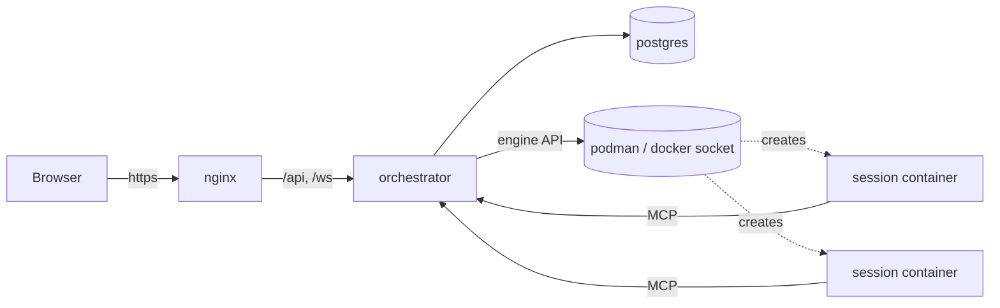

# Mars

Mars is a self-hosted web application that runs coding-agent sessions in isolated containers and shows them in a browser. Each session is one agent (Claude Code in v1; the backend is pluggable) working on its own clone of a git repository. Sessions are autonomous: they keep running when nobody is connected, and whoever connects later sees the full history. Agents coordinate through a shared task tracker that the orchestrator exposes to them over MCP, and the same tracker is visible and editable in the web UI.

Nothing in this repository is implemented yet. The documents describe the system to be built:

| Document | What it covers |
| --- | --- |
| [ARCHITECTURE.md](ARCHITECTURE.md) | Components, trust boundaries, session lifecycle, durability and recovery, git model, secrets, MCP, engine adapter. |
| [SPEC.md](SPEC.md) | v1 functional spec: features, REST/WebSocket/SSE endpoints, `AgentEvent` and `TaskEvent` schemas, MCP tool contracts, frontend structure, non-goals. |
| [docs/data-model.md](docs/data-model.md) | Every table, column, constraint, index and enum. |
| [docs/decisions/](docs/decisions/README.md) | Architecture decision records. |
| [docs/open-questions.md](docs/open-questions.md) | What is undecided, with options and recommendations. |
| [CLAUDE.md](CLAUDE.md) | Working conventions for agents (and humans) contributing to this repository. |

## Why

Running an agent on a laptop ties it to a terminal, a person, and a machine. Running many agents that way does not scale past one person's attention. Mars moves the agent into a container that outlives any browser tab, gives it a branch of its own, and gives a team one place to see what every agent is doing, steer it, and hand work between agents and people through a tracker that both sides use.

The design rests on a few commitments:

- **The container is the permission boundary.** Users are authenticated and trusted; agents run with full auto-permissions inside a container that has its own clone, no git credentials, no engine socket, and an internal network.
- **Every effect outside the container is audited.** Pushes, merges and task changes go through the orchestrator, attributed to a session or a user.
- **Nothing is lost when nobody is watching.** The agent's output is written to disk in the container and folded into an append-only event log in Postgres; the UI is a subscriber, never the owner of state.
- **One event schema.** The frontend never sees a CLI's native output; each backend is translated into the same `AgentEvent` stream.

## Deployment shape

Four kinds of container run under compose on one host:



- **orchestrator**: Rust (`axum`, `bollard`, `sqlx`, `rmcp`). Serves the API, owns every session, holds the engine socket, runs `git`. Unprivileged user.
- **postgres**: the only system of record.
- **nginx**: serves the built React frontend and proxies `/api` and `/ws`. The MCP endpoint is not proxied.
- **session containers**: one per session, created by the orchestrator, on an internal network, never given the engine socket.

Rootless Podman is the target engine, reached through its Docker-compatible socket. Docker works with a different `DOCKER_HOST`.

## Running it

These are the intended steps once the implementation exists.

### Prerequisites

- A Linux host with rootless Podman 5+ (or Docker 24+).
- `podman-compose` or `docker compose`.
- A directory for persistent data, for example `/srv/mars/data`, owned by the service user.
- For private repositories: a fine-grained GitHub personal access token scoped to the repository.
- Model credentials: an `ANTHROPIC_API_KEY`, or a `CLAUDE_CODE_OAUTH_TOKEN` from `claude setup-token` (requires a Pro or Max subscription). Never both for the same session.

### Podman setup (once, as the service user)

```bash
# Let the user's services run without an active login session
sudo loginctl enable-linger "$USER"

# Start the Docker-compatible API socket with socket activation
systemctl --user enable --now podman.socket

# The socket the orchestrator will use
echo "unix://$XDG_RUNTIME_DIR/podman/podman.sock"
```

The compose file runs the orchestrator with `userns_mode: keep-id` and mounts that socket, so the orchestrator's uid inside the container matches the service user on the host. Session containers also run with `keep-id`; the orchestrator verifies this at startup with a probe container and refuses to start if Podman does not honour it. If `keep-id` is unavailable on your host, the fallback is to run the orchestrator binary as a plain user systemd service instead of a container.

For Docker, use the daemon's socket (`unix:///var/run/docker.sock`) and a user in the `docker` group. Nothing else changes.

### Configuration

Copy `.env.example` to `.env` and set:

| Variable | Meaning |
| --- | --- |
| `PUBLIC_URL` | The URL users open, used for cookies and email links. |
| `JWT_SECRET` | Secret for signing access tokens. |
| `DATABASE_URL` | Postgres connection string (compose sets it for the orchestrator). |
| `POSTGRES_USER`, `POSTGRES_PASSWORD`, `POSTGRES_DB` | Database bootstrap. |
| `DOCKER_HOST` | Engine socket, `unix:///run/user/1000/podman/podman.sock` for rootless Podman. |
| `DATA_DIR_HOST` | Host path of the data directory; mounted at `/data` in the orchestrator and used as the source of session bind mounts. |
| `SECRETS_MASTER_KEYS` | One or more `<version>=<base64 32-byte key>` entries, comma separated. Or `SECRETS_MASTER_KEY_FILE`. Back this up separately from the database; without it every stored secret is unrecoverable. |
| `GIT_BOT_NAME`, `GIT_BOT_EMAIL` | Identity for commits the orchestrator creates (merges). |
| `API_PORT` | Port of the API listener nginx proxies to (default 7000). |
| `MCP_PORT` | Port of the MCP listener on the sessions network (default 7001). |
| `STOP_GRACE_SECS` | Seconds between SIGINT and SIGTERM when stopping a session (default 20). |
| `MIRROR_FETCH_INTERVAL_SECS` | How often project mirrors are fetched (default 600). |
| `SESSION_IMAGE_DEFAULT` | Image used by the default profile of new projects. |
| `RESEND_API_KEY`, `MAIL_FROM` | Email delivery through Resend, used for invites and password resets. Without an API key the links are written to the orchestrator log instead of sent. |
| `RUST_LOG` | Log filter, `info` by default. |

Generate a master key with `openssl rand -base64 32`.

### Start

```bash
podman-compose up -d        # or: docker compose up -d
```

The orchestrator applies database migrations on startup; the first migration seeds an administrator:

| Username | Password |
| --- | --- |
| `admin` | `changeme` |

Open `PUBLIC_URL`, log in as `admin`, and you are required to set a new password before anything else works. Then invite your team from the admin page (each invite is a 7-day link sent by email), create a project from a remote URL, and launch a session from its default profile. There is no self-registration.

### Operating notes

- Session working copies, project mirrors and transcripts live under `DATA_DIR_HOST`. Back it up with the database.
- Rotating the secrets master key: add a new `<version>=<key>` entry with a higher version, restart, and let the rotation job re-wrap existing rows; remove the old entry once `GET /api/secrets` shows no row on the old version.
- Restarting the orchestrator does not stop sessions: running containers are re-adopted and their transcripts resumed from the last committed offset.
- Removing a project removes its mirror and every session directory under it.

## Development

The intended layout:

```
mars/
├── orchestrator/    Rust crate (axum API, MCP server, session owners)
├── frontend/        Vite + React + TypeScript
├── images/          session container images (claude/)
├── nginx/           nginx.conf and Dockerfile for the frontend image
├── docs/            data model, decisions, open questions
├── compose.yml
└── .env.example
```

Local development runs Postgres in a container, the orchestrator with `cargo run` against the host's Podman socket, and the frontend with `npm run dev` proxying `/api` and `/ws` to the orchestrator. See `CLAUDE.md` for the exact commands, toolchain and test expectations.

## Roadmap after v1

Multiple role profiles per project (implementer, reviewer, QA, merge); ephemeral agents spawned by policy when tasks become ready; GitHub App credentials and webhooks; egress restriction for session containers; sandboxed runtimes (gVisor, Kata) per profile; per-project toolchain setup scripts for session images; a second agent backend (GitHub Copilot CLI is the candidate, pending a spike to learn its structured output, stdin protocol and container authentication).

## License

MIT.
