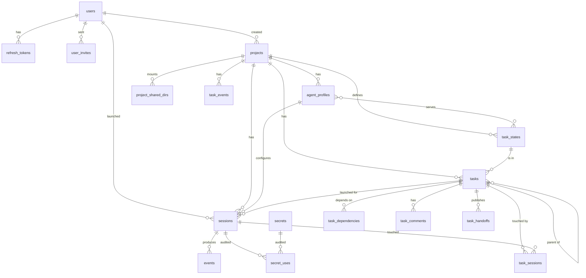

# Data model

This document is the authoritative description of the Postgres schema. Every table, column, constraint and index that the orchestrator relies on is listed here. Migrations in `orchestrator/migrations/` must match this document; a change to one is a change to both (see `CLAUDE.md`, "Documentation is part of the change").

Conventions used throughout:

- Primary keys are `UUID`, generated by the application (v4) so that a row's id is known before it is inserted.
- All timestamps are `TIMESTAMPTZ`. Columns named `*_at` are timestamps; `created_at` defaults to `NOW()`.
- Enumerations are Postgres `ENUM` types. Adding a value is a migration (`ALTER TYPE ... ADD VALUE`); values are never removed or renamed.
- Foreign keys declare their `ON DELETE` behaviour explicitly.
- Postgres 18 is assumed. `UNIQUE NULLS NOT DISTINCT` (Postgres 15+) is used where a nullable column takes part in a uniqueness rule.
- Managed credential values are encrypted in the `secrets` table and are not copied by credential handling into diagnostics or generated event metadata. Agent/tool output and user-provided content are stored without automatic secret redaction in v1, so event payloads may contain plaintext credentials (ADR 0027).

Postgres is the only system of record. The orchestrator also owns a filesystem volume (`/data`) holding git mirrors, session working copies and transcript logs; that volume is durable working storage, not a database, and everything the UI shows is reconstructible from Postgres plus that volume. See `ARCHITECTURE.md`, "Storage".

## Entity overview



## Enums

| Type | Values | Notes |
| --- | --- | --- |
| `project_status` | `cloning`, `ready`, `error` | `cloning` is set at creation; the clone job moves it to `ready` or `error`. |
| `profile_kind` | `conversational`, `ephemeral` | `conversational` sessions take input over stdin and are parked and resumed; `ephemeral` sessions run one prompt and end. Users launch both, and the dispatcher launches `ephemeral` ones unattended — `auto_launch` on `agent_profiles` is refused on the other kind (`ARCHITECTURE.md`, "Dispatcher"; ADR 0042). |
| `agent_backend` | `claude` | Which CLI adapter drives sessions of this profile. A second backend is added as a new value by migration. |
| `session_launch_source` | `user`, `dispatcher`, `schedule` | Who launched a session. `user` is every launch a person makes and is the column default, so every row written before the column existed is one. Never updated after insert: a retry or a resume keeps it (`ARCHITECTURE.md`, "Task tracker" → "Unattended launches"; ADR 0042). |
| `session_state` | `creating`, `running`, `parked`, `done`, `failed` | State machine in `ARCHITECTURE.md`, "Session lifecycle". Only conversational sessions use `parked`; an ephemeral session goes to `done` when its result arrives. |
| `task_state_kind` | `queue`, `human`, `terminal` | What a project-defined task state means to the orchestrator; see `task_states`. The states themselves are rows, not enum values. |
| `task_dependency_kind` | `blocks`, `discovered_from`, `related` | Only `blocks` affects whether a task is claimable; see `task_dependencies`. |
| `secret_scope` | `global`, `user`, `project` | Resolution order at session start is global, then project, then launching user. |

Event kinds (`events.kind`, `task_events.kind`) are deliberately `TEXT`, not enums: the set of kinds is owned by the Rust types in `orchestrator/src/events/` and adding a kind must not require a migration.

## Users and authentication

### `users`

There is no self-registration. The `users` migration seeds one administrator (`username = 'admin'`, a fixed default password documented in `README.md`, `must_change_password = TRUE`); every other user is created by accepting an invite (see `user_invites` and ADR 0013).

| Column | Type | Constraints | Notes |
| --- | --- | --- | --- |
| `id` | `UUID` | PK | The seeded admin has a fixed id `00000000-0000-0000-0000-000000000001`. |
| `username` | `TEXT` | NOT NULL, UNIQUE | 3–32 chars, validated in the model. |
| `email` | `TEXT` | NOT NULL, UNIQUE | Stored lower-cased and trimmed, at most 254 characters (the RFC 5321 maximum), validated in the model. Comes from the invite, so it is known to be deliverable. The seeded admin's is `admin@localhost`. |
| `password_hash` | `TEXT` | NOT NULL | Argon2id PHC string. Never serialised. |
| `auth_version` | `BIGINT` | NOT NULL DEFAULT 0, CHECK (`auth_version >= 0`) | Included in access-token claims; incremented atomically on every password change or reset. Compared with the current user on requests and stream authorization checks. Internal; not part of the `User` DTO. |
| `must_change_password` | `BOOLEAN` | NOT NULL DEFAULT FALSE | While true, every endpoint except login, logout, refresh, `GET /users/me` and the password change returns 403 (`SPEC.md`, "Authentication"). |
| `admin` | `BOOLEAN` | NOT NULL DEFAULT FALSE | Admins invite users and manage them. |
| `notify_email` | `BOOLEAN` | NOT NULL DEFAULT TRUE | Receive escalation emails (`SPEC.md`, "Task board"). |
| `created_at` | `TIMESTAMPTZ` | NOT NULL DEFAULT NOW() | |
| `updated_at` | `TIMESTAMPTZ` | NOT NULL DEFAULT NOW() | Set by the repository on every update. |

User deletion and changes to `users.admin` preserve at least one administrator. Before authoritative reads or writes, these operations acquire the same transaction-scoped database advisory lock for administrator membership; after waiting, re-read the current administrator count and reject a deletion or demotion that would leave none. Hold the lock through commit, and acquire it before any user-row or project locks needed by the operation. A deletion needs both kinds: after the advisory lock it locks the user row `FOR NO KEY UPDATE`, then the project row of every project with a row naming the user (`projects.created_by`, `sessions.created_by`, the task, comment and hand-off user columns) in UUID order with the tracker's own lock, then the user's `sessions` rows in id order, and only then deletes, so that the cascades never wait for a transaction that is waiting for a foreign-key check on the user (`ARCHITECTURE.md`, "Task tracker"; ADR 0041). This is a repository invariant, not a per-row `CHECK`. A failed check rolls back the entire operation. Self-deletion is separately prohibited; self-demotion is allowed if another administrator remains. Validation must cover concurrent demotions and deletion racing with demotion, as well as the single-request cases.

Password changes and resets atomically update `password_hash`, clear `must_change_password`, increment `auth_version`, revoke all of the user's existing refresh tokens and invalidate outstanding reset tokens. Self-service changes also insert a replacement refresh token before commit; reset-link and admin-for-another-user changes issue no replacement. Deleting the user cascades both token tables; access-token validation rejects the now-missing user. Demotion changes authorization through current-user checks without incrementing `auth_version` (ADR 0025).

Login, refresh, reset-link issuance, password changes and reset-token consumption lock the user row before locking or writing that user's token rows. Re-read and validate credentials under that lock. Expensive password hashing may happen beforehand, but an earlier password check must be revalidated against the locked row before issuing credentials. For token-based requests, an initial unlocked lookup may locate the user; re-read and validate the token after locking the user. Thus a refresh either commits before a password change and is revoked by it, or observes revocation and fails. Return credentials only after commit. Ordinary request authorization reads current user state without taking this mutation lock.

### `refresh_tokens`

Opaque refresh tokens, stored hashed. The raw token is two UUIDs joined by `.`; the row stores its SHA-256 hex.

| Column | Type | Constraints |
| --- | --- | --- |
| `id` | `UUID` | PK |
| `user_id` | `UUID` | NOT NULL, FK `users(id)` ON DELETE CASCADE |
| `token_hash` | `TEXT` | NOT NULL, UNIQUE |
| `expires_at` | `TIMESTAMPTZ` | NOT NULL |
| `revoked_at` | `TIMESTAMPTZ` | NULL |
| `created_at` | `TIMESTAMPTZ` | NOT NULL DEFAULT NOW() |

Indexes: `refresh_tokens_user_id_idx (user_id)`, `refresh_tokens_expires_at_idx (expires_at)`.

Validity — `revoked_at IS NULL AND expires_at > NOW()` — is decided by the lookup query, never by a predicate in application code: the refresh path re-reads the token with that clause inside the transaction that holds the user row lock, so the revocation race has one answer and a caller cannot forget to apply it.

### `user_invites`

An admin invites an email address; the invitee follows the emailed link, chooses a username and password, and the user row is created when the invite is accepted. Tokens are single-use and expire after 7 days.

| Column | Type | Constraints | Notes |
| --- | --- | --- | --- |
| `id` | `UUID` | PK | |
| `email` | `TEXT` | NOT NULL | Lower-cased, trimmed and length-limited exactly as `users.email`. At most one open invite per email (partial unique index below). |
| `token_hash` | `TEXT` | NOT NULL, UNIQUE | SHA-256 of the raw token in the link. |
| `admin` | `BOOLEAN` | NOT NULL DEFAULT FALSE | Whether the resulting user is an admin. |
| `invited_by` | `UUID` | NULL, FK `users(id)` ON DELETE SET NULL | |
| `expires_at` | `TIMESTAMPTZ` | NOT NULL | Creation time plus 7 days. |
| `accepted_at` | `TIMESTAMPTZ` | NULL | |
| `accepted_user_id` | `UUID` | NULL, FK `users(id)` ON DELETE SET NULL | |
| `created_at` | `TIMESTAMPTZ` | NOT NULL DEFAULT NOW() | |

Indexes: UNIQUE `user_invites_open_email_idx ON user_invites (email) WHERE accepted_at IS NULL`, `user_invites_expires_at_idx (expires_at)`. Inviting an email that already belongs to a user is refused with a conflict. A background reaper deletes expired, unaccepted invites.

Validity — `accepted_at IS NULL AND expires_at > NOW()` — is decided by the lookup query, which is why every lookup that may return an invite to act on carries that clause and there is no equivalent predicate in application code.

### `password_reset_tokens`

Single-use tokens sent by email, valid for 1 hour from issuance. Successful password changes and resets invalidate every outstanding reset token for that user by setting `used_at`; consuming a reset link, changing the password and revoking logins commit together. A token must be unexpired and have null `used_at` when revalidated under the user lock, and that revalidation is the lookup query's `WHERE` clause — `used_at IS NULL AND expires_at > NOW()` — rather than a check on a row already read.

| Column | Type | Constraints |
| --- | --- | --- |
| `id` | `UUID` | PK |
| `user_id` | `UUID` | NOT NULL, FK `users(id)` ON DELETE CASCADE |
| `token_hash` | `TEXT` | NOT NULL, UNIQUE |
| `expires_at` | `TIMESTAMPTZ` | NOT NULL |
| `used_at` | `TIMESTAMPTZ` | NULL |
| `created_at` | `TIMESTAMPTZ` | NOT NULL DEFAULT NOW() |

Indexes on `(user_id)` and `(expires_at)`. A background reaper deletes expired rows.

## Projects and profiles

### `projects`

A project is one git repository, stored as a bare project repository under `/data/projects/<id>/repo.git`. Its upstream-tracking refs, Mars integration heads and session refs are separate (ADR 0017); the term "mirror" elsewhere is shorthand for this repository, not an exact copy of upstream refs.

| Column | Type | Constraints | Notes |
| --- | --- | --- | --- |
| `id` | `UUID` | PK | Also the directory name under `/data/projects/`. |
| `name` | `TEXT` | NOT NULL, UNIQUE | Display name, 1–100 chars. |
| `remote_url` | `TEXT` | NOT NULL | `https://` URL only in v1. Never contains credentials; see `secrets`. |
| `default_branch` | `TEXT` | NULL; CHECK (`status <> 'ready' OR default_branch IS NOT NULL`) | Supplied by the caller or discovered from the remote `HEAD` during cloning. May be null while discovery is pending or has failed; readiness requires a resolvable integration head. |
| `status` | `project_status` | NOT NULL DEFAULT `'cloning'` | |
| `status_message` | `TEXT` | NULL | Human-readable reason when `status = 'error'`. |
| `created_by` | `UUID` | NULL, FK `users(id)` ON DELETE SET NULL | |
| `last_fetched_at` | `TIMESTAMPTZ` | NULL | Updated by the periodic mirror fetch, by the clone that finished it and by `POST /projects/{id}/fetch`; unchanged when the fetch failed. |
| `max_attempts` | `SMALLINT` | NOT NULL DEFAULT 3, CHECK 1–20 | How many claims a task may go through in one state before a release sends it to the project's human state instead. See `tasks`. |
| `max_rounds` | `SMALLINT` | NOT NULL DEFAULT 5, CHECK 1–50 | How many revision hand-offs a task may go through before a send-back by a session or the system sends it to the project's human state instead. See `tasks.rounds` (ADR 0046). |
| `next_task_number` | `INTEGER` | NOT NULL DEFAULT 1 | Counter for `tasks.number`, taken with `UPDATE ... RETURNING` inside the task insert transaction, which serialises concurrent inserts on the project row. |
| `max_concurrent_sessions` | `INTEGER` | NULL, CHECK >= 1 | How many live sessions (`creating` or `running`) the project may have before an unattended launch is held back. NULL means no project cap. Counts every session, whoever launched it, and never refuses a launch by a person (`ARCHITECTURE.md`, "Task tracker" → "Unattended launches"; ADR 0042). |
| `automation_paused` | `BOOLEAN` | NOT NULL DEFAULT FALSE | While true, no unattended launch and no automatic merge happens in this project. Sessions already running are unaffected and people can still launch and merge by hand. |
| `created_at` | `TIMESTAMPTZ` | NOT NULL DEFAULT NOW() | |
| `updated_at` | `TIMESTAMPTZ` | NOT NULL DEFAULT NOW() | |

The remote credential is not a column. It is a project-scoped, orchestrator-only secret named `GIT_CREDENTIAL` (see `secrets`). The git credential provider looks it up by that fixed name.

### `project_shared_dirs`

Directories under `/data/projects/<project_id>/shared/<name>` that every session container of the project mounts read-write at `container_path` (`ARCHITECTURE.md`, "Storage"; ADR 0015). The rows are configuration; the directories themselves are created lazily at launch and removed with the row or the project.

| Column | Type | Constraints | Notes |
| --- | --- | --- | --- |
| `project_id` | `UUID` | NOT NULL, FK `projects(id)` ON DELETE CASCADE | |
| `name` | `TEXT` | NOT NULL | 1–64 chars, `[a-z0-9][a-z0-9_-]*`. Directory name on disk. |
| `container_path` | `TEXT` | NOT NULL | Absolute, normalised. Validated by the model against the reserved paths listed in `SPEC.md`, "Shared directories". |
| `created_at` | `TIMESTAMPTZ` | NOT NULL DEFAULT NOW() | |

Constraints and indexes:

- `PRIMARY KEY (project_id, name)`.
- `UNIQUE (project_id, container_path)`.

### `agent_profiles`

Per-project configuration of one kind of agent. Every project gets three conversational profiles on creation — `planner`, `implementer` (the default one) and `reviewer` — each with the served state, tool list and `system_prompt` of its role copied from the templates in `SPEC.md`, "Role profile templates" (ADR 0038). No `merger` is seeded: the `merge` state is merged by the orchestrator (ADR 0045). They are ordinary rows from then on.

| Column | Type | Constraints | Notes |
| --- | --- | --- | --- |
| `id` | `UUID` | PK | |
| `project_id` | `UUID` | NOT NULL, FK `projects(id)` ON DELETE CASCADE | |
| `name` | `TEXT` | NOT NULL | Unique per project. |
| `kind` | `profile_kind` | NOT NULL DEFAULT `'conversational'` | |
| `backend` | `agent_backend` | NOT NULL DEFAULT `'claude'` | |
| `model` | `TEXT` | NULL | Passed to the CLI as `--model` when set; CLI default otherwise. |
| `system_prompt` | `TEXT` | NULL | Appended on every launch, including resumes. |
| `permission_mode` | `TEXT` | NOT NULL DEFAULT `'bypass'` | Adapter-specific string. v1 accepts only `bypass`. |
| `image` | `TEXT` | NOT NULL | Container image reference for sessions of this profile. |
| `runtime` | `TEXT` | NULL | Container runtime name (`runsc`, `kata`), passed as `HostConfig.Runtime`. NULL means engine default. |
| `mcp_tools` | `TEXT[]` | NOT NULL DEFAULT `'{}'` | Names of MCP tools this profile may call. Empty means the task-tracker set only; see `SPEC.md`, "MCP tool contracts". |
| `secrets` | `TEXT[]` | NOT NULL DEFAULT `'{}'` | Secret names to inject beside the backend's agent credential, which is never listed here: `ProfileInput` refuses an agent credential name of any backend and the `strip_agent_credentials_from_profiles` migration removed the ones older rows carried (ADR 0036). Orchestrator-only secrets are never injected even if listed. |
| `partial_messages` | `BOOLEAN` | NOT NULL | Whether to request partial (streaming) messages from the CLI. No column default: the model sets `true` for `conversational` and `false` for `ephemeral` when the caller does not specify it. |
| `idle_timeout_secs` | `INTEGER` | NOT NULL DEFAULT 1800 | Time without any event after which a running conversational session is parked, or a running ephemeral session is treated as stalled and failed (`ARCHITECTURE.md`, "Task tracker"). |
| `is_default` | `BOOLEAN` | NOT NULL DEFAULT FALSE | Exactly one per project. |
| `auto_launch` | `BOOLEAN` | NOT NULL DEFAULT FALSE | Whether the dispatcher may start a session of this profile by itself. Refused on a `conversational` profile, and refused at save unless the backend's agent credential resolves at `global` or `project` scope (ADR 0036, ADR 0042). |
| `max_concurrent` | `INTEGER` | NOT NULL DEFAULT 1, CHECK >= 1 | How many live sessions of this profile an unattended launch may leave behind. Valid on any ephemeral profile whether or not `auto_launch` is set: the scheduler reads it too. |
| `schedule_cron` | `TEXT` | NULL | The 5-field UTC cron expression this profile is launched on, or NULL for a profile nothing schedules. Refused on a `conversational` profile and refused at save unless the backend's agent credential resolves at `global` or `project` scope, exactly as `auto_launch` is; the finest period the form can express is one minute, which is the scheduler's tick (`ARCHITECTURE.md`, "Task tracker" → "Scheduled agents"; ADR 0043). |
| `schedule_prompt` | `TEXT` | NULL | What a scheduled run is told to do: the `message` of that launch. Set exactly when `schedule_cron` is. |
| `last_scheduled_at` | `TIMESTAMPTZ` | NULL | When the scheduler last decided a tick of this profile fires, advanced before that tick's launch in one statement that carries the value the scan read (`... WHERE id = $1 AND last_scheduled_at IS NOT DISTINCT FROM $2 AND schedule_cron IS NOT NULL`), so two writers cannot both move it. A guard against firing one tick twice, never a cursor to catch up from (ADR 0043). Read-only over REST, and cleared when the schedule is. |
| `created_at` | `TIMESTAMPTZ` | NOT NULL DEFAULT NOW() | Project creation supplies it instead of taking the default: `NOW()` is the transaction's start, so the seeded profiles would share it and `ORDER BY created_at` could not put them in role order. |
| `updated_at` | `TIMESTAMPTZ` | NOT NULL DEFAULT NOW() | |

Constraints and indexes:

- `UNIQUE (project_id, name)`.
- Partial unique index `agent_profiles_one_default_idx ON agent_profiles (project_id) WHERE is_default`.
- Partial index `agent_profiles_auto_launch_idx ON agent_profiles (project_id, created_at) WHERE auto_launch`, which is the dispatcher's selection and its oldest-profile-wins tie-break.
- `CHECK ((schedule_cron IS NULL) = (schedule_prompt IS NULL))`: a schedule and the prompt its runs are given stand or fall together, whatever writes the row.
- Partial index `agent_profiles_schedule_idx ON agent_profiles (project_id) WHERE schedule_cron IS NOT NULL`, which is the scheduler's scan.
- Deleting a profile that has sessions is refused (`sessions.profile_id` is `ON DELETE RESTRICT`).

Which task states a profile serves is the `profile_states` link table under "Tasks". Automatic launching (a dispatcher that starts an ephemeral session when a served state has claimable work, or a schedule that runs a profile periodically) is configured by `auto_launch`, `max_concurrent`, `schedule_cron` and `schedule_prompt` here, by `max_concurrent_sessions` and `automation_paused` on `projects`, and recorded by `sessions.launch_source`; the jobs that read them are one per feature and change no task table (`ARCHITECTURE.md`, "Task tracker" → "Unattended launches"; ADR 0042).

## Sessions and events

### `sessions`

One agent instance. The row outlives the container: a session may be relaunched into a new container many times.

| Column | Type | Constraints | Notes |
| --- | --- | --- | --- |
| `id` | `UUID` | PK | Also the directory name under `/data/sessions/`. |
| `project_id` | `UUID` | NOT NULL, FK `projects(id)` ON DELETE CASCADE | |
| `profile_id` | `UUID` | NOT NULL, FK `agent_profiles(id)` ON DELETE RESTRICT | |
| `kind` | `profile_kind` | NOT NULL | Copied from the profile at launch. Ephemeral sessions are never parked, resumed or retried. |
| `created_by` | `UUID` | NULL, FK `users(id)` ON DELETE SET NULL | The launching user; determines the `user` secret scope. |
| `launch_source` | `session_launch_source` | NOT NULL DEFAULT `'user'` | Who launched this session. Written at insert from the launch actor and never updated, so it survives the launching user being deleted, which nulls `created_by` (ADR 0042). |
| `title` | `TEXT` | NULL | Optional label; defaults to the task's title or the first line of the first message (`SPEC.md`, "Sessions"). |
| `task_id` | `UUID` | NULL, FK `tasks(id)` ON DELETE SET NULL | The task the session was launched for, if any; the launch claims it in the same transaction. Added by the `tasks` migration because `tasks` references `sessions`. |
| `handoff_id` | `UUID` | NULL, FK `task_handoffs(id)` ON DELETE SET NULL | Hand-off used to choose the initial checkout when launched for a task without an explicit base override. Its commit is stored in `base_ref`. Added by the `tasks` migration. |
| `state` | `session_state` | NOT NULL DEFAULT `'creating'` | |
| `base_ref` | `TEXT` | NOT NULL | Branch, tag or commit the session clone started from. |
| `branch` | `TEXT` | NOT NULL | Always `session/<id>`; stored so it is queryable. |
| `container_id` | `TEXT` | NULL | Engine container id of the current or last container. NULL once removed. |
| `cli_session_id` | `TEXT` | NULL | The CLI's own session id from its init event. Needed for resume. Null until that event arrives, which for a conversational session is after its first message, so a `running` session can legitimately have none (`ARCHITECTURE.md`, "Launch sequence"; ADR 0032). |
| `mcp_token_hash` | `TEXT` | NOT NULL, UNIQUE | SHA-256 of a fresh random MCP bearer token for each process launch, including resume/retry. Initial hash is stored at session creation; replacement hash commits before the new process starts. Unchanged when adopting an already-running process after an orchestrator restart. The raw token is written to `mcp.json`, never recovered from this hash (ADR 0029). |
| `last_seq` | `BIGINT` | NOT NULL DEFAULT 0 | Cache of the highest committed `events.seq`; the truth is `MAX(events.seq)`. |
| `last_activity_at` | `TIMESTAMPTZ` | NOT NULL DEFAULT NOW() | Advanced on every event; the idle reaper reads it. |
| `cost_usd` | `DOUBLE PRECISION` | NOT NULL DEFAULT 0 | Accumulated from `result` events (`ARCHITECTURE.md`, "Cost accounting"). |
| `input_tokens` | `BIGINT` | NOT NULL DEFAULT 0 | Same. |
| `output_tokens` | `BIGINT` | NOT NULL DEFAULT 0 | Same. |
| `error` | `TEXT` | NULL | Reason for `failed`; cleared on the `failed → parked` retry. |
| `created_at` | `TIMESTAMPTZ` | NOT NULL DEFAULT NOW() | |
| `parked_at` | `TIMESTAMPTZ` | NULL | Set on each transition to `parked`. |
| `ended_at` | `TIMESTAMPTZ` | NULL | Set on transition to `done` or `failed`; cleared on the `failed → parked` retry. |

Indexes: `sessions_project_created_idx (project_id, created_at DESC)`, `sessions_state_idx (state)`, `sessions_container_id_idx (container_id)`, `sessions_task_idx (task_id) WHERE task_id IS NOT NULL`.

The MCP bearer token is generated at creation, written into the session's `mcp.json` on the session volume, and only its hash is stored. Rotating it means rewriting the file and relaunching.

### `events`

Append-only. The UI's source of truth for a session. `seq` is monotonic per session and is derived from the table at insert time, never from an in-memory counter. Every writer begins a transaction and locks the existing session row before reading the sequence or transcript offset (ADR 0021):

```sql
SELECT id FROM sessions WHERE id = $1 FOR UPDATE;

INSERT INTO events (session_id, seq, ts, kind, payload)
SELECT $1, COALESCE(MAX(seq), 0) + 1, $2, $3, $4 FROM events WHERE session_id = $1
RETURNING seq;
```

The lock statement and insert are separate statements in the same `READ COMMITTED` transaction, so a waiting writer reads the previous writer's committed events after acquiring the lock. The owner, git handlers, launcher, recovery and reaper all use this repository path. A native line's complete event batch and its offset, plus `last_seq` and other affected session counters, commit together. A primary-key collision indicates a writer bypassed the locking contract or another implementation defect; roll back and surface an error, without retrying only part of the batch. A combined tracker/session transaction locks the project row before this session row; an event-only transaction never acquires a project lock afterwards.

| Column | Type | Constraints | Notes |
| --- | --- | --- | --- |
| `session_id` | `UUID` | NOT NULL, FK `sessions(id)` ON DELETE CASCADE | |
| `seq` | `BIGINT` | NOT NULL | Starts at 1. |
| `ts` | `TIMESTAMPTZ` | NOT NULL | Time the orchestrator observed the event. |
| `kind` | `TEXT` | NOT NULL | `AgentEvent` kind in `snake_case`, e.g. `tool_call`. |
| `payload` | `JSONB` | NOT NULL | The kind-specific body of the `AgentEvent`; see `SPEC.md`. |

Constraints: `PRIMARY KEY (session_id, seq)`. No other indexes; all reads are by `session_id` and a `seq` range.

Row size: tool results are stored in full up to 256 KiB per event; larger results are truncated in the payload with `truncated: true` and the full text remains in the transcript file on the session volume. Neither path automatically redacts secrets. The encryption contract for `secrets` does not cover credential values printed into event payloads or transcripts (ADR 0027).

## Tasks

The shared tracker, project-scoped. Agents reach it through MCP, users through the REST API, both write the same rows. The design is in `ARCHITECTURE.md`, "Task tracker" and ADR 0016: a task's state is the queue it waits in, the set of states is defined per project, and the lease says which session is working on it right now.

### Tracker mutation transactions

All tracker mutations use one `READ COMMITTED` transaction per logical operation and acquire `SELECT id FROM projects WHERE id = $1 FOR NO KEY UPDATE` before authoritative validation reads or writes (ADR 0021; the strength, which task row locks share, is ADR 0041 and `ARCHITECTURE.md`, "Task tracker"). Validation runs in subsequent statements after acquiring the lock. This includes task/state/dependency/comment changes, profile served states, claim/release, hand-off publication, launch-for-task, background jobs and deletions that affect tracker rows. Helpers receive the same transaction, as a locked-connection token the mutation alone can produce, so a helper cannot be called outside one; no related update or event is committed separately. Reads taken while the mutation is open use that same connection, so a mutation holds exactly one pooled connection and concurrent mutations on distinct projects never queue for a second one.

While holding the lock, allocate task numbers from `projects.next_task_number`, check cycles and leases, apply the mutation, recompute affected dependants/parents, and append all resulting project events with successive `MAX(seq)+1` values. Commit all changes together; on failure roll back all of them. Different projects use different rows and can proceed independently. Multi-project operations lock project rows in UUID order. If git is involved, acquire its per-project lock(s) first and finish git preparation before opening the tracker transaction; never acquire a git lock from inside that transaction. Combined tracker/session writes acquire the project row before session row locks, and a tracker mutation reaches the session rows it names only through the `FOR KEY SHARE` its own foreign keys take. Deleting a `sessions` row is therefore a tracker mutation's business too — the delete cascades `task_sessions` and nulls `tasks.created_by_session_id`, `task_comments.author_session_id` and the `*_session_id` columns of `task_handoffs` — so it acquires the project row first. The cascades that no single project lock can order, such as a `users` delete nulling `tasks.assignee_user_id` across projects, are covered by the bounded `40P01` retry every tracker entry point runs under (`ARCHITECTURE.md`, "Task tracker" → "Lock order").

### `task_states`

The states a project's tasks can be in, in board order. Every project is created with the default set below; users add, rename, reorder and remove states from the project page.

| Column | Type | Constraints | Notes |
| --- | --- | --- | --- |
| `id` | `UUID` | PK | |
| `project_id` | `UUID` | NOT NULL, FK `projects(id)` ON DELETE CASCADE | |
| `name` | `TEXT` | NOT NULL | 1–32 chars matching `[a-z0-9][a-z0-9_-]*`. The API and agents use the name; the id is internal. |
| `kind` | `task_state_kind` | NOT NULL | `queue`: agents claim from it. `human`: agents never claim from it; escalations land here. `terminal`: closes the task and satisfies dependencies. Immutable after creation. |
| `position` | `INTEGER` | NOT NULL | Board column order, ascending. |
| `auto_merge` | `BOOLEAN` | NOT NULL DEFAULT FALSE | The orchestrator merges approved hand-offs of tasks in this state (`ARCHITECTURE.md`, "Task tracker" → "Automatic merges"; ADR 0045). `queue` states only. |
| `conflict_state_id` | `UUID` | NULL, FK `task_states(id)` ON DELETE RESTRICT | Where a task goes when its automatic merge conflicts. A `queue` state of the same project other than this one (repository check). |
| `created_at` | `TIMESTAMPTZ` | NOT NULL DEFAULT NOW() | |

Constraints and indexes:

- `UNIQUE (project_id, name)`.
- `CHECK (auto_merge = (conflict_state_id IS NOT NULL))`: the flag and its conflict state are set and cleared together.
- `CHECK (NOT auto_merge OR kind = 'queue')`. The API validates both rules first so a caller reads its message, not a constraint violation.
- Partial unique index `task_states_one_human_idx ON task_states (project_id) WHERE kind = 'human'`: at most one human state per project.
- The repository refuses to delete the human state, the last queue state, the last terminal state, any state a task is in (`tasks.state_id` is `ON DELETE RESTRICT`), or a state another state names as its `conflict_state_id` (also `ON DELETE RESTRICT`; the repository checks first so the answer names that state).
- The default state for a new task is the `queue` state with the lowest position.

Default set, created with the project:

| `name` | `kind` | `position` | Meant for |
| --- | --- | --- | --- |
| `backlog` | `queue` | 0 | Requests and ideas that need planning before work can start. |
| `ready` | `queue` | 1 | Planned work an implementer can pick up. |
| `review` | `queue` | 2 | Implemented; waiting for review. |
| `merge` | `queue` | 3 | Approved; merged by the orchestrator as it arrives. The one default state with `auto_merge` set, with `ready` as its `conflict_state_id`. |
| `needs_human` | `human` | 4 | An agent asked for a decision, or the task ran out of attempts. |
| `done` | `terminal` | 5 | Finished. |
| `cancelled` | `terminal` | 6 | Will not be done. Satisfies dependencies like `done`. |

### `profile_states`

Which states an agent profile serves. The MCP `ready` tool lists, and `claim` claims, only tasks in the calling profile's served states. This is the whole role mechanism: a profile's served states say which queue it works, its system prompt says what to do there.

| Column | Type | Constraints |
| --- | --- | --- |
| `profile_id` | `UUID` | NOT NULL, FK `agent_profiles(id)` ON DELETE CASCADE |
| `state_id` | `UUID` | NOT NULL, FK `task_states(id)` ON DELETE CASCADE |

Constraint: `PRIMARY KEY (profile_id, state_id)`. Both rows must belong to the same project (repository check). Only `queue` states may be served (repository check). The default profile of a new project serves `ready`. An `auto_merge` state may be served too; the auto-merge job skips a task while a session holds it.

### `tasks`

| Column | Type | Constraints | Notes |
| --- | --- | --- | --- |
| `id` | `UUID` | PK | |
| `project_id` | `UUID` | NOT NULL, FK `projects(id)` ON DELETE CASCADE | |
| `number` | `INTEGER` | NOT NULL | Per-project human-readable number, taken from `projects.next_task_number` inside the insert transaction. Agents and the API accept it wherever a task id is accepted. |
| `title` | `TEXT` | NOT NULL | 1–200 chars. |
| `description` | `TEXT` | NOT NULL DEFAULT `''` | Markdown. |
| `state_id` | `UUID` | NOT NULL, FK `task_states(id)` ON DELETE RESTRICT | The queue the task is in. Set by the repository to the project's default state when the caller gives none. |
| `priority` | `SMALLINT` | NOT NULL DEFAULT 2, CHECK 0–3 | `0` critical, `1` high, `2` medium, `3` low. Claimable tasks are ordered by priority, then number. |
| `blocked` | `BOOLEAN` | NOT NULL DEFAULT FALSE | True while any `blocks` dependency or any child is in a non-terminal state. Stored, not derived; recomputed by the orchestrator (see below). A blocked task is not claimable in any state. |
| `labels` | `TEXT[]` | NOT NULL DEFAULT `'{}'` | Free-form tags, each 1–32 chars matching the state-name pattern. Filterable; carry no behaviour in v1. |
| `parent_id` | `UUID` | NULL, FK `tasks(id)` ON DELETE SET NULL | The epic this task belongs to. One level: a task with children cannot itself get a parent, and a task with a parent cannot receive children. |
| `assignee_user_id` | `UUID` | NULL, FK `users(id)` ON DELETE SET NULL | The person who should look at it, mostly for the human state. |
| `lease_holder_session_id` | `UUID` | NULL, FK `sessions(id)` ON DELETE SET NULL | Session currently working on the task. NULL means nobody. |
| `lease_since` | `TIMESTAMPTZ` | NULL | When the current holder claimed it; NULL iff `lease_holder_session_id` is NULL. |
| `attempts` | `SMALLINT` | NOT NULL DEFAULT 0 | Claims since the task last changed state. Incremented on claim, reset to 0 on every state change. |
| `rounds` | `SMALLINT` | NOT NULL DEFAULT 0 | Revision hand-offs published since the task last left the project's human state. Incremented by revision publication, reset to 0 by any state change out of the human state; a send-back by a session or the system at `projects.max_rounds` goes to the human state instead (ADR 0046). |
| `needs_human_reason` | `TEXT` | NULL | Why the task was last escalated; set by the `needs_human` tool and by the reaper. |
| `current_handoff_id` | `UUID` | NULL, FK `task_handoffs(id)` ON DELETE SET NULL | Current immutable code hand-off; must belong to this task (repository check). Added after `task_handoffs` is created. |
| `created_by_user_id` | `UUID` | NULL, FK `users(id)` ON DELETE SET NULL | |
| `created_by_session_id` | `UUID` | NULL, FK `sessions(id)` ON DELETE SET NULL | |
| `created_at` | `TIMESTAMPTZ` | NOT NULL DEFAULT NOW() | |
| `updated_at` | `TIMESTAMPTZ` | NOT NULL DEFAULT NOW() | |
| `closed_at` | `TIMESTAMPTZ` | NULL | Set on entering a terminal state, cleared on leaving one. |

Constraints and indexes:

- `UNIQUE (project_id, number)`.
- `CHECK ((lease_holder_session_id IS NULL) = (lease_since IS NULL))`.
- `CHECK (priority BETWEEN 0 AND 3)`.
- `CHECK (parent_id <> id)`; the parent must belong to the same project, have no parent itself, and the child must have no children of its own, including terminal children (repository checks on creation and re-parenting under the project lock).
- `tasks_project_state_idx (project_id, state_id, priority, number)` for the board.
- `tasks_claimable_idx (project_id, state_id, priority, number) WHERE NOT blocked AND lease_holder_session_id IS NULL` for the `ready` tool.
- `tasks_lease_holder_idx (lease_holder_session_id) WHERE lease_holder_session_id IS NOT NULL` for the stuck-task reaper.
- `tasks_parent_idx (parent_id)`.

Claiming is a single atomic update within the project-locked mutation transaction (ADRs 0016 and 0021):

```sql
UPDATE tasks
SET lease_holder_session_id = $2,
    lease_since = NOW(),
    attempts = attempts + 1,
    updated_at = NOW()
WHERE id = $1
  AND project_id = $3
  AND state_id = ANY($4)          -- the claiming profile's served states; every non-terminal state for a launch from the UI
  AND NOT blocked
  AND lease_holder_session_id IS NULL
RETURNING *;
```

Zero rows returned means the claim lost; the caller gets a conflict, never a partial state.

A **hand-off** changes to a different state. Assigning the current `state_id` preserves the lease, `attempts` and `closed_at` and emits no state-change event; other supplied changes still apply. Code publication with an unchanged state is rejected. In one transaction the orchestrator sets `state_id`, clears the lease, resets `attempts`, sets or clears `closed_at` according to the new state's kind, recomputes `blocked` on every dependant when a terminal state is entered or left, and writes the `task_events` row. A change out of the human state also resets `rounds` to 0. When code is published or forwarded, that same transaction also inserts `task_handoffs` and its required `task_comments` row, increments `rounds` for a new revision, updates `current_handoff_id`, upserts the relevant source/calling session links, and emits the comment event. The immutable git ref is prepared first; the transaction rechecks state, holder and the previous current-hand-off id before publishing (`ARCHITECTURE.md`, "Code hand-offs"). A plain state move, release or automatic parent closure leaves `current_handoff_id` unchanged.

A **release** clears the lease and keeps the state. When the release comes from an agent (`release` tool) or from the reaper and `attempts` has reached `projects.max_attempts`, the same transaction moves the task to the project's human state instead, sets `needs_human_reason`, and writes a system comment. A release by a user never escalates.

A **send-back** — a forward recording `changes_requested`, or the auto-merge job's move to a conflict state — by a session or by the system, of a task whose `rounds` has reached `projects.max_rounds`, is written as a move to the project's human state instead: the same transaction sets `needs_human_reason`, writes the send-back's comment and an `escalated` event rather than `state_changed`. The forward's review decision is still recorded on its `task_handoffs` row. A user's move is never redirected.

The `blocked` flag is stored so that the claimable query is a plain indexed read and so that the transition to unblocked can emit a `TaskEvent`. The orchestrator recomputes it for every dependant inside the same transaction that adds or removes a `blocks` dependency, moves a task into or out of a terminal state, or deletes a prerequisite. Before deleting a task, capture its surviving dependants and parent; after the foreign-key cascades, recompute their flags from the remaining edges and children in the same transaction. Emit `dependency_removed` for surviving dependants whose edges were removed, plus `blocked`/`unblocked` on flag changes.

A **parent** is blocked by its open children exactly as by `blocks` dependencies; the flag is recomputed when a child is created, deleted, re-parented or changes state. When the last non-terminal child of a non-terminal parent enters a terminal state, the same transaction moves the parent to the project's terminal state with the lowest position, clears its lease, sets `closed_at` and writes a `state_changed` event with actor `system`. Parents are never reopened automatically.

### `task_dependencies`

| Column | Type | Constraints | Notes |
| --- | --- | --- | --- |
| `task_id` | `UUID` | NOT NULL, FK `tasks(id)` ON DELETE CASCADE | |
| `depends_on_task_id` | `UUID` | NOT NULL, FK `tasks(id)` ON DELETE CASCADE | |
| `kind` | `task_dependency_kind` | NOT NULL DEFAULT `'blocks'` | `blocks`: `task_id` is not claimable until `depends_on_task_id` is terminal. `discovered_from`: `task_id` was created while working on `depends_on_task_id`; provenance only. `related`: informational. |

Constraints: `PRIMARY KEY (task_id, depends_on_task_id, kind)`, `CHECK (task_id <> depends_on_task_id)`. Both tasks must belong to the same project (enforced in the repository, since a cross-table check needs a trigger). Cycles among `blocks` edges are rejected in the repository with a recursive CTE after locking the project row and before insert in the same transaction. Thus concurrent reciprocal edges cannot both pass their checks. The other kinds are not checked for cycles and never affect `blocked`. Different kinds may coexist for the same task pair; edge removal includes `kind` so removing a blocker does not erase provenance.

On MCP task creation, resolve `discovered_from` within this transaction: infer the sole held task, omit provenance when none is held, and require an explicit origin when several are held. A supplied origin must be held by the calling session in the same project. Reject ambiguous or invalid input before creating any task or edge. The parent link suffices when the origin equals the new task’s parent; otherwise insert a `discovered_from` edge, even if a `blocks` edge already connects the same pair (`SPEC.md`, `create_task`).

Index: `task_dependencies_depends_on_idx (depends_on_task_id)` for "who is waiting on me".

### `task_comments`

The agent-to-agent (and human-to-agent) communication channel.

| Column | Type | Constraints | Notes |
| --- | --- | --- | --- |
| `id` | `UUID` | PK | |
| `task_id` | `UUID` | NOT NULL, FK `tasks(id)` ON DELETE CASCADE | |
| `author_user_id` | `UUID` | NULL, FK `users(id)` ON DELETE SET NULL | |
| `author_session_id` | `UUID` | NULL, FK `sessions(id)` ON DELETE SET NULL | |
| `system` | `BOOLEAN` | NOT NULL DEFAULT FALSE | True for comments the orchestrator writes (reaper releases, escalations). Both author columns are NULL. |
| `body` | `TEXT` | NOT NULL | |
| `created_at` | `TIMESTAMPTZ` | NOT NULL DEFAULT NOW() | |

Constraint: exactly one author column is set when `system` is false, none when it is true; enforced at insert time in the repository, since either author may later become NULL through `ON DELETE SET NULL`. Index: `task_comments_task_idx (task_id, created_at)`.

### `task_handoffs`

An immutable record of code passed between workers, including review status for that exact commit (ADR 0018). Publishing a new revision starts unreviewed; forwarding copies the current record's source and commit, and either carries its review attribution forward or records an explicit new review decision. No current branch tip is substituted. Rows are immutable except for foreign keys becoming null on deletion; there is no individual delete endpoint.

| Column | Type | Constraints | Notes |
| --- | --- | --- | --- |
| `id` | `UUID` | PK | Commit retained at `refs/handoffs/<id>` in the project's bare repository. |
| `task_id` | `UUID` | NOT NULL, FK `tasks(id)` ON DELETE CASCADE | Project derived from the task. |
| `source_session_id` | `UUID` | NULL, FK `sessions(id)` ON DELETE SET NULL | Original producing session; required when first publishing, copied when forwarding. |
| `source_branch` | `TEXT` | NOT NULL | Snapshot of the original `session/<id>` branch name, retained after session deletion. |
| `commit` | `TEXT` | NOT NULL | Full git object id validated as a commit in this project repository. |
| `comment_id` | `UUID` | NULL, FK `task_comments(id)` ON DELETE SET NULL | Required at creation and belongs to this task; the comment describes work, checks or review findings. |
| `review_status` | `TEXT` | NOT NULL DEFAULT `'unreviewed'`, CHECK in (`unreviewed`, `approved`, `changes_requested`) | Applies only to `commit`. |
| `reviewed_by_user_id` | `UUID` | NULL, FK `users(id)` ON DELETE SET NULL | Authenticated reviewer, if a user. |
| `reviewed_by_session_id` | `UUID` | NULL, FK `sessions(id)` ON DELETE SET NULL | Authenticated reviewer, if a session. |
| `reviewed_at` | `TIMESTAMPTZ` | NULL | Carried forward with an existing decision. |
| `created_by_user_id` | `UUID` | NULL, FK `users(id)` ON DELETE SET NULL | Actor publishing or forwarding this record. |
| `created_by_session_id` | `UUID` | NULL, FK `sessions(id)` ON DELETE SET NULL | Actor publishing or forwarding this record. |
| `created_at` | `TIMESTAMPTZ` | NOT NULL DEFAULT NOW() | |

Repository validation requires all referenced tasks, comments and sessions to belong to the same project. Exactly one creation actor is present on insertion. For an explicit review decision, exactly one reviewer is set from the caller and `reviewed_at` is set; an unreviewed record has no reviewer or review time. Forwarding preserves attribution even when a prior reviewer has since been deleted: a carried decision may therefore be a reviewed status with `reviewed_at` set and no reviewer id at all, which is the one shape validation allows only for a carried record. New revision publication never carries an old approval, even when the supplied commit is the same. Index: `task_handoffs_task_idx (task_id, created_at)`.

The current record is selected through `tasks.current_handoff_id`, not timestamps. Historical rows and their git refs survive source-session deletion. Task/project deletion removes their hand-off refs under the project git lock; cleanup retries remove orphan refs left by interrupted deletion or failed publication. Session launch selects and records the current hand-off in the same transaction as claiming the task, and persists the chosen commit in `sessions.base_ref`.

### `task_sessions`

Which sessions worked on which tasks. A row is upserted when a session successfully creates, claims, changes, comments on, releases, escalates or hands off a task, and when a session is launched for a task. Publishing a code hand-off links the source session whenever the record still names one — a revision links the session the commit came from, and a forward links the original producing session it copied, unless deletion has nulled it — plus the calling session when the caller is a session, which for a revision an agent publishes from its own branch is the same link. The link for the directly changed task commits in the same transaction as the change and its events. Preserve `first_touched_at` on conflict and advance `last_touched_at` only for an actual change. Read-only calls, rejected operations and updates with no effective changes neither create links nor advance either timestamp (ADR 0030).

| Column | Type | Constraints |
| --- | --- | --- |
| `task_id` | `UUID` | NOT NULL, FK `tasks(id)` ON DELETE CASCADE |
| `session_id` | `UUID` | NOT NULL, FK `sessions(id)` ON DELETE CASCADE |
| `first_touched_at` | `TIMESTAMPTZ` | NOT NULL DEFAULT NOW() |
| `last_touched_at` | `TIMESTAMPTZ` | NOT NULL DEFAULT NOW() |

Constraint: `PRIMARY KEY (task_id, session_id)`. Index: `task_sessions_session_idx (session_id)`.

### `task_events`

The project-scoped `TaskEvent` stream, delivered over SSE. It records actual tracker changes, not tool invocations: reads, rejected operations and updates with no effective change add no rows (ADR 0030). Append-only, with `seq` allocated as `MAX(seq)+1` for this project while holding the project row lock in the tracker mutation transaction. Writers never allocate outside that lock or publish an event in a separate transaction from its change. Changes to `task_states` are also written here (kind `states_changed`, `task_id` NULL) so a connected board learns about new columns.

| Column | Type | Constraints | Notes |
| --- | --- | --- | --- |
| `project_id` | `UUID` | NOT NULL, FK `projects(id)` ON DELETE CASCADE | |
| `seq` | `BIGINT` | NOT NULL | Monotonic per project; used as the SSE `id`. |
| `ts` | `TIMESTAMPTZ` | NOT NULL | |
| `task_id` | `UUID` | NULL; deliberately no FK to `tasks` | Original task UUID, retained after task deletion. NULL only for project-wide events such as `states_changed`. |
| `kind` | `TEXT` | NOT NULL | `TaskEvent` kind; see `SPEC.md`. |
| `payload` | `JSONB` | NOT NULL | |

Constraint: `PRIMARY KEY (project_id, seq)`. The row and the task change it describes are written in one transaction, which also executes `SELECT pg_notify('task_events', '<project_id>:<seq>')`. PostgreSQL delivers the notification only after that transaction commits; rollback discards it (ADR 0028).

The repository validates the event's task belongs to the project while the task still exists, under the project mutation lock. Deleting a task captures its id and writes the `deleted` event in the same transaction as the deletion; neither that event nor earlier events lose their task identity. Historical events are not rewritten or deleted when a task is removed. The project FK still cascades all event history when the project itself is deleted (ADR 0022).

## Secrets

### `secrets`

Envelope-encrypted values. The design is in `ARCHITECTURE.md`, "Secrets"; the columns are:

| Column | Type | Constraints | Notes |
| --- | --- | --- | --- |
| `id` | `UUID` | PK | |
| `scope` | `secret_scope` | NOT NULL | |
| `scope_id` | `UUID` | NULL | `users.id` for `user`, `projects.id` for `project`, NULL for `global`. No FK, because the scope decides the target table; the repository validates existence and a reaper deletes orphans. |
| `name` | `TEXT` | NOT NULL | Environment-variable style: `^[A-Z][A-Z0-9_]{0,127}$`. |
| `ciphertext` | `BYTEA` | NOT NULL | AES-256-GCM ciphertext of the value, including the 16-byte tag. |
| `nonce` | `BYTEA` | NOT NULL | 12-byte nonce for `ciphertext`. |
| `data_key_wrapped` | `BYTEA` | NOT NULL | Per-row data key, AES-256-GCM wrapped by the master key. |
| `data_key_nonce` | `BYTEA` | NOT NULL | 12-byte nonce for the wrap. |
| `key_version` | `INTEGER` | NOT NULL | Which master key wrapped `data_key_wrapped`. |
| `orchestrator_only` | `BOOLEAN` | NOT NULL DEFAULT FALSE | Never injected into containers. |
| `created_by` | `UUID` | NULL, FK `users(id)` ON DELETE SET NULL | |
| `created_at` | `TIMESTAMPTZ` | NOT NULL DEFAULT NOW() | |
| `updated_at` | `TIMESTAMPTZ` | NOT NULL DEFAULT NOW() | |

Constraints and indexes:

- `UNIQUE NULLS NOT DISTINCT (scope, scope_id, name)`.
- `CHECK ((scope = 'global') = (scope_id IS NULL))`.
- `secrets_key_version_idx (key_version)` for rotation sweeps.
- `secrets_claude_credential_idx`: `UNIQUE NULLS NOT DISTINCT (scope, scope_id) WHERE name IN ('ANTHROPIC_API_KEY', 'CLAUDE_CODE_OAUTH_TOKEN')`. One agent credential per scope for the `claude` backend (ADR 0036; `ARCHITECTURE.md`, "Secrets", Agent credentials). The names are the backend's `credential_names`, repeated here because an index predicate is a literal; a test asserts the two agree. A further backend adds its own index, so credentials of different backends coexist at one scope. The secrets service checks the rule first to answer 409 with the name already there; the index is what holds under concurrent writes.

Additional authenticated data (AAD) for the value encryption is the UTF-8 string `<scope>:<scope_id or empty>:<name>`, so a ciphertext copied to another row fails to decrypt. Renaming a secret therefore re-encrypts the value under the new AAD (decrypt, re-encrypt, one transaction); it does not change the data key.

### `secret_uses`

Audit of which secret was resolved into which session.

| Column | Type | Constraints |
| --- | --- | --- |
| `id` | `BIGINT` | PK, `GENERATED ALWAYS AS IDENTITY` |
| `secret_id` | `UUID` | NOT NULL, FK `secrets(id)` ON DELETE CASCADE |
| `session_id` | `UUID` | NULL, FK `sessions(id)` ON DELETE CASCADE |
| `user_id` | `UUID` | NULL, FK `users(id)` ON DELETE SET NULL |
| `purpose` | `TEXT` | NOT NULL; `launch` or `git` |
| `at` | `TIMESTAMPTZ` | NOT NULL DEFAULT NOW() |

Indexes: `secret_uses_secret_idx (secret_id, at DESC)`, `secret_uses_session_idx (session_id) WHERE session_id IS NOT NULL`. A row with `purpose = 'launch'` and `session_id` set is written for every injected secret on every launch, including relaunches of parked sessions. Uses by the git credential provider are recorded with `purpose = 'git'` and whichever of `session_id` (MCP tool) or `user_id` (REST) asked; the mirror-fetch job sets neither.

## Notifications (LISTEN/NOTIFY channels)

Not tables, but part of the schema contract. Payloads are small and are wake signals only (ADR 0005, with transaction ordering corrected by ADR 0028). Call `pg_notify` on the transaction that writes the corresponding rows, using bound parameters. PostgreSQL delivers notifications only after successful commit and discards them on rollback; there is no separate post-commit notification write.

| Channel | Payload | Issued within |
| --- | --- | --- |
| `session_events` | `<session_id>:<seq>` | The transaction inserting the session event batch. |
| `task_events` | `<project_id>:<seq>` | The transaction inserting the task event batch and its task changes. |
| `session_state` | `<session_id>:<state>` | The transaction changing `sessions.state`. |

For a batch, one notification per affected event stream may carry its highest sequence; consumers treat it as "there may be new rows after the last `seq` you saw" and always read from the table. The shared listener fans out delivered notifications after commit. Cursor replay, deduplication and periodic safety reads remain required for lost notifications or disconnected listeners.

## Migration list for v1

Migrations are created with `sqlx migrate add -r <name>` and applied automatically at startup. The initial set, in order:

1. `enums` — all enum types above.
2. `users` — `users` (including the seeded admin row), `refresh_tokens`, `user_invites`, `password_reset_tokens`.
3. `projects` — `projects`, `agent_profiles`, `project_shared_dirs`.
4. `sessions` — `sessions`, `events`.
5. `tasks` — `task_states`, `profile_states`, `tasks`, `task_dependencies`, `task_comments`, `task_handoffs`, `task_sessions`, `task_events`, then `ALTER TABLE tasks ADD COLUMN current_handoff_id` and `ALTER TABLE sessions ADD COLUMN task_id, ADD COLUMN handoff_id` with their foreign keys. The down migration removes these referencing columns before dropping the tables.
6. `secrets` — `secrets`, `secret_uses`.
7. `secrets_claude_credential_idx` — the partial unique index above, preceded by a `DO` block that raises a readable exception naming any scope that already holds both Claude credentials (ADR 0036).
8. `strip_agent_credentials_from_profiles` — removes `ANTHROPIC_API_KEY` and `CLAUDE_CODE_OAUTH_TOKEN` from every `agent_profiles.secrets` array (ADR 0036).
9. `dispatcher_columns` — the `session_launch_source` type and `sessions.launch_source`, `agent_profiles.auto_launch` and `max_concurrent`, `projects.max_concurrent_sessions` and `automation_paused`, and `agent_profiles_auto_launch_idx` (ADR 0042).
10. `schedule_columns` — `agent_profiles.schedule_cron`, `schedule_prompt` and `last_scheduled_at`, their pair `CHECK` and `agent_profiles_schedule_idx` (ADR 0043).
11. `round_limit` — `projects.max_rounds` and `tasks.rounds` (ADR 0046).
12. `auto_merge_states` — `task_states.auto_merge` and `conflict_state_id` with their pair `CHECK`. Existing rows get `auto_merge = false`; no project is changed (ADR 0045).

Each `.down.sql` drops exactly what its `.up.sql` created, in reverse order. A migration that changes rows rather than schema has nothing to drop: `strip_agent_credentials_from_profiles` reverses to a documented `SELECT 1;`, because the entries it removed carried no information the launcher does not already act on.
