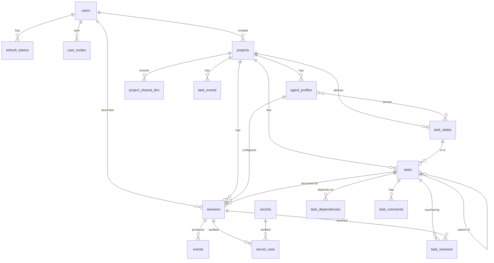

# Data model

This document is the authoritative description of the Postgres schema. Every table, column, constraint and index that the orchestrator relies on is listed here. Migrations in `orchestrator/migrations/` must match this document; a change to one is a change to both (see `CLAUDE.md`, "Documentation is part of the change").

Conventions used throughout:

- Primary keys are `UUID`, generated by the application (v4) so that a row's id is known before it is inserted.
- All timestamps are `TIMESTAMPTZ`. Columns named `*_at` are timestamps; `created_at` defaults to `NOW()`.
- Enumerations are Postgres `ENUM` types. Adding a value is a migration (`ALTER TYPE ... ADD VALUE`); values are never removed or renamed.
- Foreign keys declare their `ON DELETE` behaviour explicitly.
- Postgres 18 is assumed. `UNIQUE NULLS NOT DISTINCT` (Postgres 15+) is used where a nullable column takes part in a uniqueness rule.
- Secrets are never stored in plaintext anywhere in the database, including log or event payloads.

Postgres is the only system of record. The orchestrator also owns a filesystem volume (`/data`) holding git mirrors, session working copies and transcript logs; that volume is durable working storage, not a database, and everything the UI shows is reconstructible from Postgres plus that volume. See `ARCHITECTURE.md`, "Storage".

## Entity overview



## Enums

| Type | Values | Notes |
| --- | --- | --- |
| `project_status` | `cloning`, `ready`, `error` | `cloning` is set at creation; the clone job moves it to `ready` or `error`. |
| `profile_kind` | `conversational`, `ephemeral` | v1 launches only `conversational`; `ephemeral` exists so future roles are rows, not migrations. |
| `agent_backend` | `claude` | Which CLI adapter drives sessions of this profile. A second backend is added as a new value by migration. |
| `session_state` | `creating`, `running`, `parked`, `done`, `failed` | State machine in `ARCHITECTURE.md`, "Session lifecycle". Only conversational sessions use `parked`; an ephemeral session goes to `done` when its result arrives. |
| `task_state_kind` | `queue`, `human`, `terminal` | What a project-defined task state means to the orchestrator; see `task_states`. The states themselves are rows, not enum values. |
| `task_dependency_kind` | `blocks`, `discovered_from`, `related` | Only `blocks` affects whether a task is claimable; see `task_dependencies`. |
| `secret_scope` | `global`, `user`, `project` | Resolution order at session start is global, then project, then launching user. |

Event kinds (`events.kind`, `task_events.kind`) are deliberately `TEXT`, not enums: the set of kinds is owned by the Rust types in `orchestrator/src/events/` and adding a kind must not require a migration.

## Users and authentication

### `users`

There is no self-registration. The `users` migration seeds one administrator (`username = 'admin'`, a fixed default password documented in `README.md`, `must_change_password = TRUE`); every other user is created by accepting an invite (see `user_invites` and ADR 0013).

| Column | Type | Constraints | Notes |
| --- | --- | --- | --- |
| `id` | `UUID` | PK | The seeded admin has a fixed id `00000000-0000-0000-0000-000000000001`. |
| `username` | `TEXT` | NOT NULL, UNIQUE | 3–32 chars, validated in the model. |
| `email` | `TEXT` | NOT NULL, UNIQUE | Stored lower-cased and trimmed. Comes from the invite, so it is known to be deliverable. |
| `password_hash` | `TEXT` | NOT NULL | Argon2id PHC string. Never serialised. |
| `must_change_password` | `BOOLEAN` | NOT NULL DEFAULT FALSE | While true, every endpoint except login, logout, `GET /users/me` and the password change returns 403 (`SPEC.md`, "Authentication"). |
| `admin` | `BOOLEAN` | NOT NULL DEFAULT FALSE | Admins invite users and manage them. |
| `created_at` | `TIMESTAMPTZ` | NOT NULL DEFAULT NOW() | |
| `updated_at` | `TIMESTAMPTZ` | NOT NULL DEFAULT NOW() | Set by the repository on every update. |

### `refresh_tokens`

Opaque refresh tokens, stored hashed. The raw token is two UUIDs joined by `.`; the row stores its SHA-256 hex.

| Column | Type | Constraints |
| --- | --- | --- |
| `id` | `UUID` | PK |
| `user_id` | `UUID` | NOT NULL, FK `users(id)` ON DELETE CASCADE |
| `token_hash` | `TEXT` | NOT NULL, UNIQUE |
| `expires_at` | `TIMESTAMPTZ` | NOT NULL |
| `revoked_at` | `TIMESTAMPTZ` | NULL |
| `created_at` | `TIMESTAMPTZ` | NOT NULL DEFAULT NOW() |

Indexes: `refresh_tokens_user_id_idx (user_id)`, `refresh_tokens_expires_at_idx (expires_at)`.

### `user_invites`

An admin invites an email address; the invitee follows the emailed link, chooses a username and password, and the user row is created when the invite is accepted. Tokens are single-use and expire after 7 days.

| Column | Type | Constraints | Notes |
| --- | --- | --- | --- |
| `id` | `UUID` | PK | |
| `email` | `TEXT` | NOT NULL | Lower-cased and trimmed. At most one open invite per email (partial unique index below). |
| `token_hash` | `TEXT` | NOT NULL, UNIQUE | SHA-256 of the raw token in the link. |
| `admin` | `BOOLEAN` | NOT NULL DEFAULT FALSE | Whether the resulting user is an admin. |
| `invited_by` | `UUID` | NULL, FK `users(id)` ON DELETE SET NULL | |
| `expires_at` | `TIMESTAMPTZ` | NOT NULL | Creation time plus 7 days. |
| `accepted_at` | `TIMESTAMPTZ` | NULL | |
| `accepted_user_id` | `UUID` | NULL, FK `users(id)` ON DELETE SET NULL | |
| `created_at` | `TIMESTAMPTZ` | NOT NULL DEFAULT NOW() | |

Indexes: `user_invites_open_email_idx ON user_invites (email) WHERE accepted_at IS NULL`, `user_invites_expires_at_idx (expires_at)`. Inviting an email that already belongs to a user is refused with a conflict. A background reaper deletes expired, unaccepted invites.

### `password_reset_tokens`

Single-use tokens sent by email.

| Column | Type | Constraints |
| --- | --- | --- |
| `id` | `UUID` | PK |
| `user_id` | `UUID` | NOT NULL, FK `users(id)` ON DELETE CASCADE |
| `token_hash` | `TEXT` | NOT NULL, UNIQUE |
| `expires_at` | `TIMESTAMPTZ` | NOT NULL |
| `used_at` | `TIMESTAMPTZ` | NULL |
| `created_at` | `TIMESTAMPTZ` | NOT NULL DEFAULT NOW() |

Indexes on `(user_id)` and `(expires_at)`. A background reaper deletes expired rows.

## Projects and profiles

### `projects`

A project is one git repository, mirrored under `/data/projects/<id>/repo.git`.

| Column | Type | Constraints | Notes |
| --- | --- | --- | --- |
| `id` | `UUID` | PK | Also the directory name under `/data/projects/`. |
| `name` | `TEXT` | NOT NULL, UNIQUE | Display name, 1–100 chars. |
| `remote_url` | `TEXT` | NOT NULL | `https://` URL only in v1. Never contains credentials; see `secrets`. |
| `default_branch` | `TEXT` | NOT NULL | Discovered from the remote `HEAD` during cloning unless given. |
| `status` | `project_status` | NOT NULL DEFAULT `'cloning'` | |
| `status_message` | `TEXT` | NULL | Human-readable reason when `status = 'error'`. |
| `created_by` | `UUID` | NULL, FK `users(id)` ON DELETE SET NULL | |
| `last_fetched_at` | `TIMESTAMPTZ` | NULL | Updated by the periodic mirror fetch. |
| `max_attempts` | `SMALLINT` | NOT NULL DEFAULT 3, CHECK 1–20 | How many claims a task may go through in one state before a release sends it to the project's human state instead. See `tasks`. |
| `created_at` | `TIMESTAMPTZ` | NOT NULL DEFAULT NOW() | |
| `updated_at` | `TIMESTAMPTZ` | NOT NULL DEFAULT NOW() | |

The remote credential is not a column. It is a project-scoped, orchestrator-only secret named `GIT_CREDENTIAL` (see `secrets`). The git credential provider looks it up by that fixed name.

### `project_shared_dirs`

Directories under `/data/projects/<project_id>/shared/<name>` that every session container of the project mounts read-write at `container_path` (`ARCHITECTURE.md`, "Storage"; ADR 0015). The rows are configuration; the directories themselves are created lazily at launch and removed with the row or the project.

| Column | Type | Constraints | Notes |
| --- | --- | --- | --- |
| `project_id` | `UUID` | NOT NULL, FK `projects(id)` ON DELETE CASCADE | |
| `name` | `TEXT` | NOT NULL | 1–64 chars, `[a-z0-9][a-z0-9_-]*`. Directory name on disk. |
| `container_path` | `TEXT` | NOT NULL | Absolute, normalised. Validated by the model against the reserved paths listed in `SPEC.md`, "Shared directories". |
| `created_at` | `TIMESTAMPTZ` | NOT NULL DEFAULT NOW() | |

Constraints and indexes:

- `PRIMARY KEY (project_id, name)`.
- `UNIQUE (project_id, container_path)`.

### `agent_profiles`

Per-project configuration of one kind of agent. Every project gets one default conversational profile on creation, named `default`.

| Column | Type | Constraints | Notes |
| --- | --- | --- | --- |
| `id` | `UUID` | PK | |
| `project_id` | `UUID` | NOT NULL, FK `projects(id)` ON DELETE CASCADE | |
| `name` | `TEXT` | NOT NULL | Unique per project. |
| `kind` | `profile_kind` | NOT NULL DEFAULT `'conversational'` | |
| `backend` | `agent_backend` | NOT NULL DEFAULT `'claude'` | |
| `model` | `TEXT` | NULL | Passed to the CLI as `--model` when set; CLI default otherwise. |
| `system_prompt` | `TEXT` | NULL | Appended on every launch, including resumes. |
| `permission_mode` | `TEXT` | NOT NULL DEFAULT `'bypass'` | Adapter-specific string. v1 accepts only `bypass`. |
| `image` | `TEXT` | NOT NULL | Container image reference for sessions of this profile. |
| `runtime` | `TEXT` | NULL | Container runtime name (`runsc`, `kata`), passed as `HostConfig.Runtime`. NULL means engine default. |
| `mcp_tools` | `TEXT[]` | NOT NULL DEFAULT `'{}'` | Names of MCP tools this profile may call. Empty means the task-tracker set only; see `SPEC.md`, "MCP tool contracts". |
| `secrets` | `TEXT[]` | NOT NULL DEFAULT `'{}'` | Secret names to inject. Orchestrator-only secrets are never injected even if listed. |
| `partial_messages` | `BOOLEAN` | NOT NULL | Whether to request partial (streaming) messages from the CLI. No column default: the model sets `true` for `conversational` and `false` for `ephemeral` when the caller does not specify it. |
| `idle_timeout_secs` | `INTEGER` | NOT NULL DEFAULT 1800 | Time without any event after which a running conversational session is parked, or a running ephemeral session is treated as stalled and failed (`ARCHITECTURE.md`, "Task tracker"). |
| `is_default` | `BOOLEAN` | NOT NULL DEFAULT FALSE | Exactly one per project. |
| `created_at` | `TIMESTAMPTZ` | NOT NULL DEFAULT NOW() | |
| `updated_at` | `TIMESTAMPTZ` | NOT NULL DEFAULT NOW() | |

Constraints and indexes:

- `UNIQUE (project_id, name)`.
- Partial unique index `agent_profiles_one_default_idx ON agent_profiles (project_id) WHERE is_default`.
- Deleting a profile that has sessions is refused (`sessions.profile_id` is `ON DELETE RESTRICT`).

Which task states a profile serves is the `profile_states` link table under "Tasks". Automatic launching (a dispatcher that starts an ephemeral session when a served state has claimable work, or a schedule that runs a profile periodically) is not in v1; when it comes it is columns on this table and one background job, and no change to the task tables (`ARCHITECTURE.md`, "Task tracker").

## Sessions and events

### `sessions`

One agent instance. The row outlives the container: a session may be relaunched into a new container many times.

| Column | Type | Constraints | Notes |
| --- | --- | --- | --- |
| `id` | `UUID` | PK | Also the directory name under `/data/sessions/`. |
| `project_id` | `UUID` | NOT NULL, FK `projects(id)` ON DELETE CASCADE | |
| `profile_id` | `UUID` | NOT NULL, FK `agent_profiles(id)` ON DELETE RESTRICT | |
| `created_by` | `UUID` | NULL, FK `users(id)` ON DELETE SET NULL | The launching user; determines the `user` secret scope. |
| `title` | `TEXT` | NULL | Optional user-given label. |
| `task_id` | `UUID` | NULL, FK `tasks(id)` ON DELETE SET NULL | The task the session was launched for, if any; the launch claims it in the same transaction. Added by the `tasks` migration because `tasks` references `sessions`. |
| `state` | `session_state` | NOT NULL DEFAULT `'creating'` | |
| `base_ref` | `TEXT` | NOT NULL | Branch, tag or commit the session clone started from. |
| `branch` | `TEXT` | NOT NULL | Always `session/<id>`; stored so it is queryable. |
| `container_id` | `TEXT` | NULL | Engine container id of the current or last container. NULL once removed. |
| `cli_session_id` | `TEXT` | NULL | The CLI's own session id from its init event. Needed for resume. |
| `mcp_token_hash` | `TEXT` | NOT NULL, UNIQUE | SHA-256 of the per-session MCP bearer token. |
| `last_seq` | `BIGINT` | NOT NULL DEFAULT 0 | Cache of the highest committed `events.seq`; the truth is `MAX(events.seq)`. |
| `last_activity_at` | `TIMESTAMPTZ` | NOT NULL DEFAULT NOW() | Advanced on every event; the idle reaper reads it. |
| `error` | `TEXT` | NULL | Reason for `failed`. |
| `created_at` | `TIMESTAMPTZ` | NOT NULL DEFAULT NOW() | |
| `parked_at` | `TIMESTAMPTZ` | NULL | Set on each transition to `parked`. |
| `ended_at` | `TIMESTAMPTZ` | NULL | Set on transition to `done` or `failed`. |

Indexes: `sessions_project_created_idx (project_id, created_at DESC)`, `sessions_state_idx (state)`, `sessions_container_id_idx (container_id)`, `sessions_task_idx (task_id) WHERE task_id IS NOT NULL`.

The MCP bearer token is generated at creation, written into the session's `mcp.json` on the session volume, and only its hash is stored. Rotating it means rewriting the file and relaunching.

### `events`

Append-only. The UI's source of truth for a session. `seq` is monotonic per session and is derived from the table at insert time, never from an in-memory counter:

```sql
INSERT INTO events (session_id, seq, ts, kind, payload)
SELECT $1, COALESCE(MAX(seq), 0) + 1, $2, $3, $4 FROM events WHERE session_id = $1
RETURNING seq;
```

The primary key makes a concurrent duplicate fail rather than reorder; the writer retries on unique violation. In practice each session has exactly one writer task (see `ARCHITECTURE.md`, "Session owner task").

| Column | Type | Constraints | Notes |
| --- | --- | --- | --- |
| `session_id` | `UUID` | NOT NULL, FK `sessions(id)` ON DELETE CASCADE | |
| `seq` | `BIGINT` | NOT NULL | Starts at 1. |
| `ts` | `TIMESTAMPTZ` | NOT NULL | Time the orchestrator observed the event. |
| `kind` | `TEXT` | NOT NULL | `AgentEvent` kind in `snake_case`, e.g. `tool_call`. |
| `payload` | `JSONB` | NOT NULL | The kind-specific body of the `AgentEvent`; see `SPEC.md`. |

Constraints: `PRIMARY KEY (session_id, seq)`. No other indexes; all reads are by `session_id` and a `seq` range.

Row size: tool results are stored in full up to 256 KiB per event; larger results are truncated in the payload with `truncated: true` and the full text remains in the transcript file on the session volume.

## Tasks

The shared tracker, project-scoped. Agents reach it through MCP, users through the REST API, both write the same rows. The design is in `ARCHITECTURE.md`, "Task tracker" and ADR 0016: a task's state is the queue it waits in, the set of states is defined per project, and the lease says which session is working on it right now.

### `task_states`

The states a project's tasks can be in, in board order. Every project is created with the default set below; users add, rename, reorder and remove states from the project page.

| Column | Type | Constraints | Notes |
| --- | --- | --- | --- |
| `id` | `UUID` | PK | |
| `project_id` | `UUID` | NOT NULL, FK `projects(id)` ON DELETE CASCADE | |
| `name` | `TEXT` | NOT NULL | 1–32 chars matching `[a-z0-9][a-z0-9_-]*`. The API and agents use the name; the id is internal. |
| `kind` | `task_state_kind` | NOT NULL | `queue`: agents claim from it. `human`: agents never claim from it; escalations land here. `terminal`: closes the task and satisfies dependencies. Immutable after creation. |
| `position` | `INTEGER` | NOT NULL | Board column order, ascending. |
| `created_at` | `TIMESTAMPTZ` | NOT NULL DEFAULT NOW() | |

Constraints and indexes:

- `UNIQUE (project_id, name)`.
- Partial unique index `task_states_one_human_idx ON task_states (project_id) WHERE kind = 'human'`: at most one human state per project.
- The repository refuses to delete the human state, the last terminal state, or any state a task is in (`tasks.state_id` is `ON DELETE RESTRICT`).
- The default state for a new task is the `queue` state with the lowest position.

Default set, created with the project:

| `name` | `kind` | `position` | Meant for |
| --- | --- | --- | --- |
| `backlog` | `queue` | 0 | Requests and ideas that need planning before work can start. |
| `ready` | `queue` | 1 | Planned work an implementer can pick up. |
| `review` | `queue` | 2 | Implemented; waiting for review. |
| `merge` | `queue` | 3 | Approved; waiting to be merged. |
| `needs_human` | `human` | 4 | An agent asked for a decision, or the task ran out of attempts. |
| `done` | `terminal` | 5 | Finished. |
| `cancelled` | `terminal` | 6 | Will not be done. Satisfies dependencies like `done`. |

### `profile_states`

Which states an agent profile serves. The MCP `ready` tool lists, and `claim` claims, only tasks in the calling profile's served states. This is the whole role mechanism: a profile's served states say which queue it works, its system prompt says what to do there.

| Column | Type | Constraints |
| --- | --- | --- |
| `profile_id` | `UUID` | NOT NULL, FK `agent_profiles(id)` ON DELETE CASCADE |
| `state_id` | `UUID` | NOT NULL, FK `task_states(id)` ON DELETE CASCADE |

Constraint: `PRIMARY KEY (profile_id, state_id)`. Both rows must belong to the same project (repository check). Only `queue` states may be served (repository check). The default profile of a new project serves `ready`.

### `tasks`

| Column | Type | Constraints | Notes |
| --- | --- | --- | --- |
| `id` | `UUID` | PK | |
| `project_id` | `UUID` | NOT NULL, FK `projects(id)` ON DELETE CASCADE | |
| `number` | `INTEGER` | NOT NULL | Per-project human-readable number, assigned as `MAX(number)+1` inside the insert transaction. Agents and the API accept it wherever a task id is accepted. |
| `title` | `TEXT` | NOT NULL | 1–200 chars. |
| `description` | `TEXT` | NOT NULL DEFAULT `''` | Markdown. |
| `state_id` | `UUID` | NOT NULL, FK `task_states(id)` ON DELETE RESTRICT | The queue the task is in. Set by the repository to the project's default state when the caller gives none. |
| `priority` | `SMALLINT` | NOT NULL DEFAULT 2, CHECK 0–3 | `0` critical, `1` high, `2` medium, `3` low. Claimable tasks are ordered by priority, then number. |
| `blocked` | `BOOLEAN` | NOT NULL DEFAULT FALSE | True while any `blocks` dependency is in a non-terminal state. Stored, not derived; recomputed by the orchestrator (see below). A blocked task is not claimable in any state. |
| `labels` | `TEXT[]` | NOT NULL DEFAULT `'{}'` | Free-form tags, each 1–32 chars matching the state-name pattern. Filterable; carry no behaviour in v1. |
| `parent_id` | `UUID` | NULL, FK `tasks(id)` ON DELETE SET NULL | The epic this task belongs to. One level: a task with children cannot itself get a parent. |
| `assignee_user_id` | `UUID` | NULL, FK `users(id)` ON DELETE SET NULL | The person who should look at it, mostly for the human state. |
| `lease_holder_session_id` | `UUID` | NULL, FK `sessions(id)` ON DELETE SET NULL | Session currently working on the task. NULL means nobody. |
| `lease_since` | `TIMESTAMPTZ` | NULL | When the current holder claimed it; NULL iff `lease_holder_session_id` is NULL. |
| `attempts` | `SMALLINT` | NOT NULL DEFAULT 0 | Claims since the task last changed state. Incremented on claim, reset to 0 on every state change. |
| `needs_human_reason` | `TEXT` | NULL | Why the task was last escalated; set by the `needs_human` tool and by the reaper. |
| `created_by_user_id` | `UUID` | NULL, FK `users(id)` ON DELETE SET NULL | |
| `created_by_session_id` | `UUID` | NULL, FK `sessions(id)` ON DELETE SET NULL | |
| `created_at` | `TIMESTAMPTZ` | NOT NULL DEFAULT NOW() | |
| `updated_at` | `TIMESTAMPTZ` | NOT NULL DEFAULT NOW() | |
| `closed_at` | `TIMESTAMPTZ` | NULL | Set on entering a terminal state, cleared on leaving one. |

Constraints and indexes:

- `UNIQUE (project_id, number)`.
- `CHECK ((lease_holder_session_id IS NULL) = (lease_since IS NULL))`.
- `CHECK (priority BETWEEN 0 AND 3)`.
- `CHECK (parent_id <> id)`; the parent must belong to the same project (repository check).
- `tasks_project_state_idx (project_id, state_id, priority, number)` for the board.
- `tasks_claimable_idx (project_id, state_id, priority, number) WHERE NOT blocked AND lease_holder_session_id IS NULL` for the `ready` tool.
- `tasks_lease_holder_idx (lease_holder_session_id) WHERE lease_holder_session_id IS NOT NULL` for the stuck-task reaper.
- `tasks_parent_idx (parent_id)`.

Claiming is a single atomic statement (ADR 0016):

```sql
UPDATE tasks
SET lease_holder_session_id = $2,
    lease_since = NOW(),
    attempts = attempts + 1,
    updated_at = NOW()
WHERE id = $1
  AND project_id = $3
  AND state_id = ANY($4)          -- the claiming profile's served states; every queue state for a launch from the UI
  AND NOT blocked
  AND lease_holder_session_id IS NULL
RETURNING *;
```

Zero rows returned means the claim lost; the caller gets a conflict, never a partial state.

A **hand-off** is a state change. In one transaction the orchestrator sets `state_id`, clears the lease, resets `attempts`, sets or clears `closed_at` according to the new state's kind, recomputes `blocked` on every dependant when a terminal state is entered or left, and writes the `task_events` row.

A **release** clears the lease and keeps the state. When the release comes from an agent (`release` tool) or from the reaper and `attempts` has reached `projects.max_attempts`, the same transaction moves the task to the project's human state instead, sets `needs_human_reason`, and writes a system comment. A release by a user never escalates.

The `blocked` flag is stored so that the claimable query is a plain indexed read and so that the transition to unblocked can emit a `TaskEvent`. The orchestrator recomputes it for every dependant inside the same transaction that adds or removes a `blocks` dependency, or moves a task into or out of a terminal state.

### `task_dependencies`

| Column | Type | Constraints | Notes |
| --- | --- | --- | --- |
| `task_id` | `UUID` | NOT NULL, FK `tasks(id)` ON DELETE CASCADE | |
| `depends_on_task_id` | `UUID` | NOT NULL, FK `tasks(id)` ON DELETE CASCADE | |
| `kind` | `task_dependency_kind` | NOT NULL DEFAULT `'blocks'` | `blocks`: `task_id` is not claimable until `depends_on_task_id` is terminal. `discovered_from`: `task_id` was created while working on `depends_on_task_id`; provenance only. `related`: informational. |

Constraints: `PRIMARY KEY (task_id, depends_on_task_id)`, `CHECK (task_id <> depends_on_task_id)`. Both tasks must belong to the same project (enforced in the repository, since a cross-table check needs a trigger). Cycles among `blocks` edges are rejected in the repository with a recursive CTE before insert; the other kinds are not checked for cycles and never affect `blocked`.

Index: `task_dependencies_depends_on_idx (depends_on_task_id)` for "who is waiting on me".

### `task_comments`

The agent-to-agent (and human-to-agent) communication channel.

| Column | Type | Constraints | Notes |
| --- | --- | --- | --- |
| `id` | `UUID` | PK | |
| `task_id` | `UUID` | NOT NULL, FK `tasks(id)` ON DELETE CASCADE | |
| `author_user_id` | `UUID` | NULL, FK `users(id)` ON DELETE SET NULL | |
| `author_session_id` | `UUID` | NULL, FK `sessions(id)` ON DELETE SET NULL | |
| `system` | `BOOLEAN` | NOT NULL DEFAULT FALSE | True for comments the orchestrator writes (reaper releases, escalations). Both author columns are NULL. |
| `body` | `TEXT` | NOT NULL | |
| `created_at` | `TIMESTAMPTZ` | NOT NULL DEFAULT NOW() | |

Constraint: exactly one author column is set when `system` is false, none when it is true; enforced at insert time in the repository, since either author may later become NULL through `ON DELETE SET NULL`. Index: `task_comments_task_idx (task_id, created_at)`.

### `task_sessions`

Which sessions touched which tasks. A row is upserted whenever a session claims, updates, comments on, releases or hands off a task, and when a session is launched for a task.

| Column | Type | Constraints |
| --- | --- | --- |
| `task_id` | `UUID` | NOT NULL, FK `tasks(id)` ON DELETE CASCADE |
| `session_id` | `UUID` | NOT NULL, FK `sessions(id)` ON DELETE CASCADE |
| `first_touched_at` | `TIMESTAMPTZ` | NOT NULL DEFAULT NOW() |
| `last_touched_at` | `TIMESTAMPTZ` | NOT NULL DEFAULT NOW() |

Constraint: `PRIMARY KEY (task_id, session_id)`. Index: `task_sessions_session_idx (session_id)`.

### `task_events`

The project-scoped `TaskEvent` stream, delivered over SSE. Same append-only, derived-`seq` discipline as `events`, keyed by project. Changes to `task_states` are also written here (kind `states_changed`, `task_id` NULL) so a connected board learns about new columns.

| Column | Type | Constraints | Notes |
| --- | --- | --- | --- |
| `project_id` | `UUID` | NOT NULL, FK `projects(id)` ON DELETE CASCADE | |
| `seq` | `BIGINT` | NOT NULL | Monotonic per project; used as the SSE `id`. |
| `ts` | `TIMESTAMPTZ` | NOT NULL | |
| `task_id` | `UUID` | NULL, FK `tasks(id)` ON DELETE SET NULL | |
| `kind` | `TEXT` | NOT NULL | `TaskEvent` kind; see `SPEC.md`. |
| `payload` | `JSONB` | NOT NULL | |

Constraint: `PRIMARY KEY (project_id, seq)`. The row is written in the same transaction as the task change it describes, then `NOTIFY task_events, '<project_id>:<seq>'` fires after commit.

## Secrets

### `secrets`

Envelope-encrypted values. The design is in `ARCHITECTURE.md`, "Secrets"; the columns are:

| Column | Type | Constraints | Notes |
| --- | --- | --- | --- |
| `id` | `UUID` | PK | |
| `scope` | `secret_scope` | NOT NULL | |
| `scope_id` | `UUID` | NULL | `users.id` for `user`, `projects.id` for `project`, NULL for `global`. No FK, because the scope decides the target table; the repository validates existence and a reaper deletes orphans. |
| `name` | `TEXT` | NOT NULL | Environment-variable style: `^[A-Z][A-Z0-9_]{0,127}$`. |
| `ciphertext` | `BYTEA` | NOT NULL | AES-256-GCM ciphertext of the value, including the 16-byte tag. |
| `nonce` | `BYTEA` | NOT NULL | 12-byte nonce for `ciphertext`. |
| `data_key_wrapped` | `BYTEA` | NOT NULL | Per-row data key, AES-256-GCM wrapped by the master key. |
| `data_key_nonce` | `BYTEA` | NOT NULL | 12-byte nonce for the wrap. |
| `key_version` | `INTEGER` | NOT NULL | Which master key wrapped `data_key_wrapped`. |
| `orchestrator_only` | `BOOLEAN` | NOT NULL DEFAULT FALSE | Never injected into containers. |
| `created_by` | `UUID` | NULL, FK `users(id)` ON DELETE SET NULL | |
| `created_at` | `TIMESTAMPTZ` | NOT NULL DEFAULT NOW() | |
| `updated_at` | `TIMESTAMPTZ` | NOT NULL DEFAULT NOW() | |

Constraints and indexes:

- `UNIQUE NULLS NOT DISTINCT (scope, scope_id, name)`.
- `CHECK ((scope = 'global') = (scope_id IS NULL))`.
- `secrets_key_version_idx (key_version)` for rotation sweeps.

Additional authenticated data (AAD) for the value encryption is the UTF-8 string `<scope>:<scope_id or empty>:<name>`, so a ciphertext copied to another row fails to decrypt. Renaming a secret therefore re-encrypts the value under the new AAD (decrypt, re-encrypt, one transaction); it does not change the data key.

### `secret_uses`

Audit of which secret was resolved into which session.

| Column | Type | Constraints |
| --- | --- | --- |
| `id` | `BIGINT` | PK, `GENERATED ALWAYS AS IDENTITY` |
| `secret_id` | `UUID` | NOT NULL, FK `secrets(id)` ON DELETE CASCADE |
| `session_id` | `UUID` | NOT NULL, FK `sessions(id)` ON DELETE CASCADE |
| `at` | `TIMESTAMPTZ` | NOT NULL DEFAULT NOW() |

Indexes: `secret_uses_secret_idx (secret_id, at DESC)`, `secret_uses_session_idx (session_id)`. A row is written for every injected secret on every launch, including relaunches of parked sessions. Orchestrator-only uses (the git credential provider) are also recorded, with the session that triggered the git operation.

## Notifications (LISTEN/NOTIFY channels)

Not tables, but part of the schema contract. Payloads are small and are wake signals only (ADR 0005).

| Channel | Payload | Sent when |
| --- | --- | --- |
| `session_events` | `<session_id>:<seq>` | After an `events` row commits. |
| `task_events` | `<project_id>:<seq>` | After a `task_events` row commits. |
| `session_state` | `<session_id>:<state>` | After `sessions.state` changes. |

Consumers treat a notification as "there may be new rows after the last `seq` you saw" and always read from the table.

## Migration list for v1

Migrations are created with `sqlx migrate add -r <name>` and applied automatically at startup. The initial set, in order:

1. `enums` — all enum types above.
2. `users` — `users` (including the seeded admin row), `refresh_tokens`, `user_invites`, `password_reset_tokens`.
3. `projects` — `projects`, `agent_profiles`, `project_shared_dirs`.
4. `sessions` — `sessions`, `events`.
5. `tasks` — `task_states`, `profile_states`, `tasks`, `task_dependencies`, `task_comments`, `task_sessions`, `task_events`, and `ALTER TABLE sessions ADD COLUMN task_id`.
6. `secrets` — `secrets`, `secret_uses`.

Each `.down.sql` drops exactly what its `.up.sql` created, in reverse order.
